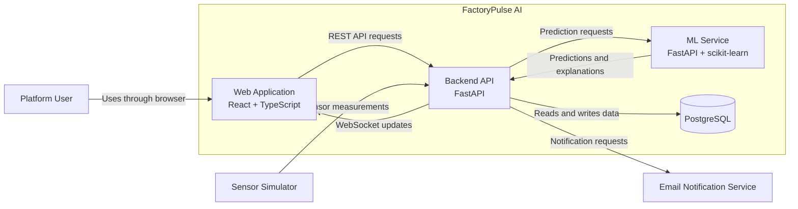

# FactoryPulse AI — Architecture Overview

## 1. Purpose

This document provides a high-level overview of the FactoryPulse AI software architecture.

It summarizes:

- The architecture style
- The main system containers
- The internal software components
- The deployment approach
- The selected technologies
- The principal communication flows
- The most important architectural decisions

Detailed explanations and diagrams are available in the related architecture documents.

---

## 2. System Overview

FactoryPulse AI is an industrial monitoring and predictive-maintenance platform.

The platform receives machine sensor measurements, monitors equipment condition, detects abnormal behaviour, estimates failure risk, generates alerts and supports maintenance interventions.

The initial version uses simulated industrial sensor data instead of physical IoT devices.

The system is designed for four main user roles:

- Administrator
- Plant Manager
- Maintenance Engineer
- Machine Operator

---

## 3. Architecture Style

FactoryPulse AI uses:

> A modular monolith for the main Backend API, combined with a separate Machine Learning Service.

The Backend API is deployed as one application but is divided into clear business modules.

Examples include:

- Authentication and authorization
- User management
- Machine and sensor management
- Sensor ingestion
- Monitoring
- Prediction orchestration
- Alert management
- Maintenance management
- Reporting
- Notifications
- Real-time communication
- Audit logging

The ML Service is separated from the Backend API because it has:

- Different dependencies
- Different processing responsibilities
- Independent model lifecycle requirements
- Different future scaling needs

The project does not use a full microservices architecture during the MVP.

This reduces deployment and development complexity while preserving clear separation of responsibilities.

---

## 4. High-Level Architecture



---

## 5. Main Containers

### 5.1 Web Application

**Technology:** React, TypeScript and Vite

The Web Application provides:

- Role-based dashboards
- Machine and sensor monitoring
- Near-real-time measurement visualization
- Alert management
- Maintenance-task management
- Prediction and explanation views
- Reports and operational trends

It communicates only with the Backend API.

---

### 5.2 Backend API

**Technology:** Python, FastAPI, SQLAlchemy, Alembic and Pydantic

The Backend API is the central application service.

It is responsible for:

- Authentication and authorization
- Business rules
- User and role management
- Machine and sensor management
- Sensor-data ingestion
- Alert and maintenance management
- Database access
- ML Service communication
- WebSocket updates
- Notifications
- Audit logging

---

### 5.3 ML Service

**Technology:** Python, FastAPI, scikit-learn, Pandas, NumPy and SHAP

The ML Service is responsible for:

- Data preprocessing
- Anomaly detection
- Failure-risk prediction
- Risk-level classification
- Prediction explanations
- Model loading
- Model version management

The ML Service does not directly modify the application database.

---

### 5.4 PostgreSQL Database

**Technology:** PostgreSQL

The database stores:

- Users
- Roles and permissions
- Machines
- Sensors
- Sensor measurements
- Predictions
- Alerts
- Maintenance tasks
- Notifications
- Audit records

Only the Backend API directly accesses the main application database.

---

### 5.5 Sensor Simulator

**Technology:** Python

The Sensor Simulator generates artificial industrial measurements.

It supports:

- Normal machine behaviour
- Abnormal conditions
- Gradual degradation
- Multiple machines and sensors
- Configurable transmission intervals

It sends measurements to the Backend API through an ingestion endpoint.

---

### 5.6 Email Notification Service

The Email Notification Service delivers important alerts and maintenance notifications.

During local development, a free local email-testing service may be used.

---

## 6. Main Communication Methods

| Communication | Method |
|---|---|
| Web Application to Backend API | REST over HTTP |
| Backend API to Web Application | WebSockets |
| Sensor Simulator to Backend API | HTTP ingestion API |
| Backend API to ML Service | Internal HTTP API |
| Backend API to PostgreSQL | SQL through SQLAlchemy |
| Backend API to Email Service | SMTP or service API |

---

## 7. Main Data Flows

### 7.1 Sensor Monitoring Flow

```text
Sensor Simulator
  → Backend API
  → Sensor validation
  → PostgreSQL
  → Monitoring
  → WebSocket update
  → Web Application
```

---

### 7.2 AI Prediction Flow

```text
Sensor measurements
  → Backend Prediction Orchestrator
  → ML Service
  → Data preprocessing
  → Anomaly or failure-risk model
  → Explainability
  → Backend API
  → PostgreSQL
  → Web Application
```

---

### 7.3 Alert Flow

```text
Threshold violation or AI prediction
  → Alert Management
  → Alert storage
  → Real-time dashboard update
  → Notification Component
  → Email Notification Service
```

---

### 7.4 Maintenance Flow

```text
Alert
  → Maintenance task
  → Assignment to Maintenance Engineer
  → Intervention updates
  → Completion
  → Maintenance history
```

---

## 8. Deployment Approach

The initial deployment runs locally on Windows 11.

The source code remains in the Windows filesystem.

Docker Desktop and Docker Compose run the application services.

Initial services:

```text
frontend
backend
ml-service
postgres
sensor-simulator
```

An optional local email-testing service may be added later.

The services communicate through a private Docker network.

PostgreSQL data is stored in a persistent Docker volume.

Machine-learning model artifacts are mounted or stored outside disposable container layers.

---

## 9. Technology Stack

| Area | Technology |
|---|---|
| Frontend | React, TypeScript and Vite |
| Backend | Python and FastAPI |
| Validation | Pydantic |
| ORM | SQLAlchemy |
| Database migrations | Alembic |
| Database | PostgreSQL |
| Machine learning | scikit-learn |
| Data processing | Pandas and NumPy |
| Explainability | SHAP |
| Real-time updates | WebSockets |
| Containers | Docker |
| Local orchestration | Docker Compose |
| Version control | Git and GitHub |
| Development system | Windows 11 |
| Development editor | Visual Studio Code |

---

## 10. Security Overview

The architecture applies the following security principles:

- Users must authenticate before accessing protected functionality
- Role-based access control is enforced by the Backend API
- Passwords are stored using secure hashing
- Sensitive configuration is stored in environment variables
- The `.env` file is excluded from Git
- The frontend cannot access PostgreSQL directly
- The frontend cannot access the ML Service directly
- Sensor-ingestion requests must be validated
- API inputs must be validated
- Important actions must be recorded in audit logs
- Secrets and authentication tokens must not appear in logs
- Unnecessary service ports should not be publicly exposed

---

## 11. Scalability Approach

The MVP is designed for simplicity, but the architecture supports future growth.

Possible scaling options include:

- Running multiple Backend API instances
- Scaling the ML Service independently
- Adding Redis for caching or asynchronous processing
- Introducing a message broker for high-volume sensor ingestion
- Using TimescaleDB for larger time-series workloads
- Moving PostgreSQL to a managed database
- Deploying services to a remote Linux server
- Adding a reverse proxy and HTTPS
- Adding centralized logging and monitoring

These capabilities will not be introduced until they become necessary.

---

## 12. Key Architectural Decisions

### AD-001 — Modular Monolith Backend

The main Backend API will use a modular-monolith architecture instead of multiple business microservices.

**Reason:** It provides clear code organization without unnecessary distributed-system complexity.

---

### AD-002 — Separate ML Service

Machine-learning inference will run in a separate service.

**Reason:** ML dependencies, model lifecycle and future scaling requirements differ from normal backend business logic.

---

### AD-003 — PostgreSQL Database

PostgreSQL will be used as the primary application database.

**Reason:** It is free, open source, reliable and suitable for relational business and operational data.

---

### AD-004 — REST and WebSockets

REST will be used for standard API operations, while WebSockets will provide near-real-time dashboard updates.

**Reason:** Each communication method is suited to a different interaction pattern.

---

### AD-005 — Sensor Simulation

A Python Sensor Simulator will replace physical IoT devices during the MVP.

**Reason:** It allows free and repeatable testing of normal, abnormal and degrading machine conditions.

---

### AD-006 — Docker Compose Deployment

Docker Compose will coordinate the services during local development.

**Reason:** It provides repeatable environments and keeps service dependencies isolated.

---

### AD-007 — Windows Development Environment

The project will be developed from the native Windows filesystem without WSL.

**Reason:** This matches the current development environment and avoids unnecessary operating-system complexity.

---

### AD-008 — Free and Open-Source Technologies

The initial project will avoid paid APIs and paid cloud infrastructure.

**Reason:** The complete MVP can be developed and demonstrated locally using free technologies.

---

## 13. Architecture Documentation Structure

```text
docs/
└── 03_Architecture/
    ├── Architecture_Overview.md
    ├── System_Context.md
    ├── Container_Architecture.md
    ├── Component_Architecture.md
    └── Deployment_Architecture.md
```

Each document has a different purpose:

| Document | Purpose |
|---|---|
| Architecture Overview | Summarizes the complete architecture |
| System Context | Shows users, external systems and system boundaries |
| Container Architecture | Shows the main applications and data stores |
| Component Architecture | Shows internal Backend API and ML Service modules |
| Deployment Architecture | Shows how services run using Windows and Docker |

---

## 14. Future Architecture Documents

The following documents will be created during the next design stages:

- Database Architecture
- Entity Relationship Diagram
- API Specification
- Authentication and Authorization Design
- AI and ML Architecture
- Frontend Architecture
- Architecture Decision Records

---

## 15. Related Documents

- [[System_Context.md]]
- [[03_Architecture/Container_Architecture|Container Architecture]]
- [[03_Architecture/Component_Architecture|Component Architecture]]
- [[03_Architecture/Deployment_Architecture|Deployment Architecture]]
- [[02_Requirements/Business_Requirements|Business Requirements]]
- [[02_Requirements/Software_Requirements_Specification|Software Requirements Specification]]
- [[02_Requirements/Functional_Requirements|Functional Requirements]]
- [[02_Requirements/Non_Functional_Requirements|Non-Functional Requirements]]
- [[02_Requirements/Requirements_Traceability_Matrix|Requirements Traceability Matrix]]


