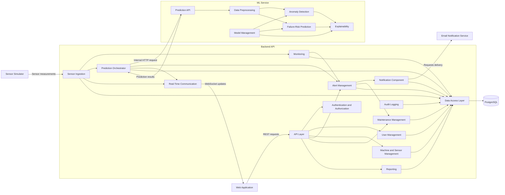

# FactoryPulse AI — Component Architecture

## 1. Purpose

This document describes the main internal software components of FactoryPulse AI.

The Container Architecture identified the principal applications and data stores. This document goes one level deeper by describing how the Backend API and ML Service are internally organized.

The components described here are logical modules. They are not separate microservices and will initially run inside their corresponding applications.

---

## 2. Scope

This document focuses on two containers:

- Backend API
- ML Service

The internal structure of the React Web Application will be documented later during frontend design.

---

## 3. Backend API Components

### 3.1 API Layer

The API Layer exposes REST endpoints used by the Web Application and Sensor Simulator.

Main responsibilities:

- Receive HTTP requests
- Validate request formats
- Apply authentication requirements
- Call the appropriate application component
- Return standardized HTTP responses
- Handle API errors

The API Layer should not contain complex business logic.

---

### 3.2 Authentication and Authorization Component

This component manages user authentication and access control.

Main responsibilities:

- Authenticate users
- Verify passwords
- Generate and validate access tokens
- Enforce role-based permissions
- Manage login sessions or token renewal
- Protect restricted endpoints

Supported roles include:

- Administrator
- Plant Manager
- Maintenance Engineer
- Machine Operator

---

### 3.3 User Management Component

This component manages platform users, roles and account information.

Main responsibilities:

- Create and update users
- Activate or deactivate accounts
- Assign roles
- Retrieve user profiles
- Manage user permissions
- Support administrative user operations

---

### 3.4 Machine and Sensor Management Component

This component manages industrial assets monitored by FactoryPulse AI.

Main responsibilities:

- Register machines
- Update machine information
- Register sensors
- Assign sensors to machines
- Configure measurement types and units
- Track machine and sensor status
- Retrieve machine and sensor details

---

### 3.5 Sensor Ingestion Component

This component receives and processes incoming sensor measurements.

Main responsibilities:

- Receive measurements from the Sensor Simulator
- Validate sensor identity
- Validate measurement values and timestamps
- Reject invalid or malformed data
- Store accepted measurements
- Trigger monitoring and prediction processes
- Publish new measurements for real-time dashboards

---

### 3.6 Monitoring Component

This component evaluates the current operating condition of machines.

Main responsibilities:

- Retrieve recent sensor measurements
- Calculate machine-health indicators
- Compare measurements with configured thresholds
- Identify warning and critical conditions
- Determine machine operating status
- Provide monitoring data to dashboards

---

### 3.7 Prediction Orchestrator

This component coordinates communication between the Backend API and ML Service.

Main responsibilities:

- Prepare validated prediction requests
- Send sensor data to the ML Service
- Receive anomaly and failure-risk results
- Store prediction results
- Associate predictions with machines and measurements
- Handle ML Service errors and unavailable responses
- Trigger alerts when prediction results exceed configured risk levels

The Prediction Orchestrator does not perform machine-learning calculations itself.

---

### 3.8 Alert Management Component

This component manages system alerts.

Main responsibilities:

- Create alerts from threshold violations
- Create alerts from AI predictions
- Assign alert severity
- Associate alerts with machines and sensors
- Track alert status
- Allow authorized users to acknowledge alerts
- Resolve or close alerts
- Prevent unnecessary duplicate alerts

Possible alert states include:

- Open
- Acknowledged
- In progress
- Resolved
- Closed

---

### 3.9 Maintenance Management Component

This component manages maintenance activities and interventions.

Main responsibilities:

- Create maintenance tasks
- Assign tasks to Maintenance Engineers
- Define task priority
- Update task status
- Add intervention notes
- Record maintenance actions
- Link tasks to machines and alerts
- Track completion dates
- Store maintenance history

---

### 3.10 Reporting Component

This component provides aggregated operational information.

Main responsibilities:

- Generate machine-health summaries
- Calculate alert statistics
- Calculate maintenance statistics
- Produce sensor-measurement trends
- Generate failure-risk summaries
- Provide dashboard metrics
- Export report data when required

---

### 3.11 Notification Component

This component coordinates user notifications.

Main responsibilities:

- Create in-application notifications
- Determine notification recipients
- Request email delivery
- Track notification status
- Avoid duplicate notifications
- Record delivery failures

---

### 3.12 Real-Time Communication Component

This component provides near-real-time updates to the Web Application.

Main responsibilities:

- Manage WebSocket connections
- Publish new sensor measurements
- Publish machine-status changes
- Publish new alerts
- Publish maintenance-task updates
- Verify that connected users are authorized to receive data

---

### 3.13 Audit Logging Component

This component records important security and business actions.

Main responsibilities:

- Record authentication events
- Record user and role changes
- Record machine and sensor changes
- Record alert acknowledgements
- Record maintenance updates
- Record important administrative actions
- Store actor, action, timestamp and affected resource

---

### 3.14 Data Access Layer

The Data Access Layer controls communication with PostgreSQL.

Main responsibilities:

- Provide repositories for persistent entities
- Execute database queries
- Manage database transactions
- Convert database records into application models
- Prevent direct database access from business components
- Support database migrations through Alembic

Example repositories include:

- User Repository
- Machine Repository
- Sensor Repository
- Measurement Repository
- Prediction Repository
- Alert Repository
- Maintenance Repository
- Notification Repository
- Audit Repository

---

## 4. ML Service Components

### 4.1 Prediction API

The Prediction API receives internal prediction requests from the Backend API.

Main responsibilities:

- Validate prediction requests
- Pass data to the preprocessing component
- Select the appropriate model
- Return prediction results
- Return standardized ML errors
- Expose model-health information

The Prediction API is not accessed directly by the Web Application.

---

### 4.2 Data Preprocessing Component

This component prepares sensor data for machine-learning models.

Main responsibilities:

- Validate required features
- Handle missing values
- Normalize or scale values when required
- Apply feature transformations
- Arrange features in the expected order
- Reject incompatible prediction input

The preprocessing logic used during inference must match the logic used during model training.

---

### 4.3 Anomaly Detection Component

This component identifies abnormal machine behaviour.

Main responsibilities:

- Receive prepared sensor features
- Calculate anomaly predictions
- Produce anomaly scores
- Classify observations as normal or abnormal
- Return model metadata

---

### 4.4 Failure-Risk Prediction Component

This component estimates the probability or risk of equipment failure.

Main responsibilities:

- Generate failure-risk scores
- Classify risk levels
- Estimate prediction confidence where supported
- Return model version information

Possible risk levels include:

- Low
- Medium
- High
- Critical

---

### 4.5 Explainability Component

This component explains machine-learning predictions.

Main responsibilities:

- Identify influential sensor features
- Generate feature-contribution information
- Produce human-readable explanation data
- Support SHAP-based explanations where appropriate

The explanation should help users understand why a machine received a particular anomaly or failure-risk result.

---

### 4.6 Model Management Component

This component manages trained machine-learning artifacts.

Main responsibilities:

- Load trained models
- Load preprocessing pipelines
- Track active model versions
- Validate model compatibility
- Provide model metadata
- Support future model replacement
- Prevent incomplete or corrupted models from being used

---

## 5. Component Diagram



---

## 6. Main Component Flows

### 6.1 Sensor Measurement Processing

```text
Sensor Simulator
  → Sensor Ingestion
  → Monitoring
  → Prediction Orchestrator
  → Data Access Layer
  → PostgreSQL
  → Real-Time Communication
  → Web Application
```

---

### 6.2 AI Prediction Processing

```text
Prediction Orchestrator
  → Prediction API
  → Data Preprocessing
  → Anomaly Detection or Failure-Risk Prediction
  → Explainability
  → Prediction API
  → Prediction Orchestrator
  → PostgreSQL
```

---

### 6.3 Alert Processing

```text
Monitoring or Prediction Orchestrator
  → Alert Management
  → Notification Component
  → Email Notification Service
```

A serious alert may also lead to the creation of a maintenance task.

---

### 6.4 User Request Processing

```text
Web Application
  → API Layer
  → Authentication and Authorization
  → Relevant Business Component
  → Data Access Layer
  → PostgreSQL
```

---

## 7. Component Design Rules

The following rules apply to the architecture:

- The API Layer should not contain complex business logic
- Business components should not access PostgreSQL directly
- Database access must pass through the Data Access Layer
- The Web Application must not communicate directly with the ML Service
- The ML Service must not directly modify application data
- The Prediction Orchestrator controls Backend-to-ML communication
- Authentication and authorization must be enforced by the Backend API
- Components should communicate through clear interfaces
- Components should remain independently testable
- Circular dependencies between components should be avoided
- Components are logical modules, not separate microservices

---

## 8. Suggested Backend Module Structure

```text
backend/
└── app/
    ├── api/
    ├── auth/
    ├── users/
    ├── machines/
    ├── sensors/
    ├── measurements/
    ├── monitoring/
    ├── predictions/
    ├── alerts/
    ├── maintenance/
    ├── reports/
    ├── notifications/
    ├── realtime/
    ├── audit/
    ├── database/
    └── shared/
```

The final source-code structure may change slightly during detailed backend design.

---

## 9. Suggested ML Service Module Structure

```text
ml-service/
└── app/
    ├── api/
    ├── preprocessing/
    ├── anomaly_detection/
    ├── failure_prediction/
    ├── explainability/
    ├── model_management/
    └── shared/
```

Training scripts and datasets should remain separate from the inference application.

---

## 10. Related Documents

- [[System_Context.md]]
- [[03_Architecture/Container_Architecture|Container Architecture]]
- [[02_Requirements/Software_Requirements_Specification|Software Requirements Specification]]
- [[02_Requirements/Functional_Requirements|Functional Requirements]]
- [[02_Requirements/Non_Functional_Requirements|Non-Functional Requirements]]
- [[02_Requirements/Use_Cases|Use Cases]]

