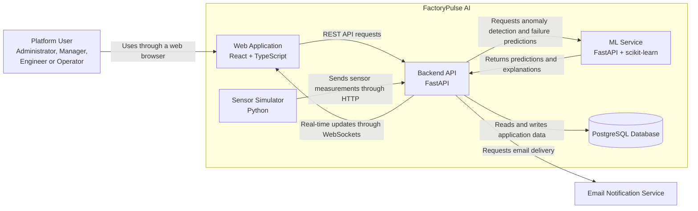

# FactoryPulse AI — Container Architecture

## 1. Purpose

This document describes the main applications and data stores that make up FactoryPulse AI.

Unlike the System Context Diagram, which represents FactoryPulse AI as one system, the Container Diagram shows the major internal parts of the platform and how they communicate.

In the C4 model, a container means an independently running application or data store. It does not refer only to a Docker container.

---

## 2. Architecture Style

FactoryPulse AI uses a modular architecture composed of:

- A web frontend
- A main backend API
- A separate machine-learning service
- A PostgreSQL database
- A sensor simulator
- An external email notification service

The main backend follows a modular-monolith approach. Business capabilities remain separated into modules while being deployed as one backend application.

The machine-learning service is separated from the backend because it has different dependencies, responsibilities and scaling requirements.

---

## 3. Containers

### 3.1 Web Application

**Technology:** React, TypeScript and Vite

The Web Application provides the user interface for FactoryPulse AI.

Main responsibilities:

- Authenticate users
- Display role-based dashboards
- Display machines and sensors
- Show near-real-time sensor measurements
- Display alerts and AI predictions
- Support maintenance-task management
- Display reports and operational trends
- Communicate with the Backend API
- Receive real-time updates through WebSockets

The Web Application runs in the user's web browser.

---

### 3.2 Backend API

**Technology:** Python, FastAPI, SQLAlchemy, Alembic and Pydantic

The Backend API contains the main business logic of FactoryPulse AI.

Main responsibilities:

- Authenticate and authorize users
- Manage users and roles
- Manage machines and sensors
- Receive sensor measurements
- Store and retrieve operational data
- Manage alerts
- Manage maintenance tasks
- Generate reports
- Request predictions from the ML Service
- Send real-time updates to the Web Application
- Request email notifications
- Record audit events

The Backend API is organized into business modules such as:

- Authentication
- Users
- Machines
- Sensors
- Measurements
- Alerts
- Maintenance
- Reports
- Audit
- Notifications

---

### 3.3 ML Service

**Technology:** Python, FastAPI, scikit-learn, Pandas, NumPy and SHAP

The ML Service provides machine-learning inference capabilities.

Main responsibilities:

- Load trained machine-learning models
- Detect abnormal sensor behaviour
- Estimate machine-failure risk
- Calculate prediction confidence or risk scores
- Generate prediction explanations
- Return model information and version details
- Validate prediction input data

The Backend API communicates with the ML Service through an internal HTTP API.

The Web Application does not communicate directly with the ML Service.

---

### 3.4 PostgreSQL Database

**Technology:** PostgreSQL

The PostgreSQL Database stores persistent FactoryPulse AI data.

Main data categories include:

- Users
- Roles and permissions
- Machines
- Sensors
- Sensor measurements
- Alerts
- AI predictions
- Maintenance tasks
- Maintenance history
- Notifications
- Audit records

Only the Backend API should access the main application database directly.

The Web Application, Sensor Simulator and ML Service should not directly modify application data in PostgreSQL.

---

### 3.5 Sensor Simulator

**Technology:** Python

The Sensor Simulator generates artificial industrial sensor measurements for development and demonstration purposes.

Example measurements include:

- Temperature
- Pressure
- Vibration
- Rotational speed
- Voltage
- Current
- Flow rate

Main responsibilities:

- Simulate multiple machines and sensors
- Generate normal operating measurements
- Generate abnormal conditions
- Simulate gradual machine degradation
- Send measurements to the Backend API
- Support configurable transmission intervals

The simulator communicates with the Backend API through the sensor-ingestion endpoint.

---

## 4. External System

### 4.1 Email Notification Service

The Email Notification Service delivers important notifications requested by the Backend API.

Example notifications include:

- Critical machine alerts
- Predicted equipment failures
- Assigned maintenance tasks
- Overdue maintenance interventions

During local development, a local email-testing tool or simulated email service may be used.

---

## 5. Container Diagram



---

## 6. Main Communication Flows

### 6.1 User Interaction Flow

```text
User
  → Web Application
  → Backend API
  → PostgreSQL Database
```

Users interact with the React Web Application. The frontend sends requests to the Backend API, which processes business rules and accesses stored data.

---

### 6.2 Sensor Ingestion Flow

```text
Sensor Simulator
  → Backend API
  → PostgreSQL Database
  → Web Application
```

The Sensor Simulator generates measurements and sends them to the Backend API.

The Backend API validates and stores the measurements, then sends relevant updates to connected Web Application clients.

---

### 6.3 AI Prediction Flow

```text
Backend API
  → ML Service
  → Backend API
  → PostgreSQL Database
  → Web Application
```

The Backend API sends validated sensor data to the ML Service.

The ML Service returns anomaly results, failure-risk scores and explanations. The Backend API stores these results and makes them available to users.

---

### 6.4 Alert Notification Flow

```text
Sensor Measurement
  → Backend API
  → Alert Creation
  → Email Notification Service
  → User
```

When a critical condition is detected, the Backend API creates an alert and may request the Email Notification Service to notify the appropriate users.

---

## 7. Security Boundaries

The architecture applies the following security principles:

- Users must authenticate before accessing protected functions
- The Backend API enforces role-based authorization
- The Web Application does not access PostgreSQL directly
- The ML Service is accessed only through the Backend API
- Sensor-ingestion requests must be authenticated or validated
- Sensitive configuration values must use environment variables
- Passwords must be stored using secure hashing
- Important user actions must be recorded in audit logs

---

## 8. Deployment Overview

For local development, the platform will be started using Docker Compose.

Planned runtime services:

```text
frontend
backend
ml-service
postgres
sensor-simulator
```

The Email Notification Service may initially be external or replaced by a local testing service.

More detailed infrastructure information will be defined in the Deployment Architecture document.

---

## 9. Technology Summary

| Container | Main Technology | Primary Responsibility |
|---|---|---|
| Web Application | React and TypeScript | User interface and dashboards |
| Backend API | FastAPI and SQLAlchemy | Business logic and API management |
| ML Service | FastAPI and scikit-learn | Predictions and explainability |
| PostgreSQL Database | PostgreSQL | Persistent application data |
| Sensor Simulator | Python | Simulated industrial measurements |
| Email Notification Service | Local or external email service | Alert delivery |

---

## 10. Architectural Decisions

The following decisions apply to the initial MVP:

- Use a modular monolith for the main backend
- Keep the ML Service separate from the Backend API
- Use PostgreSQL as the main database
- Use REST for normal frontend-backend communication
- Use WebSockets for near-real-time dashboard updates
- Use HTTP for communication between the Backend API and ML Service
- Use Docker Compose for local deployment
- Use simulated sensors instead of physical IoT devices
- Avoid unnecessary microservices during the MVP


---

## Related Documents

- [[System_Context.md]]
- [[02_Requirements/Software_Requirements_Specification|Software Requirements Specification]]
- [[02_Requirements/Functional_Requirements|Functional Requirements]]
- [[02_Requirements/Non_Functional_Requirements|Non-Functional Requirements]]
- [[02_Requirements/Requirements_Traceability_Matrix|Requirements Traceability Matrix]]
- [[Component_Architecture]]
- [[Deployment_Architecture]]

