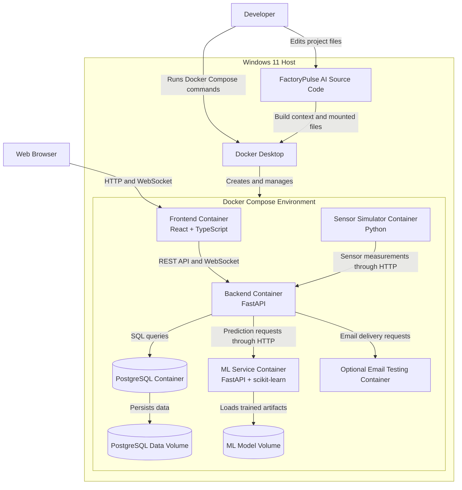

# FactoryPulse AI — Deployment Architecture

## 1. Purpose

This document describes how the FactoryPulse AI applications and infrastructure services are deployed and executed.

The initial deployment targets a Windows development computer using Docker Desktop and Docker Compose.

The deployment architecture is designed to:

- Keep services isolated
- Make the project easy to start and stop
- Provide consistent development environments
- Persist important application data
- Support future deployment to a cloud server
- Avoid unnecessary infrastructure complexity during the MVP

---

## 2. Initial Deployment Environment

FactoryPulse AI will initially run on a local Windows computer.

### Host environment

```text
Operating System: Windows 11
Container Platform: Docker Desktop
Container Orchestration: Docker Compose
Source Control: Git and GitHub
Development Environment: Visual Studio Code
```

All project source files remain inside the Windows project directory.

Example project location:

```text
D:\Projects\FactoryPulse-AI
```

The user accesses FactoryPulse AI through a web browser running on the Windows host.

---

## 3. Deployment Nodes

### 3.1 Windows Host

The Windows Host is the developer's physical computer.

Main responsibilities:

- Store the FactoryPulse AI source code
- Run Docker Desktop
- Run Docker Compose commands
- Provide access to the Web Application through a browser
- Provide access to development tools such as VS Code and Git
- Store local environment configuration

The application services run in containers managed by Docker Desktop.

---

### 3.2 Docker Environment

Docker Desktop provides the isolated runtime environment for FactoryPulse AI.

Docker Compose manages the following services:

- Frontend
- Backend API
- ML Service
- PostgreSQL Database
- Sensor Simulator
- Optional local email-testing service

All services belong to the same Docker Compose project.

---

## 4. Deployed Services

### 4.1 Frontend Service

**Technology:** React, TypeScript and Vite

The Frontend service provides the FactoryPulse AI Web Application.

Main responsibilities:

- Serve the user interface
- Send REST API requests to the Backend API
- Establish WebSocket connections
- Display dashboards, machines, measurements and alerts
- Display maintenance tasks and AI predictions

During development, the frontend may use the Vite development server.

A future production deployment may serve the compiled frontend through Nginx or another static web server.

---

### 4.2 Backend Service

**Technology:** Python and FastAPI

The Backend service provides the main FactoryPulse AI API.

Main responsibilities:

- Authenticate and authorize users
- Process business operations
- Receive sensor measurements
- Access PostgreSQL
- Communicate with the ML Service
- Manage WebSocket connections
- Request notification delivery
- Expose health-check endpoints

The Backend service is the central communication point of the platform.

---

### 4.3 ML Service

**Technology:** Python, FastAPI and scikit-learn

The ML Service provides anomaly-detection and failure-risk predictions.

Main responsibilities:

- Load trained models
- Preprocess prediction input
- Perform model inference
- Generate prediction explanations
- Return model and version information
- Expose a health-check endpoint

The ML Service communicates only with the Backend service.

It does not directly access the main PostgreSQL database.

---

### 4.4 PostgreSQL Service

**Technology:** PostgreSQL

The PostgreSQL service stores persistent application data.

Stored data includes:

- Users and roles
- Machines and sensors
- Sensor measurements
- Predictions
- Alerts
- Maintenance tasks
- Notifications
- Audit records

PostgreSQL data must be stored in a Docker volume so that it is not lost when containers are stopped or recreated.

---

### 4.5 Sensor Simulator Service

**Technology:** Python

The Sensor Simulator generates artificial industrial measurements.

Main responsibilities:

- Simulate machines and sensors
- Generate normal measurements
- Generate abnormal measurements
- Simulate gradual equipment degradation
- Send measurements to the Backend ingestion API

The simulator should begin sending data only after the Backend service becomes available.

---

### 4.6 Local Email-Testing Service

A local email-testing service may be included during development.

Main responsibilities:

- Receive email messages generated by FactoryPulse AI
- Display messages through a local web interface
- Allow alert-notification testing without sending real emails
- Avoid requiring a paid email provider

This service is optional for the first implementation.

---

## 5. Deployment Diagram



---

## 6. Docker Compose Services

The initial `docker-compose.yml` file is expected to define the following services:

```text
frontend
backend
ml-service
postgres
sensor-simulator
```

An optional email-testing service may be added later:

```text
mail
```

Each service should have:

- A clear service name
- Its own Dockerfile when required
- Environment-variable configuration
- Health checks where appropriate
- Restart behaviour
- Network configuration
- Volume configuration when persistent storage is required

---

## 7. Network Architecture

FactoryPulse AI services communicate through a private Docker network.

Example network:

```text
factorypulse-network
```

Services use Docker service names for internal communication.

Example internal addresses:

```text
http://backend:8000
http://ml-service:8001
postgres:5432
```

The frontend should communicate with the Backend API rather than accessing internal services directly.

The Backend API is allowed to communicate with:

- PostgreSQL
- ML Service
- Email-testing service

The Sensor Simulator is allowed to communicate with:

- Backend ingestion API

The ML Service is not allowed to modify application data directly.

---

## 8. Planned Port Exposure

Possible development ports are:

| Service | Container Port | Host Access |
|---|---:|---|
| Frontend | 5173 | Browser access |
| Backend API | 8000 | API development and documentation |
| ML Service | 8001 | Development diagnostics only |
| PostgreSQL | 5432 | Optional database administration |
| Email web interface | 8025 | Optional email testing |

These values are initial conventions and may be changed in the final Docker Compose configuration.

In a production deployment, internal services should not all be publicly exposed.

---

## 9. Persistent Storage

### 9.1 PostgreSQL Data Volume

PostgreSQL requires persistent storage.

Example volume:

```text
postgres-data
```

The volume stores database files outside the lifecycle of an individual PostgreSQL container.

Removing or rebuilding the PostgreSQL container should not remove the application database unless the volume is explicitly deleted.

---

### 9.2 ML Model Storage

Trained model artifacts must remain available to the ML Service.

Possible stored artifacts include:

- Anomaly-detection model
- Failure-risk prediction model
- Preprocessing pipeline
- Feature definitions
- Model metadata
- Explainability resources

Example model directory:

```text
ml-service\models\
```

During development, this directory may be mounted into the ML Service container.

---

## 10. Environment Configuration

Service configuration should be provided using environment variables.

Example configuration values include:

```text
DATABASE_URL
POSTGRES_DB
POSTGRES_USER
POSTGRES_PASSWORD
JWT_SECRET_KEY
ML_SERVICE_URL
BACKEND_API_URL
EMAIL_HOST
EMAIL_PORT
SENSOR_API_KEY
MODEL_PATH
LOG_LEVEL
```

Sensitive values must not be committed to GitHub.

A local `.env` file may be used for development.

The repository should include an example file:

```text
.env.example
```

The `.env.example` file contains variable names and safe example values but no real secrets.

---

## 11. Startup Dependencies

The services have the following logical startup order:

```text
PostgreSQL
    ↓
Backend API
    ↓
ML Service and Frontend
    ↓
Sensor Simulator
```

The actual deployment should use health checks rather than depending only on container startup order.

Examples:

- PostgreSQL reports that it is ready to accept connections
- Backend health endpoint returns a successful response
- ML Service confirms that its models are loaded
- Sensor Simulator waits until the Backend ingestion endpoint is available

---

## 12. Health Checks

Each important service should expose or provide a health check.

### Backend health check

Example endpoint:

```text
GET /health
```

It should indicate:

- Backend application status
- Database connectivity
- ML Service availability when required

### ML Service health check

Example endpoint:

```text
GET /health
```

It should indicate:

- ML Service status
- Model-loading status
- Active model versions

### PostgreSQL health check

PostgreSQL should use its database-readiness command.

Health checks allow Docker Compose and developers to identify unavailable or unhealthy services.

---

## 13. Logging

Each service should write structured logs to standard output.

Important log categories include:

- Application startup and shutdown
- Authentication failures
- API errors
- Invalid sensor measurements
- Database errors
- ML prediction failures
- Notification-delivery failures
- Simulator transmission errors

Logs must not contain:

- Plain-text passwords
- Authentication tokens
- Secret keys
- Sensitive personal data

During local development, logs can be viewed using Docker Compose commands.

---

## 14. Security Considerations

The local deployment should apply the following rules:

- Store secrets in environment variables
- Exclude `.env` from Git
- Use secure password hashing
- Validate sensor-ingestion requests
- Apply role-based authorization in the Backend
- Restrict database access
- Prevent direct frontend-to-database communication
- Prevent direct frontend-to-ML-Service communication
- Validate all API inputs
- Avoid exposing unnecessary service ports
- Record important actions in audit logs

HTTPS may not be required for isolated local development.

A future public deployment must use HTTPS.

---

## 15. Local Development Workflow

The expected local workflow is:

```text
1. Open the FactoryPulse-AI project on Windows
2. Start Docker Desktop
3. Open PowerShell in the project directory
4. Build and start the Docker Compose services
5. Open the Frontend in a web browser
6. Review service logs when required
7. Stop the services after development
```

Planned commands include:

```powershell
docker compose build
docker compose up
docker compose up -d
docker compose logs
docker compose down
```

The exact commands will be used after the service Dockerfiles and Docker Compose configuration are implemented.

---

## 16. Backup and Recovery

For the MVP, database backup may be performed manually.

Important backup targets include:

- PostgreSQL database
- ML model artifacts
- Environment configuration templates
- Source code stored on GitHub

The PostgreSQL Docker volume alone should not be considered a complete backup.

A later deployment may include scheduled database backups.

---

## 17. Future Production Deployment

The architecture should allow FactoryPulse AI to move from local development to a remote server later.

A future deployment may include:

- Linux cloud server
- Docker Compose or container orchestration
- Nginx reverse proxy
- HTTPS certificates
- Managed PostgreSQL
- Domain name
- Centralized logging
- Automated backups
- Continuous integration and deployment
- Monitoring and alerting tools

These capabilities are not required for the initial MVP.

---

## 18. Deployment Decisions

The initial deployment uses the following decisions:

- Run the project locally on Windows
- Keep project source files in the Windows filesystem
- Use Docker Desktop to run containers
- Use Docker Compose to coordinate services
- Use one private Docker network
- Store PostgreSQL data in a persistent volume
- Keep ML models outside disposable container layers
- Use environment variables for configuration
- Avoid paid cloud infrastructure during development
- Keep the architecture ready for future remote deployment

---

## 19. Related Documents

- [[System_Context.md]]
- [[03_Architecture/Container_Architecture|Container Architecture]]
- [[03_Architecture/Component_Architecture|Component Architecture]]
- [[02_Requirements/Software_Requirements_Specification|Software Requirements Specification]]
- [[02_Requirements/Non_Functional_Requirements|Non-Functional Requirements]]
