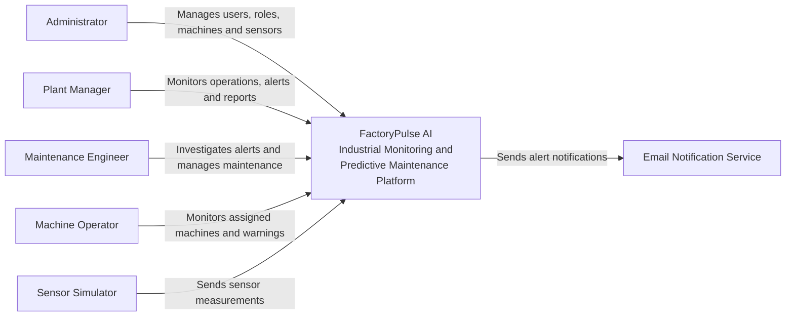

# FactoryPulse AI — System Context

## 1. Purpose

FactoryPulse AI is an industrial monitoring and predictive-maintenance platform.

The system collects machine sensor measurements, monitors equipment health, detects abnormal behaviour, predicts possible failures, generates alerts and helps maintenance teams manage interventions.

This document presents the system at the highest architectural level by identifying:

- The people who interact with FactoryPulse AI
- The external systems connected to it
- The main interactions between them

---

## 2. System in Scope

### FactoryPulse AI

FactoryPulse AI is responsible for:

- Receiving industrial sensor measurements
- Monitoring machines in near real time
- Detecting abnormal machine behaviour
- Predicting potential equipment failures
- Generating and managing alerts
- Supporting maintenance activities
- Displaying dashboards and reports
- Managing users, roles, machines and sensors
- Controlling access according to user permissions

Internal technical components such as the frontend, backend, database and machine-learning service are not shown in this document. They will be described in the Container Architecture.

---

## 3. Human Actors

### 3.1 Administrator

The Administrator manages the FactoryPulse AI platform.

Main interactions:

- Manage users and roles
- Register machines and sensors
- Configure platform settings
- Review audit information
- Access all system features

### 3.2 Plant Manager

The Plant Manager monitors factory operations and machine performance.

Main interactions:

- View the factory dashboard
- Monitor machine health
- Review alerts and AI predictions
- View maintenance performance
- Analyze reports and operational trends

### 3.3 Maintenance Engineer

The Maintenance Engineer investigates machine problems and manages maintenance interventions.

Main interactions:

- Review machine alerts
- Examine anomaly and failure predictions
- View AI prediction explanations
- Create and manage maintenance tasks
- Update intervention status
- Add maintenance notes
- Confirm completed interventions

### 3.4 Machine Operator

The Machine Operator monitors assigned equipment during daily operations.

Main interactions:

- View assigned machines
- Monitor current sensor measurements
- Review relevant warnings
- Acknowledge relevant alerts
- Report visible machine problems

---

## 4. External Systems

### 4.1 Sensor Simulator

The Sensor Simulator generates simulated industrial measurements because physical IoT sensors are not required for the initial version.

Example measurements include:

- Temperature
- Pressure
- Vibration
- Rotational speed
- Voltage
- Current
- Flow rate

The simulator sends these measurements to FactoryPulse AI through the sensor ingestion interface.

### 4.2 Email Notification Service

The Email Notification Service delivers important system notifications to users.

Example notifications include:

- Critical machine alerts
- Predicted equipment failures
- Assigned maintenance tasks
- Overdue maintenance interventions

During local development, this service may be simulated or replaced with a local email-testing solution.

---

## 5. System Context Diagram

## 6. System Boundary

### Inside the FactoryPulse AI boundary

- Machine and sensor management
- Sensor-data processing
- Machine-health monitoring
- Anomaly detection
- Failure-risk prediction
- Alert management
- Maintenance-task management
- Reporting and dashboards
- User and role management
- Audit logging

### Outside the FactoryPulse AI boundary

- Physical industrial machines
- Physical IoT sensors
- Email delivery infrastructure
- External ERP systems
- External cloud IoT platforms
- SMS providers
- External AI APIs

---

## 7. Future Integrations

Possible future integrations may include:

- Real industrial IoT sensors
- Programmable Logic Controllers
- Enterprise Resource Planning systems
- Computerized Maintenance Management Systems
- SMS notification providers
- Cloud IoT platforms
- External identity providers

These integrations are not part of the initial MVP.

---

## Related Documents

- [[Project_Charter]]
- [[02_Requirements/Business_Requirements|Business Requirements]]
- [[02_Requirements/Software_Requirements_Specification|Software Requirements Specification]]
- [[02_Requirements/Use_Cases|Use Cases]]
- [[03_Architecture/Container_Architecture|Container Architecture]]
