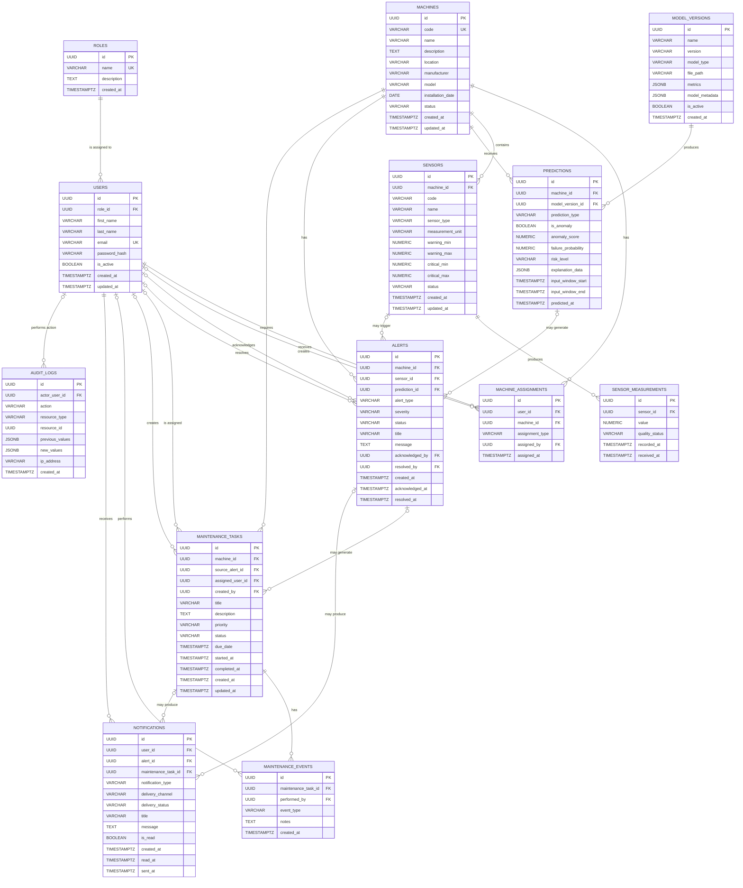

# FactoryPulse AI — Entity Relationship Diagram

## 1. Purpose

This document presents the logical Entity Relationship Diagram for the FactoryPulse AI MVP database.

It identifies:

- The thirteen main database entities
- Primary and foreign keys
- One-to-many and many-to-many relationships
- Required and optional relationships
- The main data dependencies between system domains

This diagram is a logical database model. Complete column definitions, PostgreSQL data types, defaults, constraints and indexes will be documented in the Database Schema and Data Dictionary.

---

## 2. Entity Relationship Diagram



---

## 3. Relationship Summary

### 3.1 Roles and Users

```text
One Role → Zero or many Users
One User → Exactly one Role
```

Every user must have one platform role.

The initial roles are:

- Administrator
- Plant Manager
- Maintenance Engineer
- Machine Operator

A role may exist before any users have been assigned to it.

---

### 3.2 Users and Machines

```text
One User → Zero or many Machine Assignments
One Machine → Zero or many Machine Assignments
```

Users and machines have a many-to-many relationship implemented through `machine_assignments`.

Example:

```text
Machine Operator A
  → Pump-001
  → Pump-002

Maintenance Engineer B
  → Pump-001
  → Compressor-003
```

The junction table may also record:

- The assignment type
- Who created the assignment
- When the assignment was created

A unique constraint should later prevent accidental duplicate assignments.

---

### 3.3 Machines and Sensors

```text
One Machine → Zero or many Sensors
One Sensor → Exactly one Machine
```

A machine can be registered before its sensors are configured.

A sensor cannot exist without belonging to a valid machine.

---

### 3.4 Sensors and Measurements

```text
One Sensor → Zero or many Measurements
One Measurement → Exactly one Sensor
```

Every accepted measurement must belong to one valid sensor.

A newly registered sensor may temporarily have no measurements.

The `sensor_measurements` table is expected to contain the largest number of records.

---

### 3.5 Machines, Models and Predictions

```text
One Machine → Zero or many Predictions
One Model Version → Zero or many Predictions

One Prediction → Exactly one Machine
One Prediction → Exactly one Model Version
```

Each prediction records:

- The machine being evaluated
- The model version used
- The prediction type
- The anomaly or failure-risk result
- The prediction time
- The evaluated input time window
- Structured explanation data when available

This preserves prediction traceability.

---

### 3.6 Machines, Sensors, Predictions and Alerts

```text
One Machine → Zero or many Alerts
One Alert → Exactly one Machine
```

Every alert belongs to a machine.

An alert may optionally reference:

- One sensor
- One prediction
- Neither, when it was created manually

Examples:

```text
Threshold alert
  → references a machine and sensor

AI anomaly alert
  → references a machine and prediction

Manual operator report
  → references a machine
```

A prediction or sensor may be associated with multiple alerts over time.

---

### 3.7 Users and Alert Actions

An alert may record the user who acknowledged it and the user who resolved it.

These relationships are optional because:

- A new alert has not yet been acknowledged
- An unresolved alert has no resolving user
- Some future automated actions may be performed by the system

The corresponding timestamps should only be present when those actions occur.

---

### 3.8 Machines, Alerts and Maintenance Tasks

```text
One Machine → Zero or many Maintenance Tasks
One Maintenance Task → Exactly one Machine
```

A maintenance task may optionally originate from an alert.

It can also be created manually without an alert.

Examples:

```text
Critical vibration alert
  → creates an inspection task

Planned preventive maintenance
  → created manually without an alert
```

A single alert may lead to multiple maintenance tasks when several interventions are required.

---

### 3.9 Users and Maintenance Tasks

A maintenance task may reference:

- The user assigned to perform the task
- The user who created the task

The assigned user may initially be empty while the task is awaiting assignment.

The creator may also be empty for a task automatically generated by the system.

---

### 3.10 Maintenance Tasks and Events

```text
One Maintenance Task → Zero or many Maintenance Events
One Maintenance Event → Exactly one Maintenance Task
```

Maintenance events preserve the complete task history.

Examples include:

- Task created
- Engineer assigned
- Work started
- Inspection note added
- Component replaced
- Task blocked
- Task completed

An event may reference the user who performed the action.

System-generated events may have no performing user.

---

### 3.11 Users and Notifications

```text
One User → Zero or many Notifications
One Notification → Exactly one User
```

Every notification has one recipient.

A notification may optionally be connected to:

- An alert
- A maintenance task
- Both
- Neither, for a general system notification

---

### 3.12 Users and Audit Logs

```text
One User → Zero or many Audit Logs
One Audit Log → Zero or one User
```

An audit record may identify the user responsible for an action.

The user relationship is optional because some audit events may be generated automatically by the system.

The `resource_type` and `resource_id` fields identify the affected record without requiring a separate foreign key for every possible resource type.

---

## 4. Required and Optional Relationships

| Relationship | Required? | Explanation |
|---|---|---|
| User → Role | Yes | Every user must have one role |
| Sensor → Machine | Yes | Every sensor belongs to one machine |
| Measurement → Sensor | Yes | Every measurement belongs to one sensor |
| Prediction → Machine | Yes | Every prediction evaluates one machine |
| Prediction → Model Version | Yes | Every prediction must identify its model |
| Alert → Machine | Yes | Every alert concerns one machine |
| Alert → Sensor | No | Not all alerts originate from a sensor |
| Alert → Prediction | No | Not all alerts originate from AI |
| Maintenance Task → Machine | Yes | Every task concerns one machine |
| Maintenance Task → Alert | No | Tasks may be created manually |
| Maintenance Task → Assigned User | No | A task may initially be unassigned |
| Maintenance Event → Task | Yes | Every event belongs to one task |
| Maintenance Event → User | No | Some events may be system-generated |
| Notification → User | Yes | Every notification needs a recipient |
| Notification → Alert | No | Not all notifications concern alerts |
| Notification → Maintenance Task | No | Not all notifications concern tasks |
| Audit Log → User | No | Some audit events are generated by the system |

---

## 5. Many-to-Many Relationship

The MVP contains one explicit many-to-many relationship:

```text
Users ↔ Machines
```

It is resolved through:

```text
machine_assignments
```

Conceptually:

```text
users
   ↓
machine_assignments
   ↓
machines
```

This allows:

- One user to be assigned to multiple machines
- One machine to be assigned to multiple users
- Assignment metadata to be stored
- Role-specific machine access to be enforced

---

## 6. Important Integrity Rules

The detailed database schema should enforce the following rules:

- Role names must be unique
- User email addresses must be unique
- Machine codes must be unique
- A sensor code should be unique within its machine
- Every user must reference an existing role
- Every sensor must reference an existing machine
- Every measurement must reference an existing sensor
- Every prediction must reference an existing machine and model version
- Every alert must reference an existing machine
- Every maintenance task must reference an existing machine
- Every maintenance event must reference an existing task
- Every notification must reference an existing user
- Failure probabilities must remain between `0` and `1`
- Anomaly scores must follow the selected model's expected range
- Threshold minimum values should not exceed their corresponding maximum values
- Resolved alerts should include a resolution timestamp
- Completed maintenance tasks should include a completion timestamp
- Duplicate active machine assignments should be prevented

The Backend API may enforce additional business rules that cannot be expressed cleanly through database constraints alone.

---

## 7. Deletion Behaviour Principles

Detailed foreign-key deletion actions will be defined in the Database Schema.

The initial principles are:

### Roles

A role should not be deleted while users reference it.

### Users

Users should normally be deactivated rather than permanently deleted.

Historical assignments, alert actions, maintenance events and audit records should be preserved.

### Machines

Machines should normally be marked as decommissioned rather than deleted.

Measurements, predictions, alerts and maintenance history must remain traceable.

### Sensors

Sensors should normally be marked as inactive or retired when historical measurements exist.

### Measurements

Measurements should not be automatically deleted when a sensor is deactivated.

### Predictions and Alerts

Prediction and alert history should be preserved.

### Maintenance Tasks and Events

Maintenance records should remain available for operational traceability.

### Audit Logs

Audit logs should be append-only and should not be modified by normal users.

---

## 8. Diagram Scope

The ER diagram represents the MVP database only.

The following possible future entities are intentionally excluded:

- Factories
- Production lines
- Equipment categories
- Detailed permission tables
- Refresh-token sessions
- Sensor calibration records
- Spare parts
- Inventory transactions
- Suppliers
- Work schedules
- ERP integration records
- CMMS integration records
- Data-retention policies
- Multi-tenant organizations

These entities should only be introduced when confirmed requirements justify them.

---

## 9. Next Design Step

The next database document will be:

```text
Database_Schema.md
```

It will define:

- Every table
- Every column
- PostgreSQL data types
- Primary and foreign keys
- Required and optional fields
- Default values
- Unique constraints
- Check constraints
- Foreign-key deletion behaviour

---

## 10. Related Documents

- [[04_Database/Database_Overview|Database Overview]]
- [[03_Architecture/Architecture_Overview|Architecture Overview]]
- [[03_Architecture/Component_Architecture|Component Architecture]]
- [[02_Requirements/Software_Requirements_Specification|Software Requirements Specification]]
- [[02_Requirements/Functional_Requirements|Functional Requirements]]
- [[02_Requirements/Non_Functional_Requirements|Non-Functional Requirements]]
- [[02_Requirements/Use_Cases|Use Cases]]
- [[Database_Schema]]
- [[Data_Dictionary]]
- [[Indexing_Strategy]]
- [[Migration_and_Seed_Strategy]]

