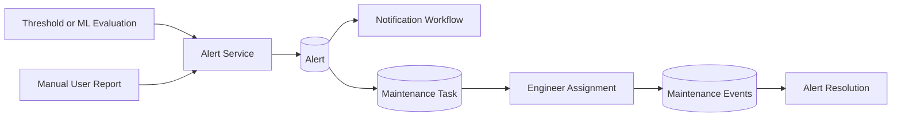
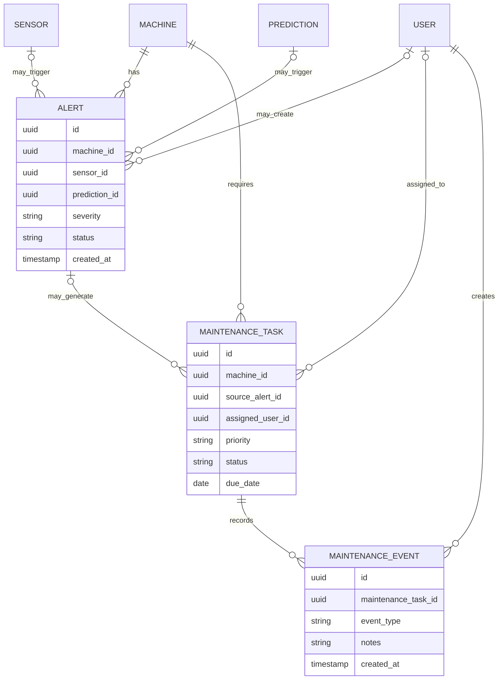

# FactoryPulse AI — Alert and Maintenance API

## 1. Purpose

This document defines the FactoryPulse AI API for:

- Automatic and manual alert creation
- Alert retrieval and filtering
- Alert acknowledgement and investigation
- Alert resolution and closure
- Alert deduplication and escalation
- Maintenance-task creation
- Maintenance-task assignment
- Maintenance workflow transitions
- Maintenance-event history
- Machine-level authorization
- Alert-to-maintenance traceability
- Auditing, transactions and error handling

Sensor measurements, threshold evaluation and ML predictions are defined in `Monitoring_and_Prediction_API.md`.

User roles and machine assignments are defined in `User_and_Access_API.md`.

---

## 2. Scope

This API manages two connected operational domains:

```text
Alerts
    ↓
Maintenance tasks
    ↓
Maintenance events
```

An alert identifies a condition that requires attention.

A maintenance task defines work that should be performed.

A maintenance event records an action or development during the task’s lifecycle.

Not every alert requires a maintenance task.

Not every maintenance task must originate from an alert.

Examples of independent maintenance tasks include:

- Preventive inspection
- Scheduled lubrication
- Sensor calibration
- Component replacement
- Post-maintenance verification

---

## 3. Operational Flow



The Backend API is responsible for:

- Validating alert conditions
- Avoiding unnecessary duplicate alerts
- Enforcing alert-status transitions
- Creating linked maintenance work
- Assigning authorized engineers
- Preserving maintenance history
- Restricting access to permitted machines
- Publishing real-time events
- Creating notifications where required
- Recording important actions in audit logs

---

## 4. Resource Relationships



An alert always belongs to one machine.

An alert may also reference:

- A sensor
- A prediction
- A user who reported the issue

A maintenance task always belongs to one machine.

A maintenance task may reference one source alert.

A maintenance task contains an append-only sequence of maintenance events.

---

## 5. Alert Sources

Alerts may originate from:

| Source | Meaning |
|---|---|
| `threshold` | A sensor measurement crossed a configured threshold |
| `prediction` | An ML prediction indicated significant machine risk |
| `manual` | An authorized user reported an operational issue |
| `system` | The platform detected an internal operational condition |

The source may be derived from the alert’s relationships.

Examples:

```text
sensor_id present
    → threshold or sensor-related alert

prediction_id present
    → prediction alert

created_by_user_id present without sensor or prediction
    → manual alert
```

The API response may expose a derived `source` field even when the database stores the relationships separately.

---

## 6. Alert Severity Values

Supported alert severities are:

| Severity | Meaning |
|---|---|
| `low` | Minor condition requiring awareness |
| `medium` | Condition requiring planned investigation |
| `high` | Serious condition requiring prompt action |
| `critical` | Immediate operational attention is required |

Severity should be based on:

- Threshold state
- Prediction risk level
- Operational consequences
- Machine status
- Confirmed human assessment

Severity must not be chosen merely to create visually dramatic dashboard results.

---

## 7. Alert Status Values

Supported alert statuses are:

| Status | Meaning |
|---|---|
| `open` | Alert has been created and has not been acknowledged |
| `acknowledged` | An authorized user has confirmed awareness |
| `in_progress` | Investigation or corrective action is underway |
| `resolved` | The condition has been addressed or is no longer present |
| `closed` | The alert lifecycle has been formally completed |

Active alert statuses are:

```text
open
acknowledged
in_progress
```

Historical alert statuses are:

```text
resolved
closed
```

Resolved and closed alerts remain stored for traceability.

---

## 8. Alert Transition Rules

The normal alert lifecycle is:

```text
open
    ↓
acknowledged
    ↓
in_progress
    ↓
resolved
    ↓
closed
```

Supported transitions include:

```text
open → acknowledged
acknowledged → in_progress
acknowledged → resolved
in_progress → resolved
resolved → in_progress
resolved → closed
```

The transition:

```text
resolved → in_progress
```

may be used when the issue returns before formal closure.

A closed alert is final during the MVP.

The normal API must not reopen a closed alert.

A new alert should be created when the condition appears again after closure.

---

## 9. Maintenance Priority Values

Supported maintenance-task priorities are:

| Priority | Meaning |
|---|---|
| `low` | Work may be scheduled when resources are available |
| `medium` | Work should be planned within the normal maintenance schedule |
| `high` | Work should be handled promptly |
| `urgent` | Immediate or near-immediate intervention is required |

The priority may initially be derived from alert severity:

| Alert Severity | Suggested Priority |
|---|---|
| `low` | `low` |
| `medium` | `medium` |
| `high` | `high` |
| `critical` | `urgent` |

An authorized user may adjust the priority when operational context justifies it.

---

## 10. Maintenance Task Status Values

Supported task statuses are:

| Status | Meaning |
|---|---|
| `open` | Task exists but has not yet been assigned |
| `assigned` | Task has an assigned Maintenance Engineer |
| `in_progress` | Work has started |
| `blocked` | Work cannot continue temporarily |
| `completed` | Required maintenance work has been completed |
| `cancelled` | Task was stopped without completion |

Completed and cancelled tasks remain stored.

They are not deleted from the public API.

---

## 11. Maintenance Task Transition Rules

The normal maintenance workflow is:

```text
open
    ↓
assigned
    ↓
in_progress
    ↓
completed
```

A blocked workflow may use:

```text
in_progress
    ↓
blocked
    ↓
in_progress
    ↓
completed
```

Supported transitions include:

```text
open → assigned
assigned → in_progress
in_progress → blocked
blocked → in_progress
in_progress → completed
open → cancelled
assigned → cancelled
in_progress → cancelled
blocked → cancelled
```

The following are final during the MVP:

```text
completed
cancelled
```

A completed or cancelled task must not return to an active state through the normal API.

A new task should be created when additional work is required.

---

## 12. Authorization Overview

### Administrator

May:

- View all alerts
- Create manual alerts
- Acknowledge and investigate alerts
- Resolve and close alerts
- Create maintenance tasks
- Assign or reassign tasks
- Update maintenance-task information
- Add maintenance events
- Cancel tasks
- View all maintenance history

### Plant Manager

May:

- View all operational alerts
- Create manual alerts
- Acknowledge and investigate alerts
- Resolve and close alerts
- Create maintenance tasks
- Assign or reassign tasks
- Set priorities and due dates
- Review maintenance progress
- Cancel tasks where justified

### Maintenance Engineer

May, for assigned machines or assigned tasks:

- View alerts
- Acknowledge alerts
- Begin alert investigation
- Resolve alerts after corrective work
- View assigned maintenance tasks
- Start, block, resume and complete assigned tasks
- Add maintenance notes and intervention events

A Maintenance Engineer may not normally:

- Assign tasks to other users
- Close alerts formally
- Cancel tasks without managerial authorization

### Machine Operator

May, for assigned machines:

- View alerts
- Create manual alerts
- Acknowledge alerts
- View relevant maintenance status

A Machine Operator may not:

- Resolve or close alerts
- Create or assign maintenance tasks
- Modify maintenance workflow state
- View sensitive engineering notes where restricted

---

## 13. Endpoint Summary

### 13.1 Alert Endpoints

| Method | Endpoint | Purpose |
|---|---|---|
| `POST` | `/api/v1/alerts` | Create a manual alert |
| `GET` | `/api/v1/alerts` | Retrieve accessible alerts |
| `GET` | `/api/v1/alerts/{alert_id}` | Retrieve one alert |
| `POST` | `/api/v1/alerts/{alert_id}/acknowledgements` | Acknowledge an alert |
| `POST` | `/api/v1/alerts/{alert_id}/investigations` | Move an alert into investigation |
| `POST` | `/api/v1/alerts/{alert_id}/resolutions` | Resolve an alert |
| `POST` | `/api/v1/alerts/{alert_id}/closures` | Close a resolved alert |

Alert status changes use explicit lifecycle endpoints instead of allowing unrestricted status changes through a generic `PATCH`.

---

### 13.2 Maintenance Task Endpoints

| Method | Endpoint | Purpose |
|---|---|---|
| `POST` | `/api/v1/maintenance-tasks` | Create a maintenance task |
| `GET` | `/api/v1/maintenance-tasks` | Retrieve accessible tasks |
| `GET` | `/api/v1/maintenance-tasks/{task_id}` | Retrieve one task |
| `PATCH` | `/api/v1/maintenance-tasks/{task_id}` | Update administrative task information |
| `GET` | `/api/v1/maintenance-tasks/{task_id}/events` | Retrieve task history |
| `POST` | `/api/v1/maintenance-tasks/{task_id}/events` | Add an event or perform a workflow transition |

Permanent task or event deletion is not exposed through the public API.

---

## 14. Alert Response Model

An alert response may use:

```json
{
  "id": "6c01895f-d712-4391-89fc-02a8127548a3",
  "machine": {
    "id": "2c1f7f02-3b4f-4e75-b517-9636f06c43c0",
    "code": "PUMP-001",
    "name": "Main Cooling Pump"
  },
  "sensor": {
    "id": "6f3d4cf1-4914-44df-93b8-5311e8d16855",
    "code": "TEMP-001",
    "sensor_type": "temperature"
  },
  "prediction": {
    "id": "458139e4-f383-4360-a4d1-54d899c2e6a9",
    "risk_level": "high"
  },
  "source": "prediction",
  "title": "Elevated cooling-pump failure risk",
  "description": "Recent temperature and vibration patterns indicate increased failure risk.",
  "severity": "high",
  "status": "open",
  "created_by": null,
  "acknowledged_by": null,
  "acknowledged_at": null,
  "resolved_by": null,
  "resolved_at": null,
  "created_at": "2026-08-01T17:31:00Z",
  "updated_at": "2026-08-01T17:31:00Z"
}
```

Nullable relationships may be omitted or returned as `null`.

The exact response fields must remain aligned with the implemented database and Pydantic models.

---

# 15. Create Manual Alert

## 15.1 Endpoint

```http
POST /api/v1/alerts
```

### Authentication

```text
Bearer access token required
```

### Permission

```text
Any user authorized to access the selected machine
```

### Purpose

Creates a manual alert when a user observes a condition not automatically detected by the system.

Examples:

- Unusual machine noise
- Oil leakage
- Unexpected vibration
- Burning smell
- Visible mechanical damage
- Repeated restart failure

---

## 15.2 Request Body

```json
{
  "machine_id": "2c1f7f02-3b4f-4e75-b517-9636f06c43c0",
  "sensor_id": null,
  "title": "Unusual mechanical noise",
  "description": "A repeated metallic noise was observed near the pump housing.",
  "severity": "medium"
}
```

### Request Fields

| Field | Type | Required | Rules |
|---|---|---:|---|
| `machine_id` | UUID | Yes | User must have access to the machine |
| `sensor_id` | UUID or `null` | No | Must belong to the selected machine |
| `title` | String | Yes | Clear summary, maximum 200 characters |
| `description` | String | Yes | Meaningful operational description |
| `severity` | String | Yes | Supported severity value |

A user must not manually provide:

```text
prediction_id
status
acknowledged_by
resolved_by
created_by
created_at
```

These fields are controlled by the Backend.

---

## 15.3 Processing Rules

The Backend API must:

1. Authenticate the user.
2. Verify machine-level access.
3. Validate the machine.
4. Validate the optional sensor relationship.
5. Validate the severity.
6. Check for an obvious active duplicate.
7. Create the alert with status `open`.
8. Record the creating user.
9. Start notification evaluation.
10. Publish an authorized real-time event.
11. Record an audit event.
12. Return the created alert.

---

## 15.4 Successful Response

```text
201 Created
```

```json
{
  "data": {
    "id": "6c01895f-d712-4391-89fc-02a8127548a3",
    "machine": {
      "id": "2c1f7f02-3b4f-4e75-b517-9636f06c43c0",
      "code": "PUMP-001",
      "name": "Main Cooling Pump"
    },
    "sensor": null,
    "source": "manual",
    "title": "Unusual mechanical noise",
    "description": "A repeated metallic noise was observed near the pump housing.",
    "severity": "medium",
    "status": "open",
    "created_by": {
      "id": "550e8400-e29b-41d4-a716-446655440000",
      "first_name": "Amine",
      "last_name": "Bennani"
    },
    "created_at": "2026-08-01T17:31:00Z",
    "updated_at": "2026-08-01T17:31:00Z"
  }
}
```

---

## 15.5 Invalid Sensor Relationship

When the selected sensor does not belong to the selected machine:

```text
400 Bad Request
```

```json
{
  "error": {
    "code": "sensor_machine_mismatch",
    "message": "The selected sensor does not belong to the selected machine.",
    "details": [],
    "request_id": "req_01J4A7QAX4N12Q3X5F20R8T9MN"
  }
}
```

---

# 16. Automatic Alert Creation

Automatic alert creation is initiated internally by:

- Threshold evaluation
- ML prediction evaluation
- System-health evaluation

It is not exposed as an unrestricted public endpoint.

Conceptual flow:

```text
Measurement or prediction stored
    ↓
Alert rules evaluated
    ↓
Existing active alerts checked
    ↓
Create, suppress or escalate alert
    ↓
Create notifications
    ↓
Publish real-time event
```

Automatic alert creation must use database transactions where alert and related state must remain consistent.

---

## 17. Alert Deduplication

Continuous sensor ingestion may repeatedly detect the same condition.

The Backend should avoid creating a new alert for every measurement.

Before creating an automatic alert, it should check for an active alert with matching characteristics such as:

- Same machine
- Same sensor where applicable
- Same alert source category
- Same operational condition
- Active status
- Recent creation or update time

When a matching active alert exists, the Backend may:

- Keep the existing alert
- Escalate its severity when risk increases
- Update its latest operational context
- Create a new notification only when required
- Record the repeated condition operationally

It should not create unnecessary duplicate active alerts.

A new alert may be created when:

- The previous alert was closed
- The condition is operationally different
- The source is different
- The previous condition occurred outside the configured suppression window
- A higher-level condition requires separate investigation

---

## 18. Alert Escalation

An active alert may increase in severity.

Example:

```text
medium → high
high → critical
```

Automatic severity escalation may occur when:

- A threshold changes from warning to critical
- Failure probability rises significantly
- A machine changes to a more serious status
- Repeated evidence confirms worsening behaviour

Severity escalation should:

- Preserve the existing alert identity where appropriate
- Update the alert severity
- Record the previous and new severity
- Generate a new notification when required
- Publish an `alert.updated` event
- Create an audit or operational event

Automatic severity reduction should be avoided.

A Plant Manager or Administrator may reduce severity only with a documented reason where the API later supports that operation.

---

# 19. Retrieve Alerts

## 19.1 Endpoint

```http
GET /api/v1/alerts
```

### Authentication

```text
Bearer access token required
```

### Access Behaviour

Administrators and Plant Managers may retrieve all alerts.

Maintenance Engineers and Machine Operators receive alerts only for machines they are authorized to access.

---

## 19.2 Query Parameters

Supported parameters:

```text
machine_id
sensor_id
prediction_id
source
severity
status
start_time
end_time
limit
cursor
sort
```

Example:

```text
GET /api/v1/alerts
    ?machine_id=2c1f7f02-3b4f-4e75-b517-9636f06c43c0
    &severity=high,critical
    &status=open,acknowledged,in_progress
    &limit=50
```

Default sorting:

```text
-created_at
```

The endpoint uses cursor-based pagination.

---

## 19.3 Successful Response

```text
200 OK
```

```json
{
  "data": [
    {
      "id": "6c01895f-d712-4391-89fc-02a8127548a3",
      "machine": {
        "id": "2c1f7f02-3b4f-4e75-b517-9636f06c43c0",
        "code": "PUMP-001",
        "name": "Main Cooling Pump"
      },
      "source": "prediction",
      "title": "Elevated cooling-pump failure risk",
      "severity": "high",
      "status": "open",
      "created_at": "2026-08-01T17:31:00Z",
      "updated_at": "2026-08-01T17:31:00Z"
    }
  ],
  "meta": {
    "limit": 50,
    "next_cursor": null,
    "has_more": false
  }
}
```

---

# 20. Retrieve One Alert

## 20.1 Endpoint

```http
GET /api/v1/alerts/{alert_id}
```

### Permission

```text
Any user authorized to access the alert’s machine
```

### Successful Response

```text
200 OK
```

The response contains the detailed alert representation and may include a summary of linked maintenance tasks.

---

## 20.2 Alert Not Found

```text
404 Not Found
```

```json
{
  "error": {
    "code": "alert_not_found",
    "message": "The requested alert does not exist or is not accessible.",
    "details": [],
    "request_id": "req_01J4A7QAX4N12Q3X5F20R8T9MN"
  }
}
```

---

# 21. Acknowledge Alert

## 21.1 Endpoint

```http
POST /api/v1/alerts/{alert_id}/acknowledgements
```

### Permission

```text
Any user authorized to access the alert’s machine
```

### Request Body

```json
{
  "note": "The alert has been reviewed and the machine is being observed."
}
```

The note may be optional.

---

## 21.2 Processing Rules

The Backend must verify:

- The alert exists.
- The user can access the machine.
- The current status is `open`.
- The user account remains active.
- The acknowledgement is recorded with the user and timestamp.

Successful acknowledgement changes:

```text
open → acknowledged
```

---

## 21.3 Successful Response

```text
200 OK
```

The response contains the updated alert.

---

## 21.4 Invalid Transition

```text
409 Conflict
```

```json
{
  "error": {
    "code": "invalid_alert_transition",
    "message": "This alert cannot be acknowledged from its current status.",
    "details": [
      {
        "current_status": "resolved",
        "requested_status": "acknowledged"
      }
    ],
    "request_id": "req_01J4A7QAX4N12Q3X5F20R8T9MN"
  }
}
```

---

# 22. Start Alert Investigation

## 22.1 Endpoint

```http
POST /api/v1/alerts/{alert_id}/investigations
```

### Permission

```text
Administrator
Plant Manager
Maintenance Engineer with machine access
```

### Request Body

```json
{
  "note": "Initial inspection indicates possible bearing wear."
}
```

---

## 22.2 Valid Transitions

```text
acknowledged → in_progress
resolved → in_progress
```

The second transition represents reopening an issue before formal closure.

---

## 22.3 Successful Response

```text
200 OK
```

The response contains the updated alert.

Starting an investigation does not automatically create a maintenance task.

The user may create a linked task separately when physical intervention is required.

---

# 23. Resolve Alert

## 23.1 Endpoint

```http
POST /api/v1/alerts/{alert_id}/resolutions
```

### Permission

```text
Administrator
Plant Manager
Maintenance Engineer with machine access
```

### Request Body

```json
{
  "resolution_summary": "The pump bearing was replaced and vibration returned to its normal range."
}
```

The resolution summary is required.

---

## 23.2 Valid Transitions

```text
acknowledged → resolved
in_progress → resolved
```

Resolution means that an authorized user believes the condition has been addressed.

It does not delete:

- The alert
- The source prediction
- The source measurement
- Maintenance history
- Notifications
- Audit records

---

## 23.3 Maintenance Validation

When the alert has active linked maintenance tasks, the Backend should verify that they are:

```text
completed
cancelled
```

An alert should not normally be resolved while linked maintenance work remains:

```text
open
assigned
in_progress
blocked
```

Example conflict:

```text
409 Conflict
```

```json
{
  "error": {
    "code": "alert_has_active_maintenance",
    "message": "The alert cannot be resolved while linked maintenance work remains active.",
    "details": [
      {
        "maintenance_task_id": "8b57c604-319d-4f18-b655-872b37b173a2",
        "status": "in_progress"
      }
    ],
    "request_id": "req_01J4A7QAX4N12Q3X5F20R8T9MN"
  }
}
```

---

## 23.4 Successful Response

```text
200 OK
```

The response contains the resolved alert, resolving user and resolution timestamp.

---

# 24. Close Alert

## 24.1 Endpoint

```http
POST /api/v1/alerts/{alert_id}/closures
```

### Permission

```text
Administrator
Plant Manager
```

### Request Body

```json
{
  "note": "Post-maintenance monitoring confirms stable operation."
}
```

---

## 24.2 Valid Transition

```text
resolved → closed
```

Closing an alert represents formal completion of the operational workflow.

A closed alert is immutable through the normal MVP API.

---

## 24.3 Successful Response

```text
200 OK
```

The response contains the closed alert.

---

## 25. Alert Immutability and History

The API must not allow users to:

- Delete alerts
- Change alert source relationships arbitrarily
- Replace historical timestamps
- Replace the user who acknowledged or resolved the alert
- Return a closed alert to an active state
- Modify prediction results through the alert API

Corrections should use:

- New alerts
- New maintenance events
- Additional resolution information
- Controlled administrative data-repair procedures

Historical meaning must be preserved.

---

## 26. Maintenance Task Response Model

A maintenance-task response may use:

```json
{
  "id": "8b57c604-319d-4f18-b655-872b37b173a2",
  "machine": {
    "id": "2c1f7f02-3b4f-4e75-b517-9636f06c43c0",
    "code": "PUMP-001",
    "name": "Main Cooling Pump"
  },
  "source_alert": {
    "id": "6c01895f-d712-4391-89fc-02a8127548a3",
    "title": "Elevated cooling-pump failure risk",
    "severity": "high"
  },
  "title": "Inspect and replace pump bearing",
  "description": "Inspect the bearing assembly and replace damaged components.",
  "priority": "high",
  "status": "assigned",
  "assigned_user": {
    "id": "550e8400-e29b-41d4-a716-446655440000",
    "first_name": "Amine",
    "last_name": "Bennani",
    "role": "maintenance_engineer"
  },
  "due_date": "2026-08-02",
  "started_at": null,
  "completed_at": null,
  "created_by": {
    "id": "50f907c1-61c8-4502-977d-fe347c2e1093",
    "first_name": "Sara",
    "last_name": "Alaoui"
  },
  "created_at": "2026-08-01T17:40:00Z",
  "updated_at": "2026-08-01T17:40:00Z"
}
```

The exact fields must remain aligned with the database schema.

---

# 27. Create Maintenance Task

## 27.1 Endpoint

```http
POST /api/v1/maintenance-tasks
```

### Authentication

```text
Bearer access token required
```

### Permission

```text
Administrator
Plant Manager
```

### Purpose

Creates corrective, preventive or inspection work for a machine.

---

## 27.2 Request Body

```json
{
  "machine_id": "2c1f7f02-3b4f-4e75-b517-9636f06c43c0",
  "source_alert_id": "6c01895f-d712-4391-89fc-02a8127548a3",
  "title": "Inspect and replace pump bearing",
  "description": "Inspect the bearing assembly and replace damaged components.",
  "priority": "high",
  "assigned_user_id": "550e8400-e29b-41d4-a716-446655440000",
  "due_date": "2026-08-02"
}
```

### Request Fields

| Field | Type | Required | Rules |
|---|---|---:|---|
| `machine_id` | UUID | Yes | Must reference an active machine |
| `source_alert_id` | UUID or `null` | No | Alert must belong to the same machine |
| `title` | String | Yes | Clear work summary |
| `description` | String | Yes | Meaningful work instructions |
| `priority` | String | Yes | Supported priority |
| `assigned_user_id` | UUID or `null` | No | Must be an eligible Maintenance Engineer |
| `due_date` | Date or `null` | No | Must be appropriate for task priority |

---

## 27.3 Initial Status

When no engineer is assigned:

```text
status = open
```

When an engineer is assigned during creation:

```text
status = assigned
```

The Backend controls the initial status.

Clients must not provide it directly.

---

## 27.4 Validation Rules

The Backend must verify:

- The machine exists.
- The machine is not decommissioned.
- The optional source alert exists.
- The source alert belongs to the same machine.
- The priority is supported.
- The due date is valid.
- The assigned user exists.
- The assigned user is active.
- The assigned user has the `maintenance_engineer` role.
- The engineer is assigned to the machine where required.
- An equivalent active task does not already exist for the source alert.
- The requester has permission.

---

## 27.5 Successful Response

```text
201 Created
```

The response contains the created task.

Task creation should also create an initial maintenance event such as:

```text
task_created
```

When an engineer is selected, it should also record:

```text
assigned
```

---

## 27.6 Alert and Machine Mismatch

```text
400 Bad Request
```

```json
{
  "error": {
    "code": "alert_machine_mismatch",
    "message": "The selected alert does not belong to the selected machine.",
    "details": [],
    "request_id": "req_01J4A7QAX4N12Q3X5F20R8T9MN"
  }
}
```

---

## 27.7 Invalid Assignee

```text
400 Bad Request
```

```json
{
  "error": {
    "code": "invalid_maintenance_assignee",
    "message": "The selected user cannot be assigned to this maintenance task.",
    "details": [
      {
        "reason": "The user is not an active Maintenance Engineer assigned to this machine."
      }
    ],
    "request_id": "req_01J4A7QAX4N12Q3X5F20R8T9MN"
  }
}
```

---

## 27.8 Duplicate Active Task

```text
409 Conflict
```

```json
{
  "error": {
    "code": "duplicate_active_maintenance_task",
    "message": "An active maintenance task already exists for this alert and machine.",
    "details": [
      {
        "maintenance_task_id": "8b57c604-319d-4f18-b655-872b37b173a2"
      }
    ],
    "request_id": "req_01J4A7QAX4N12Q3X5F20R8T9MN"
  }
}
```

---

# 28. Retrieve Maintenance Tasks

## 28.1 Endpoint

```http
GET /api/v1/maintenance-tasks
```

### Access Behaviour

Administrators and Plant Managers may retrieve all tasks.

Maintenance Engineers receive:

- Tasks assigned to them
- Tasks for machines they are permitted to access, where operational visibility is required

Machine Operators receive only limited maintenance status related to their assigned machines.

The API may use a reduced response model for Machine Operators.

---

## 28.2 Query Parameters

Supported parameters:

```text
machine_id
source_alert_id
assigned_user_id
priority
status
due_before
due_after
page
page_size
sort
search
```

Example:

```text
GET /api/v1/maintenance-tasks
    ?assigned_user_id=550e8400-e29b-41d4-a716-446655440000
    &status=assigned,in_progress,blocked
    &sort=due_date
    &page=1
    &page_size=20
```

---

## 28.3 Searchable Fields

The `search` parameter may search:

```text
title
description
machine code
machine name
```

Search should be case-insensitive.

---

## 28.4 Sortable Fields

Approved fields include:

```text
priority
status
due_date
created_at
updated_at
```

Default sorting should prioritize active urgent work.

Conceptually:

```text
priority descending
due_date ascending
created_at descending
```

The implementation must use an explicit priority ordering rather than alphabetical ordering.

---

## 28.5 Successful Response

```text
200 OK
```

```json
{
  "data": [
    {
      "id": "8b57c604-319d-4f18-b655-872b37b173a2",
      "machine": {
        "id": "2c1f7f02-3b4f-4e75-b517-9636f06c43c0",
        "code": "PUMP-001",
        "name": "Main Cooling Pump"
      },
      "title": "Inspect and replace pump bearing",
      "priority": "high",
      "status": "assigned",
      "assigned_user": {
        "id": "550e8400-e29b-41d4-a716-446655440000",
        "first_name": "Amine",
        "last_name": "Bennani"
      },
      "due_date": "2026-08-02",
      "created_at": "2026-08-01T17:40:00Z",
      "updated_at": "2026-08-01T17:40:00Z"
    }
  ],
  "meta": {
    "page": 1,
    "page_size": 20,
    "total_items": 1,
    "total_pages": 1
  }
}
```

---

# 29. Retrieve One Maintenance Task

## 29.1 Endpoint

```http
GET /api/v1/maintenance-tasks/{task_id}
```

### Permission

The user must be permitted to access the task’s machine or be the assigned engineer.

### Successful Response

```text
200 OK
```

The response contains:

- Task information
- Machine summary
- Source alert summary
- Assigned engineer
- Current status
- Important timestamps
- Recent or complete event history where appropriate

---

## 29.2 Task Not Found

```text
404 Not Found
```

```json
{
  "error": {
    "code": "maintenance_task_not_found",
    "message": "The requested maintenance task does not exist or is not accessible.",
    "details": [],
    "request_id": "req_01J4A7QAX4N12Q3X5F20R8T9MN"
  }
}
```

---

# 30. Update Maintenance Task

## 30.1 Endpoint

```http
PATCH /api/v1/maintenance-tasks/{task_id}
```

### Permission

```text
Administrator
Plant Manager
```

### Supported Fields

```text
title
description
priority
assigned_user_id
due_date
```

The following are read-only through this endpoint:

```text
id
machine_id
source_alert_id
status
started_at
completed_at
created_at
updated_at
created_by
```

Status transitions use maintenance events.

---

## 30.2 Example Request

```json
{
  "assigned_user_id": "550e8400-e29b-41d4-a716-446655440000",
  "priority": "urgent",
  "due_date": "2026-08-01"
}
```

---

## 30.3 Assignment Behaviour

Assigning an engineer to an `open` task changes:

```text
open → assigned
```

Reassigning an active task should:

- Validate the new engineer
- Record the previous engineer
- Record the new engineer
- Create a `reassigned` maintenance event
- Notify the relevant users
- Preserve existing task history

A completed or cancelled task must not be reassigned.

---

## 30.4 Removing an Assignee

Removing the assignee may be permitted only when the task is:

```text
assigned
```

and work has not started.

The task then returns to:

```text
open
```

An `in_progress` or `blocked` task must be reassigned rather than silently made unassigned.

---

## 30.5 Successful Response

```text
200 OK
```

The response contains the updated task.

---

# 31. Maintenance Event Model

A maintenance event may use:

```json
{
  "id": "d8b492cd-1098-4ae1-a2ba-265bf4d38c90",
  "maintenance_task_id": "8b57c604-319d-4f18-b655-872b37b173a2",
  "event_type": "started",
  "notes": "Inspection started after the machine was safely isolated.",
  "created_by": {
    "id": "550e8400-e29b-41d4-a716-446655440000",
    "first_name": "Amine",
    "last_name": "Bennani"
  },
  "created_at": "2026-08-01T18:00:00Z"
}
```

Maintenance events are chronological, append-only records.

---

## 32. Maintenance Event Types

Supported event types include:

| Event Type | Status Effect |
|---|---|
| `task_created` | Establishes the initial task |
| `assigned` | `open → assigned` |
| `reassigned` | Assigned user changes |
| `started` | `assigned → in_progress` |
| `note_added` | No status change |
| `inspection_recorded` | No status change |
| `blocked` | `in_progress → blocked` |
| `resumed` | `blocked → in_progress` |
| `completed` | `in_progress → completed` |
| `cancelled` | Active status → `cancelled` |

Some events are created automatically by task creation or update operations.

Clients should not manually create system-controlled events such as `task_created`.

---

# 33. Retrieve Maintenance Events

## 33.1 Endpoint

```http
GET /api/v1/maintenance-tasks/{task_id}/events
```

### Permission

```text
Any user authorized to view the task
```

### Sorting

Maintenance events are returned in chronological order:

```text
created_at ascending
```

### Pagination

The endpoint may use cursor pagination when event history becomes large.

For the MVP, the expected number of events per task is small.

---

## 33.2 Successful Response

```text
200 OK
```

```json
{
  "data": [
    {
      "id": "a152d455-3156-4574-b63c-b9555ac5adca",
      "event_type": "assigned",
      "notes": "Task assigned to the maintenance engineer.",
      "created_by": {
        "id": "50f907c1-61c8-4502-977d-fe347c2e1093",
        "first_name": "Sara",
        "last_name": "Alaoui"
      },
      "created_at": "2026-08-01T17:40:00Z"
    },
    {
      "id": "d8b492cd-1098-4ae1-a2ba-265bf4d38c90",
      "event_type": "started",
      "notes": "Inspection started after the machine was safely isolated.",
      "created_by": {
        "id": "550e8400-e29b-41d4-a716-446655440000",
        "first_name": "Amine",
        "last_name": "Bennani"
      },
      "created_at": "2026-08-01T18:00:00Z"
    }
  ]
}
```

---

# 34. Create Maintenance Event

## 34.1 Endpoint

```http
POST /api/v1/maintenance-tasks/{task_id}/events
```

### Authentication

```text
Bearer access token required
```

### Request Body

```json
{
  "event_type": "started",
  "notes": "Inspection started after the machine was safely isolated."
}
```

---

## 34.2 Authorization

### Maintenance Engineer

May create events for tasks assigned to them:

```text
started
note_added
inspection_recorded
blocked
resumed
completed
```

### Administrator and Plant Manager

May create:

```text
note_added
inspection_recorded
cancelled
```

They may also perform authorized workflow corrections where documented.

### Machine Operator

May not modify maintenance-task history.

---

## 34.3 Start Task

Event:

```text
started
```

Required transition:

```text
assigned → in_progress
```

Only the assigned Maintenance Engineer, Administrator or Plant Manager may start the task.

A task cannot start without an assigned engineer.

---

## 34.4 Add Note

Event:

```text
note_added
```

A note does not change task status.

Example:

```json
{
  "event_type": "note_added",
  "notes": "Replacement bearing requested from the spare-parts inventory."
}
```

Notes should contain useful operational information.

They must not include:

- Passwords
- API keys
- Personal medical data
- Unnecessary confidential information

---

## 34.5 Record Inspection

Event:

```text
inspection_recorded
```

Example:

```json
{
  "event_type": "inspection_recorded",
  "notes": "Bearing wear and excessive shaft vibration were confirmed."
}
```

This event does not necessarily change task status.

---

## 34.6 Block Task

Event:

```text
blocked
```

Required transition:

```text
in_progress → blocked
```

A blocking reason is required.

Example:

```json
{
  "event_type": "blocked",
  "notes": "Work is blocked while waiting for a replacement bearing."
}
```

---

## 34.7 Resume Task

Event:

```text
resumed
```

Required transition:

```text
blocked → in_progress
```

Example:

```json
{
  "event_type": "resumed",
  "notes": "The replacement bearing has arrived and work has resumed."
}
```

---

## 34.8 Complete Task

Event:

```text
completed
```

Required transition:

```text
in_progress → completed
```

Completion notes are required.

Example:

```json
{
  "event_type": "completed",
  "notes": "The bearing was replaced, alignment was verified and the machine passed the restart test."
}
```

Completing a task should set:

```text
completed_at
```

and preserve the completing user.

---

## 34.9 Cancel Task

Event:

```text
cancelled
```

### Permission

```text
Administrator
Plant Manager
```

A cancellation reason is required.

Example:

```json
{
  "event_type": "cancelled",
  "notes": "The task was replaced by a complete machine-overhaul work order."
}
```

Cancellation is permitted from:

```text
open
assigned
in_progress
blocked
```

---

## 34.10 Successful Event Response

```text
201 Created
```

```json
{
  "data": {
    "event": {
      "id": "d8b492cd-1098-4ae1-a2ba-265bf4d38c90",
      "event_type": "started",
      "notes": "Inspection started after the machine was safely isolated.",
      "created_by": {
        "id": "550e8400-e29b-41d4-a716-446655440000",
        "first_name": "Amine",
        "last_name": "Bennani"
      },
      "created_at": "2026-08-01T18:00:00Z"
    },
    "maintenance_task": {
      "id": "8b57c604-319d-4f18-b655-872b37b173a2",
      "status": "in_progress",
      "updated_at": "2026-08-01T18:00:00Z"
    }
  }
}
```

---

## 35. Task Completion and Alert Resolution

Completing a maintenance task does not automatically close its source alert.

The two actions have different meanings:

```text
Maintenance task completed
    → Physical work was completed

Alert resolved
    → The operational condition was addressed

Alert closed
    → The complete alert workflow was formally finished
```

Recommended flow:

```text
Complete maintenance task
    ↓
Verify machine behaviour
    ↓
Resolve alert
    ↓
Observe stable operation
    ↓
Close alert
```

This separation prevents the platform from claiming that an alert was resolved merely because a task was marked complete.

---

## 36. Overdue Tasks

A task is overdue when:

```text
due_date < current date
```

and its status is one of:

```text
open
assigned
in_progress
blocked
```

Overdue state may be calculated dynamically rather than stored as a separate status.

Example response field:

```json
{
  "is_overdue": true
}
```

The notification workflow may notify:

- Assigned Maintenance Engineer
- Plant Manager
- Administrator for urgent or repeatedly overdue work

---

## 37. Real-Time Events

This API may publish:

```text
alert.created
alert.updated
alert.acknowledged
alert.resolved
alert.closed
maintenance_task.created
maintenance_task.updated
maintenance_event.created
```

### Alert Event Example

```json
{
  "event": "alert.created",
  "timestamp": "2026-08-01T17:31:00Z",
  "data": {
    "alert_id": "6c01895f-d712-4391-89fc-02a8127548a3",
    "machine_id": "2c1f7f02-3b4f-4e75-b517-9636f06c43c0",
    "severity": "high",
    "status": "open"
  }
}
```

### Maintenance Event Example

```json
{
  "event": "maintenance_task.updated",
  "timestamp": "2026-08-01T18:00:00Z",
  "data": {
    "maintenance_task_id": "8b57c604-319d-4f18-b655-872b37b173a2",
    "machine_id": "2c1f7f02-3b4f-4e75-b517-9636f06c43c0",
    "assigned_user_id": "550e8400-e29b-41d4-a716-446655440000",
    "status": "in_progress"
  }
}
```

Users must receive events only for resources they are authorized to access.

Detailed event behaviour will be defined in `WebSocket_Events.md`.

---

## 38. Notification Integration

Alerts and maintenance operations may create notifications.

Examples:

```text
Critical alert created
High alert escalated
Maintenance task assigned
Maintenance task reassigned
Task due date approaching
Task overdue
Task blocked
Task completed
Alert resolved
```

Notification creation must not cause the primary alert or maintenance operation to fail after the main database transaction has succeeded.

Notification behaviour will be defined in `Notification_and_Reporting_API.md`.

---

## 39. Transaction Boundaries

### Automatic Alert Creation

```text
Check active duplicates
    +
Create or escalate alert
    +
Commit alert
```

Notification and WebSocket publication may occur after the alert transaction commits.

### Manual Alert Creation

```text
Validate access
    +
Create alert
    +
Write audit record
    +
Commit
```

### Maintenance Task Creation

```text
Validate machine and source alert
    +
Validate assignee
    +
Create task
    +
Create initial event
    +
Write audit record
    +
Commit
```

### Maintenance Event Creation

```text
Lock or retrieve current task state
    +
Validate transition
    +
Create event
    +
Update task status and timestamps
    +
Write audit record where required
    +
Commit
```

The status update and related maintenance event must be atomic.

The API must not change task status without preserving the event that explains the change.

---

## 40. Concurrency Control

Two users may attempt to update the same alert or maintenance task simultaneously.

The Backend must verify the current database state inside the transaction before applying a transition.

Example:

```text
Engineer A starts task
Engineer B attempts to start the same task
```

Only the first valid transition should succeed.

The second request should receive:

```text
409 Conflict
```

with an error such as:

```text
maintenance_state_conflict
```

The implementation may use:

- Database row locking
- Optimistic concurrency
- Updated timestamps
- Transaction-level validation

The selected approach should prevent invalid duplicate transitions.

---

## 41. Audit Events

Important actions should create audit records.

### Alert Events

```text
alert.manual_created
alert.automatically_created
alert.severity_escalated
alert.acknowledged
alert.investigation_started
alert.resolved
alert.reopened
alert.closed
```

### Maintenance Events

```text
maintenance_task.created
maintenance_task.assigned
maintenance_task.reassigned
maintenance_task.priority_changed
maintenance_task.due_date_changed
maintenance_task.started
maintenance_task.blocked
maintenance_task.resumed
maintenance_task.completed
maintenance_task.cancelled
```

Maintenance events provide detailed operational history.

Audit logs provide administrative and security traceability.

Sensitive or unnecessary information must not be duplicated into audit records.

---

## 42. Error Summary

| Condition | HTTP Status | Error Code |
|---|---:|---|
| Alert not found or inaccessible | `404` | `alert_not_found` |
| Task not found or inaccessible | `404` | `maintenance_task_not_found` |
| Machine not found or inaccessible | `404` | `machine_not_found` |
| Sensor and machine mismatch | `400` | `sensor_machine_mismatch` |
| Alert and machine mismatch | `400` | `alert_machine_mismatch` |
| Invalid alert transition | `409` | `invalid_alert_transition` |
| Alert has active maintenance | `409` | `alert_has_active_maintenance` |
| Duplicate active alert | `409` | `duplicate_active_alert` |
| Duplicate active task | `409` | `duplicate_active_maintenance_task` |
| Invalid maintenance assignee | `400` | `invalid_maintenance_assignee` |
| Invalid maintenance transition | `409` | `invalid_maintenance_transition` |
| Concurrent state conflict | `409` | `maintenance_state_conflict` |
| Task already completed | `409` | `maintenance_task_completed` |
| Task already cancelled | `409` | `maintenance_task_cancelled` |
| Invalid priority or severity | `422` | `validation_error` |
| Missing required event notes | `422` | `validation_error` |
| Missing authentication | `401` | `authentication_required` |
| Insufficient permission | `403` | `permission_denied` |

---

## 43. Security Rules

The Alert and Maintenance API must:

- Require authentication for every public endpoint
- Enforce machine-level authorization
- Restrict formal alert closure to authorized managers
- Restrict task assignment to authorized managers
- Validate engineer role and machine assignment
- Validate every workflow transition
- Prevent duplicate active alerts where appropriate
- Prevent duplicate active maintenance tasks
- Preserve all historical alerts and maintenance events
- Prevent arbitrary status modification
- Prevent public deletion of operational history
- Require meaningful resolution and completion notes
- Avoid exposing inaccessible resources
- Record important changes
- Protect personal and authentication data
- Validate pagination, filters and sorting
- Handle concurrent transitions safely
- Never trust frontend authorization alone

---

## 44. Deferred Features

The following capabilities are outside the initial MVP:

- Permanent alert deletion
- Permanent maintenance-history deletion
- Custom alert workflow states
- Custom maintenance workflow states
- Maintenance teams
- Shift scheduling
- Spare-parts inventory
- Work-order cost tracking
- External computerized maintenance-management integration
- File and image attachments
- Technician signatures
- Formal safety-permit workflows
- Multi-step approval workflows
- Automatic task scheduling optimization
- Automatic task assignment
- Service-level agreements
- Advanced alert-correlation engines
- Complex alert-suppression rules
- Alert grouping across several machines
- Automated root-cause analysis

These features may be introduced when supported by confirmed requirements.

---

## 45. Implementation Mapping

The API may later map to backend modules such as:

```text
backend/
└── app/
    ├── api/
    │   └── v1/
    │       ├── alerts.py
    │       └── maintenance.py
    ├── alerts/
    │   ├── models.py
    │   ├── schemas.py
    │   ├── repository.py
    │   ├── service.py
    │   ├── transitions.py
    │   └── deduplication.py
    ├── maintenance/
    │   ├── models.py
    │   ├── schemas.py
    │   ├── repository.py
    │   ├── service.py
    │   └── transitions.py
    ├── notifications/
    ├── realtime/
    ├── machines/
    ├── predictions/
    ├── audit/
    ├── auth/
    ├── database/
    └── shared/
```

Possible responsibilities:

| Module | Responsibility |
|---|---|
| `alerts.py` | Alert route definitions |
| `maintenance.py` | Maintenance route definitions |
| `alerts/service.py` | Alert business rules |
| `alerts/transitions.py` | Alert lifecycle validation |
| `alerts/deduplication.py` | Duplicate-alert prevention |
| `alerts/repository.py` | Alert database operations |
| `maintenance/service.py` | Task and event workflows |
| `maintenance/transitions.py` | Maintenance status validation |
| `maintenance/repository.py` | Maintenance database operations |
| `notifications` | User notification creation |
| `realtime` | WebSocket event publication |
| `audit` | Administrative traceability |
| `auth` | User, role and machine access validation |

---

## 46. Related Documents

- [[09_API/API_Overview|API Overview]]
- [[09_API/API_Conventions|API Conventions]]
- [[09_API/User_and_Access_API|User and Access API]]
- [[09_API/Machine_and_Sensor_API|Machine and Sensor API]]
- [[09_API/Monitoring_and_Prediction_API|Monitoring and Prediction API]]
- [[04_Database/Database_Schema|Database Schema]]