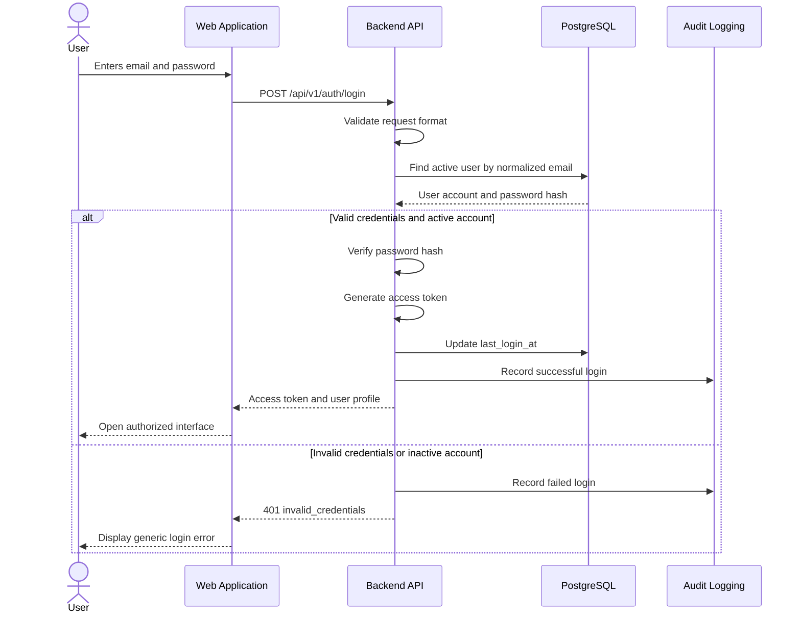

# FactoryPulse AI — Authentication API

## 1. Purpose

This document defines the authentication interface for FactoryPulse AI.

It specifies:

- How users authenticate
- How access tokens are created and validated
- How the current authenticated user is retrieved
- How inactive accounts are handled
- How passwords are verified securely
- How authentication errors are returned
- How logout works during the MVP
- How authentication events are audited
- Which authentication capabilities are deferred

This document covers user authentication only.

Sensor Simulator authentication uses a separate service credential and will be documented with the sensor-ingestion API.

---

## 2. Authentication Scope

The MVP authentication API supports:

```text
User login
Current-user retrieval
Access-token validation
Client-side logout
```

The following capabilities are deferred:

```text
Refresh tokens
Persistent login sessions
Forgot-password workflow
Email password-reset links
Multi-factor authentication
Single sign-on
External identity providers
Token revocation lists
```

Deferring these capabilities keeps the MVP consistent with the current database schema, which does not contain refresh-token or session tables.

---

## 3. Authentication Endpoints

| Method | Endpoint | Authentication | Purpose |
|---|---|---|---|
| `POST` | `/api/v1/auth/login` | Public | Authenticate a user and issue an access token |
| `GET` | `/api/v1/auth/me` | Bearer token | Retrieve the current authenticated user |

Logout is handled by removing the access token from the frontend.

The MVP does not require a server-side logout endpoint because access tokens are stateless and no persistent session is stored.

---

## 4. Authentication Flow



---

## 5. Access-Token Strategy

FactoryPulse AI uses short-lived JSON Web Tokens for user authentication.

The access token is sent using:

```http
Authorization: Bearer <access_token>
```

The Backend API validates the token before processing protected requests.

### Initial token lifetime

```text
30 minutes
```

The lifetime should be configurable through an environment variable:

```text
ACCESS_TOKEN_EXPIRE_MINUTES
```

A short token lifetime limits how long a copied or outdated token remains usable.

Because the MVP has no refresh-token workflow, the user must authenticate again after the access token expires.

---

## 6. Token Claims

The access token should contain only the information required to identify and validate the session.

Conceptual payload:

```json
{
  "sub": "550e8400-e29b-41d4-a716-446655440000",
  "type": "access",
  "iat": 1785598200,
  "exp": 1785600000,
  "jti": "01J4A7QAX4N12Q3X5F20R8T9MN",
  "iss": "factorypulse-api",
  "aud": "factorypulse-web"
}
```

### Claim meanings

| Claim | Meaning |
|---|---|
| `sub` | UUID of the authenticated user |
| `type` | Token type, which must be `access` |
| `iat` | Time the token was issued |
| `exp` | Token-expiration time |
| `jti` | Unique identifier for the token |
| `iss` | Token issuer |
| `aud` | Intended token audience |

The token must not contain:

- Passwords
- Password hashes
- Database credentials
- API keys
- Private personal information
- Complete user profiles

---

## 7. Authorization Data

The Backend API should not rely only on a role stored inside the token.

For each protected request, the Backend should use the token’s `sub` claim to retrieve the current user account and role.

Conceptual process:

```text
Access token
    ↓
Extract user ID
    ↓
Retrieve current user
    ↓
Verify is_active
    ↓
Retrieve current role
    ↓
Apply authorization rules
```

This ensures that:

- Account deactivation takes effect immediately
- Role changes take effect without waiting for token expiration
- Removed machine assignments take effect immediately
- Authorization uses the current database state

The token proves identity, while the database provides the current authorization state.

---

## 8. Token-Signing Configuration

The MVP may use:

```text
HS256
```

The signing secret must be a strong randomly generated value stored in an environment variable.

Example variables:

```text
JWT_SECRET_KEY
JWT_ALGORITHM=HS256
JWT_ISSUER=factorypulse-api
JWT_AUDIENCE=factorypulse-web
ACCESS_TOKEN_EXPIRE_MINUTES=30
```

The real secret must not be:

- Committed to GitHub
- Written in documentation
- Printed in logs
- Returned through API responses
- Hard-coded in source code

The repository’s `.env.example` file should contain only safe placeholders.

---

## 9. Password Storage

FactoryPulse AI must never store user passwords in plain text.

Passwords should be hashed using:

```text
Argon2id
```

The `users.password_hash` column stores only the resulting password hash.

Conceptual flow:

```text
User password
    ↓
Argon2id hashing or verification
    ↓
Password hash
```

The API must never return `password_hash` in any response.

Password values must also be excluded from:

- Application logs
- Audit records
- Validation details
- Error responses
- Debug output

---

## 10. Password Policy

The initial project password policy is:

- Minimum length: 12 characters
- Maximum accepted length: 128 characters
- Spaces are permitted
- Long passphrases are permitted
- The password must not consist only of whitespace
- The password must not contain the user’s email address exactly
- The API should avoid arbitrary mandatory symbol rules

Password-policy validation will be applied when user creation and password-management operations are defined.

Passwords must not be automatically modified, trimmed or converted to lowercase before verification.

---

# 11. Login Endpoint

## 11.1 Endpoint

```http
POST /api/v1/auth/login
```

### Authentication

```text
Public
```

### Purpose

Authenticates a user using an email address and password.

When authentication succeeds, the endpoint returns:

- A short-lived access token
- Token expiration information
- A safe summary of the authenticated user

---

## 11.2 Request Body

```json
{
  "email": "engineer@example.com",
  "password": "user-supplied-password"
}
```

### Request fields

| Field | Type | Required | Rules |
|---|---|---:|---|
| `email` | String | Yes | Valid email format, normalized to lowercase |
| `password` | String | Yes | Must not be empty |

The Backend normalizes the email address using:

```text
trim surrounding whitespace
convert to lowercase
```

The password must not be trimmed or otherwise transformed.

---

## 11.3 Successful Response

### Status

```text
200 OK
```

### Response

```json
{
  "data": {
    "access_token": "<jwt-access-token>",
    "token_type": "bearer",
    "expires_in": 1800,
    "expires_at": "2026-08-01T16:00:00Z",
    "user": {
      "id": "550e8400-e29b-41d4-a716-446655440000",
      "first_name": "Amine",
      "last_name": "Bennani",
      "email": "engineer@example.com",
      "role": "maintenance_engineer"
    }
  }
}
```

### Response fields

| Field | Meaning |
|---|---|
| `access_token` | Signed access token |
| `token_type` | Authentication scheme, always `bearer` |
| `expires_in` | Remaining lifetime in seconds |
| `expires_at` | Token expiration timestamp |
| `user` | Safe summary of the authenticated user |

The response must not include:

```text
password
password_hash
JWT signing secret
internal database fields
```

---

## 11.4 Authentication Processing

The Backend performs the following steps:

1. Validate the request body.
2. Normalize the email address.
3. Retrieve the user by email.
4. Verify the submitted password against `password_hash`.
5. Verify that `is_active` is `true`.
6. Retrieve the user’s current role.
7. Generate the access token.
8. Update `last_login_at`.
9. Record the authentication event.
10. Return the token and safe user information.

The password comparison should use a constant-time password-verification function provided by the password-hashing library.

---

## 11.5 Invalid Credentials

Invalid email or password returns:

```text
401 Unauthorized
```

Response:

```json
{
  "error": {
    "code": "invalid_credentials",
    "message": "The email address or password is incorrect.",
    "details": [],
    "request_id": "req_01J4A7QAX4N12Q3X5F20R8T9MN"
  }
}
```

Response header:

```http
WWW-Authenticate: Bearer
```

The response must not reveal whether:

- The email address exists
- The password was incorrect
- The account was inactive
- The account was previously deactivated

This helps prevent account enumeration.

---

## 11.6 Inactive Accounts

An inactive account must not receive an access token.

Externally, the endpoint should return the same generic response as invalid credentials:

```text
invalid_credentials
```

Internally, the audit event may distinguish:

```text
unknown_account
incorrect_password
inactive_account
```

Internal failure details must not be returned to the client.

---

## 11.7 Validation Errors

An invalid request format returns:

```text
422 Unprocessable Entity
```

Example:

```json
{
  "error": {
    "code": "validation_error",
    "message": "The request contains invalid values.",
    "details": [
      {
        "field": "email",
        "message": "A valid email address is required.",
        "type": "value_error"
      }
    ],
    "request_id": "req_01J4A7QAX4N12Q3X5F20R8T9MN"
  }
}
```

---

## 11.8 Login Rate Limiting

Rate limiting is not essential for an isolated local demonstration, but the login endpoint must be protected before public deployment.

A future public deployment should limit repeated attempts using information such as:

- Client IP address
- Normalized account identifier
- Time window
- Recent failure count

A rate-limited request returns:

```text
429 Too Many Requests
```

The response must not confirm whether the targeted account exists.

---

# 12. Current User Endpoint

## 12.1 Endpoint

```http
GET /api/v1/auth/me
```

### Authentication

```text
Bearer access token required
```

### Purpose

Returns the current user’s safe profile and authorization context.

The frontend may use this endpoint:

- After application startup
- To validate the current token
- To retrieve the current role
- To refresh account information
- To detect account deactivation
- To build role-based navigation

---

## 12.2 Successful Response

### Status

```text
200 OK
```

### Response

```json
{
  "data": {
    "id": "550e8400-e29b-41d4-a716-446655440000",
    "first_name": "Amine",
    "last_name": "Bennani",
    "email": "engineer@example.com",
    "role": {
      "name": "maintenance_engineer",
      "description": "Investigates alerts and performs maintenance interventions."
    },
    "is_active": true,
    "last_login_at": "2026-08-01T15:30:00Z",
    "created_at": "2026-07-20T11:00:00Z"
  }
}
```

The endpoint must not expose:

```text
password_hash
JWT secret
database credentials
unrelated audit information
```

---

## 12.3 Token Validation

Before returning the current user, the Backend must verify:

- The token is correctly signed
- The token has not expired
- The token type is `access`
- The issuer is valid
- The audience is valid
- The `sub` claim contains a valid UUID
- The referenced user exists
- The referenced user remains active

---

## 12.4 Missing Token

A missing token returns:

```text
401 Unauthorized
```

Example:

```json
{
  "error": {
    "code": "authentication_required",
    "message": "A valid access token is required.",
    "details": [],
    "request_id": "req_01J4A7QAX4N12Q3X5F20R8T9MN"
  }
}
```

---

## 12.5 Expired Token

An expired token returns:

```text
401 Unauthorized
```

Example:

```json
{
  "error": {
    "code": "token_expired",
    "message": "The access token has expired. Please sign in again.",
    "details": [],
    "request_id": "req_01J4A7QAX4N12Q3X5F20R8T9MN"
  }
}
```

The frontend should:

1. Remove the expired token.
2. Clear authenticated user state.
3. Redirect the user to the login page.

---

## 12.6 Invalid Token

An incorrectly signed, malformed or incompatible token returns:

```text
401 Unauthorized
```

Example error code:

```text
invalid_access_token
```

The response must not expose cryptographic validation details.

---

## 12.7 Deactivated User

When the token is valid but the referenced user has been deactivated, the API returns:

```text
401 Unauthorized
```

Example error code:

```text
account_inactive
```

The frontend should immediately clear the token and return to the login page.

---

## 13. Protected Endpoint Dependency

Protected FastAPI endpoints should use a shared authentication dependency.

Conceptually:

```text
get_current_user
```

The dependency performs:

1. Bearer-token extraction
2. Token validation
3. User-ID extraction
4. Current-user lookup
5. Active-account verification
6. Current-role retrieval
7. Authenticated-user return

A second authorization dependency may enforce allowed roles.

Conceptually:

```text
require_roles(
    "administrator",
    "plant_manager"
)
```

Resource-level access checks remain the responsibility of the relevant business component.

---

## 14. Frontend Token Handling

The access token should initially be held in frontend application memory.

Recommended conceptual flow:

```text
Login succeeds
    ↓
Store access token in application memory
    ↓
Send token in Authorization header
    ↓
Remove token on logout or expiration
```

The project should avoid storing the access token permanently in:

```text
localStorage
```

because JavaScript running through an XSS vulnerability could access it.

The trade-off of memory-only storage is that refreshing or closing the page requires the user to authenticate again.

A future authentication version may use:

- Short-lived access tokens
- Rotating refresh tokens
- Secure HttpOnly cookies
- Persistent server-side sessions

That future design would require database and security updates.

---

## 15. Logout Behaviour

The MVP uses client-side logout.

Logout performs:

1. Remove the access token from frontend memory.
2. Clear the current user state.
3. Close authenticated WebSocket connections.
4. Clear protected cached data.
5. Redirect to the login page.

Because the token is stateless, removing it from the frontend does not invalidate other copies of the same token.

The token remains technically valid until expiration.

This limitation is reduced by the short access-token lifetime.

Server-side token revocation may be added later with persistent session or token-revocation storage.

---

## 16. WebSocket Authentication

The WebSocket connection must authenticate the user before subscribing to protected events.

The exact mechanism will be finalized in:

```text
WebSocket_Events.md
```

The connection must verify:

- Access-token validity
- Current user existence
- Current account status
- Current role
- Machine assignments where required

An expired or invalid token must cause the protected WebSocket connection to be rejected or closed.

---

## 17. Authentication Audit Events

Authentication activity should generate audit or security events.

Examples:

```text
authentication.login_succeeded
authentication.login_failed
authentication.token_rejected
authentication.account_inactive
```

Possible audit information includes:

- User ID when known
- Action
- Request ID
- IP address
- Timestamp
- General failure category

Audit records must never contain:

- Submitted passwords
- Password hashes
- Complete access tokens
- JWT signing secrets
- Sensor service keys

Failed login responses remain generic even when internal audit details are more specific.

---

## 18. `last_login_at` Behaviour

The `users.last_login_at` field records the most recent successful login.

It should be updated only after:

- The email and password are valid
- The account is active
- The access token is generated successfully

Failed login attempts must not update `last_login_at`.

The timestamp is used for:

- Administrative security review
- Account activity information
- Detecting unused accounts
- User-profile display where permitted

---

## 19. Authentication Error Summary

| Condition | HTTP Status | Error Code |
|---|---:|---|
| Invalid email or password | `401` | `invalid_credentials` |
| Missing access token | `401` | `authentication_required` |
| Expired access token | `401` | `token_expired` |
| Invalid or malformed token | `401` | `invalid_access_token` |
| Deactivated authenticated account | `401` | `account_inactive` |
| Authenticated user lacks permission | `403` | `permission_denied` |
| Invalid login request fields | `422` | `validation_error` |
| Excessive login attempts | `429` | `rate_limit_exceeded` |
| Unexpected authentication failure | `500` | `internal_server_error` |

---

## 20. Security Rules

The Authentication API must follow these rules:

- Never store plain-text passwords
- Never log submitted passwords
- Never expose password hashes
- Return generic login-failure messages
- Use short-lived access tokens
- Validate token signature, issuer, audience and expiration
- Retrieve current roles and account status from the database
- Reject inactive accounts
- Keep signing secrets in environment variables
- Restrict CORS to approved frontend origins
- Use HTTPS in public deployment
- Record important authentication events
- Do not place confidential information inside tokens
- Use shared authentication and authorization dependencies
- Close protected WebSocket connections when authentication fails

---

## 21. Deferred Authentication Features

The following features are outside the initial authentication API:

### Refresh Tokens

Would allow users to obtain new short-lived access tokens without entering credentials again.

A professional implementation would require:

- Refresh-token rotation
- Secure storage
- Expiration
- Revocation
- Reuse detection
- Persistent session information

### Password Reset

Would require:

- Reset-token generation
- Expiration
- One-time use
- Email delivery
- Secure token storage or hashing
- Password-change auditing

### Multi-Factor Authentication

Would require additional enrollment, verification and recovery workflows.

### External Authentication

Possible future providers include:

- Microsoft Entra ID
- Google
- Enterprise OpenID Connect providers

These features should only be added when supported by confirmed requirements.

---

## 22. Implementation Mapping

The Authentication API will later map to backend modules such as:

```text
backend/
└── app/
    ├── api/
    │   └── v1/
    │       └── auth.py
    ├── auth/
    │   ├── dependencies.py
    │   ├── password.py
    │   ├── tokens.py
    │   └── service.py
    ├── users/
    ├── audit/
    ├── database/
    └── shared/
```

Potential responsibilities:

| Module | Responsibility |
|---|---|
| `auth.py` | Authentication route definitions |
| `password.py` | Password hashing and verification |
| `tokens.py` | Token generation and validation |
| `dependencies.py` | Current-user and role dependencies |
| `service.py` | Authentication workflow |
| `users` | User lookup and account state |
| `audit` | Authentication-event logging |

The final source structure may change slightly during backend implementation.

---

## 23. Related Documents

- [[09_API/API_Overview|API Overview]]
- [[09_API/API_Conventions|API Conventions]]
- [[03_Architecture/Component_Architecture|Component Architecture]]
- [[04_Database/Database_Schema|Database Schema]]
- [[02_Requirements/Non_Functional_Requirements|Non-Functional Requirements]]