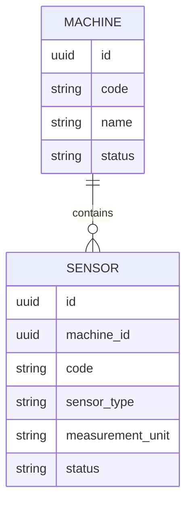
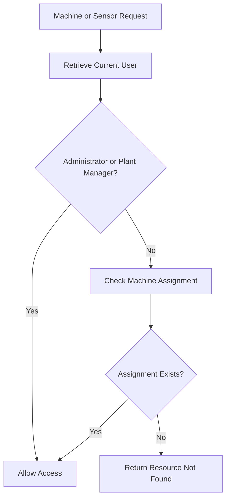

# FactoryPulse AI — Machine and Sensor API

## 1. Purpose

This document defines the FactoryPulse AI API for managing industrial machines and their sensors.

It specifies:

- Machine registration and retrieval
- Machine-information updates
- Machine operational-status management
- Machine decommissioning rules
- Sensor registration and retrieval
- Sensor configuration and threshold management
- Sensor status and retirement rules
- Machine-level authorization
- Filtering, sorting and pagination
- Validation, auditing and error handling

Machine assignments are defined in `User_and_Access_API.md`.

Sensor-measurement ingestion, measurement history and prediction operations will be defined in `Monitoring_and_Prediction_API.md`.

---

## 2. Scope

The Machine and Sensor API manages configuration and reference data.

It manages:

```text
Machines
Sensors
Sensor thresholds
Operational statuses
```

It does not manage:

```text
Sensor measurements
ML predictions
Alerts
Maintenance tasks
Machine assignments
```

These capabilities are documented through their corresponding API domains.

---

## 3. Resource Relationship

Each sensor belongs to exactly one machine.



A machine may contain zero or more sensors.

A sensor cannot exist without a valid machine.

---

## 4. Authorization Overview

### Administrator

May:

- Register machines
- View all machines
- Update machine information
- Change machine status
- Decommission machines
- Register sensors
- Update sensor configuration
- Configure thresholds
- Change sensor status
- Retire sensors

### Plant Manager

May:

- View all machines
- View all sensors
- Review operational statuses
- Review sensor configuration and thresholds

The Plant Manager does not modify machine or sensor configuration during the MVP.

### Maintenance Engineer

May:

- View assigned machines
- View sensors belonging to assigned machines
- Review sensor configuration and status

### Machine Operator

May:

- View assigned machines
- View sensors belonging to assigned machines
- Review operational information required for monitoring

All authorization rules must be enforced by the Backend API.

Hiding an action in the frontend is not sufficient authorization.

---

## 5. Machine Status Values

Supported machine statuses are:

| Status | Meaning |
|---|---|
| `operational` | Machine is operating normally |
| `warning` | Machine is operating but requires attention |
| `critical` | Machine is operating in a serious risk condition |
| `maintenance` | Machine is undergoing maintenance |
| `offline` | Machine is not currently operating |
| `decommissioned` | Machine has been permanently removed from service |

A decommissioned machine remains in the database to preserve:

- Measurement history
- Prediction history
- Alerts
- Maintenance records
- Audit history

A decommissioned machine must not accept new sensor measurements.

---

## 6. Sensor Status Values

Supported sensor statuses are:

| Status | Meaning |
|---|---|
| `active` | Sensor is available for normal monitoring |
| `inactive` | Sensor is temporarily disabled |
| `faulty` | Sensor is producing unreliable or invalid data |
| `maintenance` | Sensor is being inspected or repaired |
| `retired` | Sensor has been permanently removed from service |

A retired sensor remains stored for historical traceability.

A retired sensor must not accept new measurements.

---

## 7. Endpoint Summary

### Machine Endpoints

| Method | Endpoint | Permission | Purpose |
|---|---|---|---|
| `POST` | `/api/v1/machines` | Administrator | Register a machine |
| `GET` | `/api/v1/machines` | Authorized users | Retrieve accessible machines |
| `GET` | `/api/v1/machines/{machine_id}` | Authorized users | Retrieve one accessible machine |
| `PATCH` | `/api/v1/machines/{machine_id}` | Administrator | Update machine information or status |

Permanent machine deletion is not exposed through the public API.

---

### Sensor Endpoints

| Method | Endpoint | Permission | Purpose |
|---|---|---|---|
| `POST` | `/api/v1/machines/{machine_id}/sensors` | Administrator | Register a sensor |
| `GET` | `/api/v1/machines/{machine_id}/sensors` | Authorized users | Retrieve sensors for a machine |
| `GET` | `/api/v1/sensors` | Authorized users | Retrieve accessible sensors |
| `GET` | `/api/v1/sensors/{sensor_id}` | Authorized users | Retrieve one accessible sensor |
| `PATCH` | `/api/v1/sensors/{sensor_id}` | Administrator | Update sensor configuration or status |

Permanent sensor deletion is not exposed through the public API.

---

## 8. Machine Response Model

A machine response may use:

```json
{
  "id": "2c1f7f02-3b4f-4e75-b517-9636f06c43c0",
  "code": "PUMP-001",
  "name": "Main Cooling Pump",
  "description": "Cooling-water circulation pump for Production Line A.",
  "location": "Production Area A",
  "manufacturer": "Example Industrial Systems",
  "model": "XP-400",
  "installation_date": "2025-09-15",
  "status": "operational",
  "created_at": "2026-07-20T10:00:00Z",
  "updated_at": "2026-08-01T16:30:00Z"
}
```

The machine code acts as a stable human-readable identifier.

The UUID remains the primary API identifier.

---

# 9. Register Machine

## 9.1 Endpoint

```http
POST /api/v1/machines
```

### Authentication

```text
Bearer access token required
```

### Permission

```text
Administrator
```

### Purpose

Registers a new industrial machine in FactoryPulse AI.

---

## 9.2 Request Body

```json
{
  "code": "PUMP-001",
  "name": "Main Cooling Pump",
  "description": "Cooling-water circulation pump for Production Line A.",
  "location": "Production Area A",
  "manufacturer": "Example Industrial Systems",
  "model": "XP-400",
  "installation_date": "2025-09-15",
  "status": "operational"
}
```

### Request Fields

| Field | Type | Required | Rules |
|---|---|---:|---|
| `code` | String | Yes | Unique, normalized uppercase identifier |
| `name` | String | Yes | Non-empty, maximum 150 characters |
| `description` | String or `null` | No | Optional machine description |
| `location` | String or `null` | No | Physical or logical factory location |
| `manufacturer` | String or `null` | No | Manufacturer name |
| `model` | String or `null` | No | Manufacturer model |
| `installation_date` | Date or `null` | No | Must not be an invalid future date |
| `status` | String | No | Defaults to `operational` |

---

## 9.3 Machine-Code Rules

The machine code should:

- Be unique
- Be stable after creation
- Use uppercase letters, numbers and hyphens
- Avoid spaces
- Avoid internal database meaning

Valid examples:

```text
PUMP-001
COMPRESSOR-004
MOTOR-LINE-A-02
```

Invalid examples:

```text
pump 001
machine@1
```

The Backend should normalize surrounding whitespace and uppercase the code before validation.

After creation, `code` is treated as immutable during the MVP.

This prevents historical records and external integrations from becoming confusing.

---

## 9.4 Processing Rules

The Backend API must:

1. Verify Administrator permission.
2. Normalize and validate the machine code.
3. Verify that the code is unique.
4. Validate the requested status.
5. Validate optional dates and text lengths.
6. Create the machine in a transaction.
7. Record an audit event.
8. Return the created machine.

---

## 9.5 Successful Response

```text
201 Created
```

```json
{
  "data": {
    "id": "2c1f7f02-3b4f-4e75-b517-9636f06c43c0",
    "code": "PUMP-001",
    "name": "Main Cooling Pump",
    "description": "Cooling-water circulation pump for Production Line A.",
    "location": "Production Area A",
    "manufacturer": "Example Industrial Systems",
    "model": "XP-400",
    "installation_date": "2025-09-15",
    "status": "operational",
    "created_at": "2026-08-01T16:30:00Z",
    "updated_at": "2026-08-01T16:30:00Z"
  }
}
```

The response may include:

```http
Location: /api/v1/machines/2c1f7f02-3b4f-4e75-b517-9636f06c43c0
```

---

## 9.6 Duplicate Machine Code

```text
409 Conflict
```

```json
{
  "error": {
    "code": "duplicate_machine_code",
    "message": "A machine already exists with this code.",
    "details": [
      {
        "field": "code"
      }
    ],
    "request_id": "req_01J4A7QAX4N12Q3X5F20R8T9MN"
  }
}
```

---

# 10. Retrieve Machines

## 10.1 Endpoint

```http
GET /api/v1/machines
```

### Permission

```text
Administrator
Plant Manager
Maintenance Engineer
Machine Operator
```

### Access Behaviour

Administrators and Plant Managers may retrieve all machines.

Maintenance Engineers and Machine Operators may retrieve only machines to which they are assigned.

---

## 10.2 Query Parameters

Supported parameters:

```text
page
page_size
status
location
manufacturer
search
sort
```

Example:

```text
GET /api/v1/machines
    ?status=operational,warning
    &location=Production%20Area%20A
    &search=pump
    &sort=code
    &page=1
    &page_size=20
```

---

## 10.3 Searchable Fields

The `search` parameter may search:

```text
code
name
description
location
manufacturer
model
```

Search should be case-insensitive.

---

## 10.4 Sortable Fields

Approved sorting fields:

```text
code
name
status
location
installation_date
created_at
updated_at
```

Default sorting:

```text
code ascending
```

---

## 10.5 Successful Response

```text
200 OK
```

```json
{
  "data": [
    {
      "id": "2c1f7f02-3b4f-4e75-b517-9636f06c43c0",
      "code": "PUMP-001",
      "name": "Main Cooling Pump",
      "location": "Production Area A",
      "manufacturer": "Example Industrial Systems",
      "model": "XP-400",
      "status": "operational",
      "created_at": "2026-07-20T10:00:00Z",
      "updated_at": "2026-08-01T16:30:00Z"
    }
  ],
  "meta": {
    "page": 1,
    "page_size": 20,
    "total_items": 1,
    "total_pages": 1
  }
}
```

For assigned users, pagination metadata must describe only the machines they are authorized to access.

---

# 11. Retrieve One Machine

## 11.1 Endpoint

```http
GET /api/v1/machines/{machine_id}
```

### Successful Response

```text
200 OK
```

The response contains the complete safe machine representation.

---

## 11.2 Resource Authorization

Before returning the machine, the Backend API must determine whether the current user has access.

```text
Administrator
    → all machines

Plant Manager
    → all machines

Maintenance Engineer
    → assigned machines only

Machine Operator
    → assigned machines only
```

An unauthorized user should not receive information confirming that an inaccessible machine exists.

The API may therefore return:

```text
404 Not Found
```

instead of `403 Forbidden` for an inaccessible machine.

---

## 11.3 Machine Not Found

```text
404 Not Found
```

```json
{
  "error": {
    "code": "machine_not_found",
    "message": "The requested machine does not exist or is not accessible.",
    "details": [],
    "request_id": "req_01J4A7QAX4N12Q3X5F20R8T9MN"
  }
}
```

---

# 12. Update Machine

## 12.1 Endpoint

```http
PATCH /api/v1/machines/{machine_id}
```

### Permission

```text
Administrator
```

### Supported Fields

```text
name
description
location
manufacturer
model
installation_date
status
```

The following fields are read-only:

```text
id
code
created_at
updated_at
```

---

## 12.2 Example Request

```json
{
  "location": "Production Area B",
  "status": "maintenance"
}
```

Fields not included remain unchanged.

---

## 12.3 Successful Response

```text
200 OK
```

The response contains the updated machine.

---

## 12.4 Status-Transition Rules

Machine status changes must represent a valid operational transition.

Examples:

```text
operational → warning
warning → critical
critical → maintenance
maintenance → operational
operational → offline
offline → operational
```

A change to:

```text
decommissioned
```

is a significant and normally final lifecycle operation.

A decommissioned machine must not be returned to an active operational state through the normal MVP API.

---

## 12.5 Decommissioning Rules

Before decommissioning a machine, the Backend should verify:

- The machine exists.
- The machine is not already decommissioned.
- Active maintenance tasks are completed, cancelled or reassigned.
- New sensor ingestion for the machine can be stopped.
- Associated active sensors are retired or made inactive.
- The operation is performed by an Administrator.

Historical data must remain unchanged.

Example conflict:

```text
409 Conflict
```

```json
{
  "error": {
    "code": "machine_has_active_work",
    "message": "The machine cannot be decommissioned while active maintenance work exists.",
    "details": [
      {
        "maintenance_task_id": "8b57c604-319d-4f18-b655-872b37b173a2"
      }
    ],
    "request_id": "req_01J4A7QAX4N12Q3X5F20R8T9MN"
  }
}
```

---

## 12.6 Audit Events

Machine updates should produce appropriate audit events:

```text
machine.created
machine.profile_updated
machine.status_changed
machine.decommissioned
```

The audit record should contain relevant previous and new values.

---

## 13. Sensor Response Model

A sensor response may use:

```json
{
  "id": "6f3d4cf1-4914-44df-93b8-5311e8d16855",
  "machine": {
    "id": "2c1f7f02-3b4f-4e75-b517-9636f06c43c0",
    "code": "PUMP-001",
    "name": "Main Cooling Pump"
  },
  "code": "TEMP-001",
  "name": "Motor Temperature Sensor",
  "sensor_type": "temperature",
  "measurement_unit": "°C",
  "warning_min": null,
  "warning_max": 75.0,
  "critical_min": null,
  "critical_max": 90.0,
  "status": "active",
  "created_at": "2026-08-01T17:00:00Z",
  "updated_at": "2026-08-01T17:00:00Z"
}
```

---

## 14. Supported Sensor Types

Initial sensor types may include:

```text
temperature
pressure
vibration
rotational_speed
voltage
current
flow
```

The Backend should use a centrally defined controlled list.

A new sensor type should not be introduced through arbitrary user input without reviewing:

- Measurement units
- Threshold meaning
- Simulator support
- ML feature compatibility
- Frontend visualization support

---

# 15. Register Sensor

## 15.1 Endpoint

```http
POST /api/v1/machines/{machine_id}/sensors
```

### Authentication

```text
Bearer access token required
```

### Permission

```text
Administrator
```

### Purpose

Registers a sensor and associates it with an existing machine.

---

## 15.2 Request Body

```json
{
  "code": "TEMP-001",
  "name": "Motor Temperature Sensor",
  "sensor_type": "temperature",
  "measurement_unit": "°C",
  "warning_min": null,
  "warning_max": 75.0,
  "critical_min": null,
  "critical_max": 90.0,
  "status": "active"
}
```

### Request Fields

| Field | Type | Required | Rules |
|---|---|---:|---|
| `code` | String | Yes | Unique within the selected machine |
| `name` | String | Yes | Non-empty sensor name |
| `sensor_type` | String | Yes | Must be a supported sensor type |
| `measurement_unit` | String | Yes | Must match the sensor’s measurement meaning |
| `warning_min` | Number or `null` | No | Lower warning threshold |
| `warning_max` | Number or `null` | No | Upper warning threshold |
| `critical_min` | Number or `null` | No | Lower critical threshold |
| `critical_max` | Number or `null` | No | Upper critical threshold |
| `status` | String | No | Defaults to `active` |

---

## 15.3 Sensor-Code Rules

Sensor codes must be unique within their machine.

This means the following may be valid:

```text
PUMP-001 / TEMP-001
PUMP-002 / TEMP-001
```

But the following is invalid:

```text
PUMP-001 / TEMP-001
PUMP-001 / TEMP-001
```

Sensor codes should use uppercase letters, numbers and hyphens.

The Backend should normalize surrounding whitespace and uppercase the code.

The sensor code is treated as immutable after creation.

---

## 15.4 Validation Rules

The Backend API must verify:

- The machine exists.
- The machine is not decommissioned.
- The sensor code is unique within the machine.
- The sensor type is supported.
- The measurement unit is non-empty.
- The threshold configuration is logically valid.
- The requested status is supported.
- The Administrator has permission.

---

## 15.5 Successful Response

```text
201 Created
```

```json
{
  "data": {
    "id": "6f3d4cf1-4914-44df-93b8-5311e8d16855",
    "machine": {
      "id": "2c1f7f02-3b4f-4e75-b517-9636f06c43c0",
      "code": "PUMP-001",
      "name": "Main Cooling Pump"
    },
    "code": "TEMP-001",
    "name": "Motor Temperature Sensor",
    "sensor_type": "temperature",
    "measurement_unit": "°C",
    "warning_min": null,
    "warning_max": 75.0,
    "critical_min": null,
    "critical_max": 90.0,
    "status": "active",
    "created_at": "2026-08-01T17:00:00Z",
    "updated_at": "2026-08-01T17:00:00Z"
  }
}
```

---

## 15.6 Duplicate Sensor Code

```text
409 Conflict
```

```json
{
  "error": {
    "code": "duplicate_sensor_code",
    "message": "A sensor with this code already exists for the selected machine.",
    "details": [
      {
        "field": "code"
      }
    ],
    "request_id": "req_01J4A7QAX4N12Q3X5F20R8T9MN"
  }
}
```

---

# 16. Retrieve Sensors for a Machine

## 16.1 Endpoint

```http
GET /api/v1/machines/{machine_id}/sensors
```

### Permission

```text
Any user authorized to access the machine
```

### Supported Parameters

```text
status
sensor_type
search
sort
page
page_size
```

Example:

```text
GET /api/v1/machines/{machine_id}/sensors
    ?status=active
    &sensor_type=temperature
    &sort=code
```

---

## 16.2 Successful Response

```text
200 OK
```

```json
{
  "data": [
    {
      "id": "6f3d4cf1-4914-44df-93b8-5311e8d16855",
      "code": "TEMP-001",
      "name": "Motor Temperature Sensor",
      "sensor_type": "temperature",
      "measurement_unit": "°C",
      "status": "active",
      "warning_min": null,
      "warning_max": 75.0,
      "critical_min": null,
      "critical_max": 90.0,
      "created_at": "2026-08-01T17:00:00Z",
      "updated_at": "2026-08-01T17:00:00Z"
    }
  ],
  "meta": {
    "page": 1,
    "page_size": 20,
    "total_items": 1,
    "total_pages": 1
  }
}
```

---

# 17. Retrieve Accessible Sensors

## 17.1 Endpoint

```http
GET /api/v1/sensors
```

### Purpose

Returns sensors belonging to machines that the current user may access.

### Supported Parameters

```text
machine_id
machine_status
sensor_type
status
search
sort
page
page_size
```

Administrators and Plant Managers may retrieve sensors from all machines.

Maintenance Engineers and Machine Operators receive sensors only from assigned machines.

---

# 18. Retrieve One Sensor

## 18.1 Endpoint

```http
GET /api/v1/sensors/{sensor_id}
```

### Permission

```text
Any user authorized to access the sensor’s machine
```

### Successful Response

```text
200 OK
```

The response contains the complete sensor representation.

---

## 18.2 Sensor Not Found

```text
404 Not Found
```

```json
{
  "error": {
    "code": "sensor_not_found",
    "message": "The requested sensor does not exist or is not accessible.",
    "details": [],
    "request_id": "req_01J4A7QAX4N12Q3X5F20R8T9MN"
  }
}
```

---

# 19. Update Sensor

## 19.1 Endpoint

```http
PATCH /api/v1/sensors/{sensor_id}
```

### Permission

```text
Administrator
```

### Supported Fields

```text
name
sensor_type
measurement_unit
warning_min
warning_max
critical_min
critical_max
status
```

Read-only fields:

```text
id
machine_id
code
created_at
updated_at
```

A sensor cannot be moved from one machine to another during the MVP.

A new sensor must be registered instead.

---

## 19.2 Example Request

```json
{
  "warning_max": 80.0,
  "critical_max": 95.0,
  "status": "active"
}
```

---

## 19.3 Successful Response

```text
200 OK
```

The response contains the updated sensor.

---

## 19.4 Retired Sensor Rules

Changing the sensor status to:

```text
retired
```

means that the sensor has permanently left service.

A retired sensor:

- Remains associated with its machine
- Preserves its measurement history
- Preserves related alerts and predictions
- Must not accept new measurements
- Should not return to `active` through the normal MVP API

Configuration fields on a retired sensor should normally become read-only.

---

## 20. Threshold Validation

Thresholds may be one-sided or two-sided.

### Upper-Threshold Example

```text
warning_max = 75
critical_max = 90
```

Interpretation:

```text
value < 75
    → normal

75 ≤ value < 90
    → warning

value ≥ 90
    → critical
```

### Lower-Threshold Example

```text
critical_min = 20
warning_min = 30
```

Interpretation:

```text
value > 30
    → normal

20 < value ≤ 30
    → warning

value ≤ 20
    → critical
```

### Validation Relationships

When both lower thresholds exist:

```text
critical_min < warning_min
```

When both upper thresholds exist:

```text
warning_max < critical_max
```

When complete lower and upper thresholds exist:

```text
critical_min
    <
warning_min
    <
warning_max
    <
critical_max
```

A sensor may omit threshold fields that do not apply.

---

## 20.1 Invalid Threshold Error

```text
422 Unprocessable Entity
```

```json
{
  "error": {
    "code": "invalid_threshold_configuration",
    "message": "The sensor thresholds are not logically ordered.",
    "details": [
      {
        "field": "critical_max",
        "message": "The critical maximum must be greater than the warning maximum."
      }
    ],
    "request_id": "req_01J4A7QAX4N12Q3X5F20R8T9MN"
  }
}
```

---

## 21. Machine-Level Authorization Flow



When retrieving a sensor, authorization is determined through the sensor’s machine.

---

## 22. Status and Configuration Effects

### Machine Becomes Offline

- Historical information remains accessible.
- New measurements may be rejected or ignored depending on the ingestion workflow.
- The frontend displays the machine as unavailable.

### Machine Enters Maintenance

- Measurements may continue if required.
- Maintenance workflows may remain active.
- Operators should see the maintenance status.

### Machine Is Decommissioned

- New measurements are rejected.
- New sensors cannot be registered.
- Historical information remains accessible.

### Sensor Becomes Faulty

- Measurements may be stored with a suspicious quality status.
- Monitoring workflows should avoid treating the data as fully reliable.
- The condition may create an operational alert.

### Sensor Becomes Retired

- New measurements are rejected.
- Historical measurements remain accessible.

The detailed ingestion behaviour will be finalized in `Monitoring_and_Prediction_API.md`.

---

## 23. Audit Events

The following operations should create audit records:

```text
machine.created
machine.profile_updated
machine.status_changed
machine.decommissioned
sensor.created
sensor.configuration_updated
sensor.thresholds_updated
sensor.status_changed
sensor.retired
```

Audit records should include:

- Acting user
- Affected resource
- Relevant previous values
- Relevant new values
- Request identifier
- Timestamp
- IP address where appropriate

Measurement values must not be copied into configuration audit records unnecessarily.

---

## 24. Transaction Requirements

The following operations should use database transactions.

### Register Machine

```text
Create machine
    +
Write audit log
```

### Update Machine Status

```text
Validate transition
    +
Update status
    +
Write audit log
```

### Register Sensor

```text
Validate machine
    +
Create sensor
    +
Write audit log
```

### Update Sensor Thresholds

```text
Validate threshold relationships
    +
Update configuration
    +
Write audit log
```

If a required step fails, the operation should roll back.

---

## 25. Error Summary

| Condition | HTTP Status | Error Code |
|---|---:|---|
| Machine not found or inaccessible | `404` | `machine_not_found` |
| Sensor not found or inaccessible | `404` | `sensor_not_found` |
| Duplicate machine code | `409` | `duplicate_machine_code` |
| Duplicate sensor code | `409` | `duplicate_sensor_code` |
| Invalid machine status | `422` | `validation_error` |
| Invalid status transition | `409` | `invalid_machine_status_transition` |
| Machine has active work | `409` | `machine_has_active_work` |
| Machine is decommissioned | `409` | `machine_decommissioned` |
| Unsupported sensor type | `422` | `validation_error` |
| Invalid thresholds | `422` | `invalid_threshold_configuration` |
| Retired sensor modification | `409` | `retired_sensor_immutable` |
| Invalid request fields | `422` | `validation_error` |
| Missing authentication | `401` | `authentication_required` |
| Insufficient permission | `403` | `permission_denied` |

---

## 26. Security Rules

The Machine and Sensor API must:

- Require authentication for every endpoint
- Restrict configuration changes to Administrators
- Enforce machine-level access for assigned users
- Validate all UUID identifiers
- Prevent duplicate machine codes
- Prevent duplicate sensor codes within a machine
- Reject invalid threshold configurations
- Prevent new sensors on decommissioned machines
- Prevent new measurements for retired sensors
- Preserve historical operational records
- Record important configuration changes
- Avoid exposing inaccessible resource existence
- Validate filters and sorting fields
- Never trust frontend authorization alone

---

## 27. Deferred Features

The following capabilities are outside the initial MVP:

- Permanent machine deletion
- Permanent sensor deletion
- Moving a sensor between machines
- Bulk machine import
- Bulk sensor import
- Sensor calibration-history management
- Machine hierarchy and production-line modeling
- Factory-site management
- Digital-twin configuration
- Sensor firmware management
- Automatic hardware discovery
- Vendor-specific device protocols
- Custom sensor types created through the UI

These capabilities may be added when supported by confirmed requirements.

---

## 28. Implementation Mapping

The API may later map to backend modules such as:

```text
backend/
└── app/
    ├── api/
    │   └── v1/
    │       ├── machines.py
    │       └── sensors.py
    ├── machines/
    │   ├── models.py
    │   ├── schemas.py
    │   ├── repository.py
    │   ├── service.py
    │   └── access.py
    ├── sensors/
    │   ├── models.py
    │   ├── schemas.py
    │   ├── repository.py
    │   └── service.py
    ├── audit/
    ├── auth/
    ├── database/
    └── shared/
```

Possible responsibilities:

| Module | Responsibility |
|---|---|
| `machines.py` | Machine route definitions |
| `sensors.py` | Sensor route definitions |
| `machines/service.py` | Machine lifecycle and status rules |
| `machines/access.py` | Machine-level authorization |
| `machines/repository.py` | Machine database queries |
| `sensors/service.py` | Sensor and threshold rules |
| `sensors/repository.py` | Sensor database queries |
| `audit` | Configuration-change history |
| `auth` | Current-user and role validation |

---

## 29. Related Documents

- [[09_API/API_Overview|API Overview]]
- [[09_API/API_Conventions|API Conventions]]
- [[09_API/User_and_Access_API|User and Access API]]
- [[04_Database/Database_Schema|Database Schema]]
- [[02_Requirements/Functional_Requirements|Functional Requirements]]