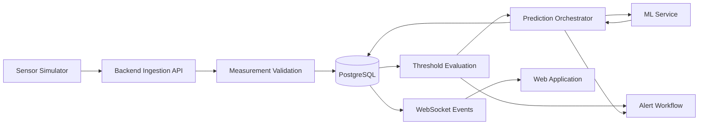
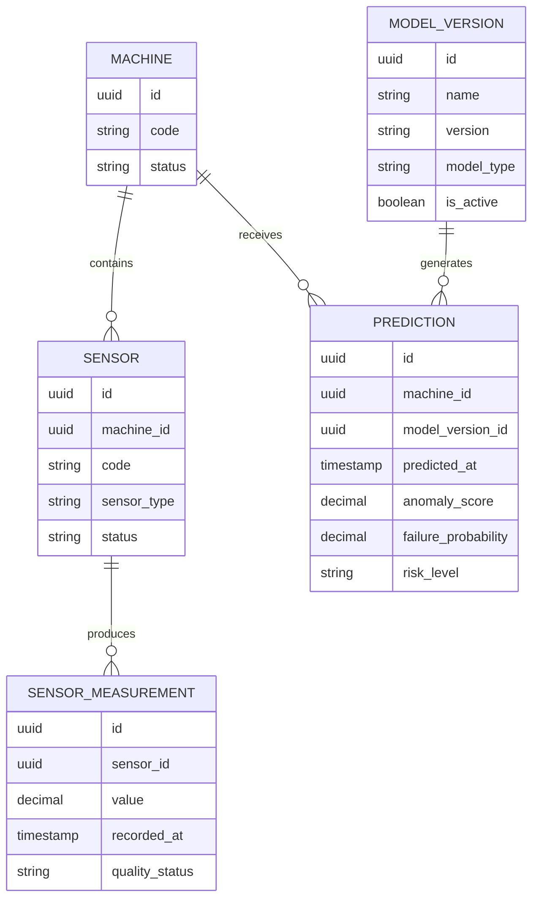

# FactoryPulse AI — Monitoring and Prediction API

## 1. Purpose

This document defines the FactoryPulse AI API for:

- Sensor-measurement ingestion
- Measurement validation and storage
- Batch ingestion
- Measurement-history retrieval
- Threshold evaluation
- Machine-learning prediction triggering
- Prediction storage and retrieval
- Prediction explanations
- Model-version traceability
- Measurement and prediction authorization
- Internal Backend-to-ML communication
- Error handling, auditing and service-failure behaviour

Machine and sensor configuration is defined in `Machine_and_Sensor_API.md`.

Alert creation and maintenance workflows will be defined separately in `Alert_and_Maintenance_API.md`.

---

## 2. Scope

The Monitoring and Prediction API manages two main categories of operational data:

```text
Sensor measurements
ML predictions
```

It supports two different clients:

```text
Sensor Simulator
    → submits measurements

Web Application
    → retrieves measurements and predictions
```

The Web Application does not submit industrial measurements directly.

The Sensor Simulator does not retrieve administrative or user-facing information.

---

## 3. Monitoring Data Flow



The Backend API remains responsible for:

- Authenticating the ingestion client
- Validating measurements
- Storing accepted measurements
- Preparing ML input
- Calling the ML Service
- Validating ML output
- Storing predictions
- Initiating alert evaluation
- Publishing real-time events

The ML Service must not write directly to the application database.

---

## 4. Main Resource Relationship



A sensor measurement belongs to exactly one sensor.

A prediction belongs to one machine and records which model version generated it.

---

## 5. Endpoint Summary

### 5.1 Sensor-Ingestion Endpoints

| Method | Endpoint | Authentication | Purpose |
|---|---|---|---|
| `POST` | `/api/v1/ingestion/measurements` | Sensor service credential | Submit one measurement |
| `POST` | `/api/v1/ingestion/measurements/batch` | Sensor service credential | Submit several measurements |

---

### 5.2 Measurement-Retrieval Endpoints

| Method | Endpoint | Permission | Purpose |
|---|---|---|---|
| `GET` | `/api/v1/sensors/{sensor_id}/measurements` | Authorized machine access | Retrieve sensor history |
| `GET` | `/api/v1/machines/{machine_id}/measurements` | Authorized machine access | Retrieve measurements across a machine |
| `GET` | `/api/v1/measurements/{measurement_id}` | Authorized machine access | Retrieve one measurement |

Measurements are immutable through the public API.

No public `PATCH` or `DELETE` endpoint is provided.

---

### 5.3 Prediction Endpoints

| Method | Endpoint | Permission | Purpose |
|---|---|---|---|
| `GET` | `/api/v1/machines/{machine_id}/predictions` | Authorized machine access | Retrieve machine prediction history |
| `GET` | `/api/v1/predictions/{prediction_id}` | Authorized machine access | Retrieve one prediction |
| `POST` | `/api/v1/machines/{machine_id}/predictions` | Administrator or Plant Manager | Trigger an on-demand prediction |

Automatic predictions may also be initiated by the Backend after receiving measurements.

---

## 6. Sensor-Service Authentication

The ingestion endpoints do not use a normal user access token.

The Sensor Simulator uses a dedicated service credential.

Conceptual header:

```http
X-Sensor-API-Key: <sensor_service_key>
```

The key must be:

- Stored in an environment variable
- Compared securely
- Excluded from logs
- Excluded from error responses
- Excluded from Git
- Different from the JWT signing secret
- Different from database credentials

Example environment variable:

```text
SENSOR_INGESTION_API_KEY
```

A future production version may use:

- Per-device credentials
- Per-simulator credentials
- Signed requests
- Mutual TLS
- Credential rotation
- Device identity certificates

The MVP uses one protected service credential for the local Sensor Simulator.

---

## 7. Ingestion Authentication Failure

A missing or invalid service credential returns:

```text
401 Unauthorized
```

Example:

```json
{
  "error": {
    "code": "invalid_sensor_service_credentials",
    "message": "Valid sensor-service credentials are required.",
    "details": [],
    "request_id": "req_01J4A7QAX4N12Q3X5F20R8T9MN"
  }
}
```

The response must not reveal:

- The expected API key
- Whether the submitted key was close to the correct value
- Internal secret-storage information
- Credential comparison details

---

## 8. Measurement Quality Values

Supported measurement-quality values are:

| Value | Meaning |
|---|---|
| `good` | Measurement passed normal validation |
| `suspect` | Measurement may be unreliable but remains useful for investigation |
| `invalid` | Measurement failed an important validation rule |
| `missing` | An expected value was unavailable |

The ingestion API normally accepts actual numeric measurements using:

```text
good
suspect
```

An `invalid` or `missing` state may be generated internally or used in controlled simulation scenarios.

A missing value must not be represented as a normal numeric value such as:

```text
0
-1
9999
```

unless that value is genuinely meaningful for the sensor.

---

## 9. Measurement Response Model

A measurement response may use:

```json
{
  "id": "ab915409-6d47-4ce2-951c-0c395f0cb5a8",
  "sensor": {
    "id": "6f3d4cf1-4914-44df-93b8-5311e8d16855",
    "code": "TEMP-001",
    "sensor_type": "temperature",
    "measurement_unit": "°C"
  },
  "machine": {
    "id": "2c1f7f02-3b4f-4e75-b517-9636f06c43c0",
    "code": "PUMP-001",
    "name": "Main Cooling Pump"
  },
  "value": 78.4,
  "recorded_at": "2026-08-01T17:30:00Z",
  "quality_status": "good",
  "received_at": "2026-08-01T17:30:01Z"
}
```

`recorded_at` represents when the simulated sensor produced the value.

`received_at` represents when the Backend received or stored the value, where supported by the database schema.

The difference between these timestamps may be used to identify ingestion delays.

---

# 10. Submit One Measurement

## 10.1 Endpoint

```http
POST /api/v1/ingestion/measurements
```

### Authentication

```text
Sensor service credential required
```

### Purpose

Submits one sensor measurement to the Backend API.

---

## 10.2 Request Body

```json
{
  "sensor_id": "6f3d4cf1-4914-44df-93b8-5311e8d16855",
  "value": 78.4,
  "recorded_at": "2026-08-01T17:30:00Z",
  "quality_status": "good"
}
```

### Request Fields

| Field | Type | Required | Rules |
|---|---|---:|---|
| `sensor_id` | UUID | Yes | Must reference an existing sensor |
| `value` | Number | Yes | Must be finite and valid for storage |
| `recorded_at` | Timestamp | Yes | ISO 8601 with timezone |
| `quality_status` | String | No | Defaults to `good` |

The API must reject non-finite numeric values such as:

```text
NaN
Infinity
-Infinity
```

---

## 10.3 Processing Steps

The Backend performs the following steps:

1. Validate the sensor-service credential.
2. Validate the request structure.
3. Retrieve the sensor.
4. Retrieve the sensor’s machine.
5. Verify the sensor and machine lifecycle states.
6. Validate the timestamp.
7. Validate the numeric value.
8. Determine or validate measurement quality.
9. Store the measurement.
10. Evaluate configured sensor thresholds.
11. Determine whether prediction processing should run.
12. Call the ML Service where appropriate.
13. Store a valid prediction result.
14. Start alert evaluation where required.
15. Publish authorized real-time events.
16. Return the accepted measurement and processing summary.

Measurement storage must not be rolled back merely because the ML Service is temporarily unavailable.

---

## 10.4 Lifecycle Validation

### Accepted Machine Statuses

Measurements may be accepted when the machine status is:

```text
operational
warning
critical
maintenance
```

Accepting measurements during maintenance may help:

- Verify repairs
- Review test runs
- Observe controlled restart behaviour
- Compare conditions before and after intervention

### Rejected Machine Statuses

Measurements are rejected when the machine is:

```text
offline
decommissioned
```

### Accepted Sensor Statuses

Measurements may be accepted when the sensor is:

```text
active
faulty
maintenance
```

When the sensor is `faulty`, the Backend should change or preserve the measurement quality as:

```text
suspect
```

unless the submitted quality is already more restrictive.

### Rejected Sensor Statuses

Measurements are rejected when the sensor is:

```text
inactive
retired
```

---

## 10.5 Timestamp Validation

The Backend should validate that:

- The timestamp contains timezone information.
- The timestamp is not unreasonably far in the future.
- The timestamp is not outside the configured ingestion-history limit.
- The timestamp is appropriate for the sensor’s data stream.

Initial recommended tolerance for future timestamps:

```text
5 minutes
```

Initial recommended maximum historical ingestion age:

```text
24 hours
```

These values should be configurable.

A larger historical-import workflow is outside this endpoint’s normal purpose.

---

## 10.6 Successful Response

```text
201 Created
```

Example:

```json
{
  "data": {
    "measurement": {
      "id": "ab915409-6d47-4ce2-951c-0c395f0cb5a8",
      "sensor_id": "6f3d4cf1-4914-44df-93b8-5311e8d16855",
      "machine_id": "2c1f7f02-3b4f-4e75-b517-9636f06c43c0",
      "value": 78.4,
      "recorded_at": "2026-08-01T17:30:00Z",
      "quality_status": "good"
    },
    "processing": {
      "threshold_state": "warning",
      "prediction_triggered": true,
      "prediction_status": "completed",
      "prediction_id": "458139e4-f383-4360-a4d1-54d899c2e6a9"
    }
  }
}
```

Possible threshold states:

```text
normal
warning
critical
not_configured
not_evaluated
```

Possible prediction statuses:

```text
not_required
insufficient_data
completed
unavailable
failed_validation
```

---

## 10.7 Measurement Accepted but ML Unavailable

The measurement remains successfully stored when the ML Service is unavailable.

The response remains:

```text
201 Created
```

Example processing metadata:

```json
{
  "processing": {
    "threshold_state": "normal",
    "prediction_triggered": true,
    "prediction_status": "unavailable",
    "prediction_id": null
  }
}
```

The Backend should log the ML failure using the request or correlation identifier.

It must not return `503 Service Unavailable` for the entire ingestion request after the measurement has already been accepted successfully.

---

## 10.8 Unknown Sensor

```text
404 Not Found
```

```json
{
  "error": {
    "code": "sensor_not_found",
    "message": "The submitted sensor does not exist.",
    "details": [],
    "request_id": "req_01J4A7QAX4N12Q3X5F20R8T9MN"
  }
}
```

---

## 10.9 Sensor Not Accepting Measurements

```text
409 Conflict
```

Example:

```json
{
  "error": {
    "code": "sensor_not_accepting_measurements",
    "message": "The sensor is not currently accepting measurements.",
    "details": [
      {
        "sensor_status": "retired"
      }
    ],
    "request_id": "req_01J4A7QAX4N12Q3X5F20R8T9MN"
  }
}
```

---

## 10.10 Machine Not Accepting Measurements

```text
409 Conflict
```

Example:

```json
{
  "error": {
    "code": "machine_not_accepting_measurements",
    "message": "The sensor’s machine is not currently accepting measurements.",
    "details": [
      {
        "machine_status": "decommissioned"
      }
    ],
    "request_id": "req_01J4A7QAX4N12Q3X5F20R8T9MN"
  }
}
```

---

## 10.11 Invalid Measurement Timestamp

```text
422 Unprocessable Entity
```

Example error code:

```text
invalid_measurement_timestamp
```

Possible causes:

- Missing timezone
- Timestamp too far in the future
- Timestamp older than the accepted ingestion range
- Invalid ISO 8601 format

---

# 11. Batch Measurement Ingestion

## 11.1 Endpoint

```http
POST /api/v1/ingestion/measurements/batch
```

### Authentication

```text
Sensor service credential required
```

### Purpose

Submits several sensor measurements in one request.

Batch ingestion reduces:

- HTTP overhead
- Repeated authentication work
- Network round trips
- Simulator processing cost

---

## 11.2 Request Body

```json
{
  "measurements": [
    {
      "sensor_id": "6f3d4cf1-4914-44df-93b8-5311e8d16855",
      "value": 78.4,
      "recorded_at": "2026-08-01T17:30:00Z",
      "quality_status": "good"
    },
    {
      "sensor_id": "ca874261-e038-440c-b16e-bb4382fde8f1",
      "value": 4.9,
      "recorded_at": "2026-08-01T17:30:00Z",
      "quality_status": "good"
    }
  ]
}
```

---

## 11.3 Batch Limits

Initial recommended rules:

```text
Minimum items: 1
Maximum items: 500
```

The maximum should be configurable.

The API should reject the entire request when:

- The request body is malformed.
- The `measurements` array is missing.
- The batch exceeds the maximum size.
- Service authentication fails.

Individual invalid measurement items may be rejected without rejecting valid items.

---

## 11.4 Partial-Acceptance Strategy

The MVP batch endpoint uses:

```text
partial acceptance
```

Each item is validated independently.

Valid items are stored.

Invalid items are reported in the response.

This is more suitable for continuous sensor ingestion than rejecting an entire batch because one item is invalid.

The Backend should use efficient database operations while preserving clear per-item validation results.

---

## 11.5 Successful Batch Response

```text
200 OK
```

Example:

```json
{
  "data": {
    "submitted_count": 3,
    "accepted_count": 2,
    "rejected_count": 1,
    "accepted_items": [
      {
        "index": 0,
        "measurement_id": "ab915409-6d47-4ce2-951c-0c395f0cb5a8"
      },
      {
        "index": 1,
        "measurement_id": "0ddfc889-c577-42ab-b050-45b92bd348a9"
      }
    ],
    "rejected_items": [
      {
        "index": 2,
        "code": "sensor_not_found",
        "message": "The submitted sensor does not exist."
      }
    ],
    "prediction_processing": [
      {
        "machine_id": "2c1f7f02-3b4f-4e75-b517-9636f06c43c0",
        "status": "completed",
        "prediction_id": "458139e4-f383-4360-a4d1-54d899c2e6a9"
      }
    ]
  }
}
```

Prediction processing should normally occur once per affected machine after accepted batch items are stored rather than once for every individual measurement.

---

## 11.6 Completely Rejected Batch

A structurally valid batch in which every item fails validation may still return:

```text
200 OK
```

with:

```json
{
  "data": {
    "submitted_count": 3,
    "accepted_count": 0,
    "rejected_count": 3,
    "accepted_items": [],
    "rejected_items": []
  }
}
```

This indicates that batch processing completed successfully, even though no measurement item was accepted.

---

## 12. Ingestion Idempotency

Duplicate measurements can occur when a simulator retries after a network timeout.

The initial database design does not define a persistent client-generated measurement identifier.

Therefore, strict persistent idempotency is deferred until supporting storage is introduced.

During the MVP:

- The Sensor Simulator should avoid retrying requests after receiving a successful response.
- The simulator should retry only after connection or timeout failures.
- The Backend may detect obvious duplicates using sensor ID, timestamp and value within a short window.
- Duplicate detection must not silently discard legitimate repeated measurements.

A future version should introduce a stable field such as:

```text
client_measurement_id
```

or persistent support for:

```http
Idempotency-Key
```

That change must be reflected in:

- Database schema
- Data dictionary
- Migrations
- API documentation
- Simulator implementation

---

# 13. Retrieve Sensor Measurements

## 13.1 Endpoint

```http
GET /api/v1/sensors/{sensor_id}/measurements
```

### Authentication

```text
Bearer access token required
```

### Permission

```text
Any user authorized to access the sensor’s machine
```

### Purpose

Returns chronological measurement history for one sensor.

---

## 13.2 Query Parameters

Supported parameters:

```text
start_time
end_time
quality_status
limit
cursor
sort
```

Example:

```text
GET /api/v1/sensors/{sensor_id}/measurements
    ?start_time=2026-08-01T00:00:00Z
    &end_time=2026-08-01T23:59:59Z
    &quality_status=good,suspect
    &limit=100
```

Default sort:

```text
-recorded_at
```

The endpoint uses cursor-based pagination.

---

## 13.3 Default Time Range

When no time range is supplied, the endpoint should default to a limited recent period.

Initial recommendation:

```text
Last 24 hours
```

The endpoint must not return unlimited measurement history by default.

Initial recommended maximum requested range:

```text
30 days
```

Longer analytical ranges may later use aggregated reporting endpoints.

---

## 13.4 Successful Response

```text
200 OK
```

```json
{
  "data": [
    {
      "id": "ab915409-6d47-4ce2-951c-0c395f0cb5a8",
      "sensor_id": "6f3d4cf1-4914-44df-93b8-5311e8d16855",
      "value": 78.4,
      "measurement_unit": "°C",
      "recorded_at": "2026-08-01T17:30:00Z",
      "quality_status": "good"
    }
  ],
  "meta": {
    "limit": 100,
    "next_cursor": null,
    "has_more": false
  }
}
```

The `measurement_unit` is taken from the sensor configuration.

---

# 14. Retrieve Machine Measurements

## 14.1 Endpoint

```http
GET /api/v1/machines/{machine_id}/measurements
```

### Permission

```text
Any user authorized to access the machine
```

### Purpose

Returns measurements across one or more sensors belonging to a machine.

---

## 14.2 Query Parameters

Supported parameters:

```text
sensor_id
sensor_type
quality_status
start_time
end_time
limit
cursor
sort
```

Example:

```text
GET /api/v1/machines/{machine_id}/measurements
    ?sensor_type=temperature,vibration
    &start_time=2026-08-01T16:00:00Z
    &end_time=2026-08-01T18:00:00Z
    &limit=200
```

Results should include enough sensor information for the frontend to separate series correctly.

---

## 14.3 Successful Response

```json
{
  "data": [
    {
      "id": "ab915409-6d47-4ce2-951c-0c395f0cb5a8",
      "sensor": {
        "id": "6f3d4cf1-4914-44df-93b8-5311e8d16855",
        "code": "TEMP-001",
        "sensor_type": "temperature",
        "measurement_unit": "°C"
      },
      "value": 78.4,
      "recorded_at": "2026-08-01T17:30:00Z",
      "quality_status": "good"
    }
  ],
  "meta": {
    "limit": 200,
    "next_cursor": null,
    "has_more": false
  }
}
```

---

# 15. Retrieve One Measurement

## 15.1 Endpoint

```http
GET /api/v1/measurements/{measurement_id}
```

### Permission

```text
Any user authorized to access the measurement’s machine
```

### Successful Response

```text
200 OK
```

The response contains the complete safe measurement representation.

---

## 15.2 Measurement Not Found

```text
404 Not Found
```

```json
{
  "error": {
    "code": "measurement_not_found",
    "message": "The requested measurement does not exist or is not accessible.",
    "details": [],
    "request_id": "req_01J4A7QAX4N12Q3X5F20R8T9MN"
  }
}
```

---

## 16. Measurement Immutability

Sensor measurements are historical records.

The public API does not allow users to:

- Modify measurement values
- Change timestamps
- Delete measurements
- Reassign measurements to another sensor
- Change measurement quality manually

Corrections should be handled through:

- New corrected records
- Explicit administrative data-repair migrations
- Controlled development-data reset processes

Any exceptional correction process must preserve auditability.

---

## 17. Threshold Evaluation

After accepting a measurement, the Backend evaluates the sensor’s configured thresholds.

Possible states:

```text
normal
warning
critical
not_configured
not_evaluated
```

### Upper Threshold Example

```text
warning_max = 75
critical_max = 90
```

Interpretation:

```text
value < 75
    → normal

75 ≤ value < 90
    → warning

value ≥ 90
    → critical
```

### Lower Threshold Example

```text
critical_min = 20
warning_min = 30
```

Interpretation:

```text
value > 30
    → normal

20 < value ≤ 30
    → warning

value ≤ 20
    → critical
```

Threshold evaluation must use the sensor configuration that exists when the measurement is processed.

---

## 18. Threshold and ML Separation

Threshold detection and machine-learning prediction are separate mechanisms.

### Threshold Detection

Uses configured limits.

Example:

```text
Temperature is greater than 90°C.
```

### Machine-Learning Prediction

Uses patterns across recent data.

Example:

```text
Temperature, vibration and pressure patterns indicate an elevated failure risk.
```

A measurement may be:

```text
Within thresholds
    +
Part of an abnormal ML pattern
```

or:

```text
Outside thresholds
    +
Not enough data for an ML prediction
```

The platform should preserve both results rather than treating them as interchangeable.

---

## 19. Prediction Triggering

Predictions may be triggered through two mechanisms.

### 19.1 Automatic Prediction

The Backend may trigger prediction processing after receiving accepted measurements.

The trigger may depend on:

- Machine configuration
- Required sensor availability
- Minimum measurement window
- Time since the previous prediction
- Active model availability
- Measurement quality
- Machine lifecycle state

### 19.2 On-Demand Prediction

An Administrator or Plant Manager may request a prediction through:

```http
POST /api/v1/machines/{machine_id}/predictions
```

This is useful for:

- Demonstrations
- Operational review
- Verification after maintenance
- Manual investigation
- Testing the ML integration

---

## 20. Prediction Eligibility

Before calling the ML Service, the Backend must verify:

- The machine exists.
- The requester may access the machine.
- The machine is not decommissioned.
- An active compatible model version exists.
- Required sensors are configured.
- Sufficient recent measurements exist.
- Required measurements meet quality expectations.
- Input timestamps form an acceptable prediction window.

When these conditions are not met, the Backend must not create a misleading prediction.

---

## 21. Prediction Input Window

A prediction should record or make traceable the measurement window used for inference.

Conceptual values:

```text
window_start
window_end
measurement_count
sensor_count
```

Example:

```json
{
  "window_start": "2026-08-01T17:00:00Z",
  "window_end": "2026-08-01T17:30:00Z",
  "measurement_count": 360,
  "sensor_count": 4
}
```

The exact prediction-window size depends on:

- Model training
- Sampling frequency
- Sensor types
- Feature engineering
- Machine behaviour

The Backend must not invent a different window from the one expected by the model.

---

## 22. Backend-to-ML Request

The Backend prepares the internal ML request.

Conceptual endpoint:

```http
POST /predict/combined
```

Conceptual request:

```json
{
  "machine_id": "2c1f7f02-3b4f-4e75-b517-9636f06c43c0",
  "model_version": "1.0.0",
  "window": {
    "start_time": "2026-08-01T17:00:00Z",
    "end_time": "2026-08-01T17:30:00Z"
  },
  "features": {
    "temperature_mean": 73.8,
    "temperature_max": 78.4,
    "vibration_mean": 4.1,
    "vibration_max": 5.0,
    "pressure_mean": 6.2
  }
}
```

The Backend may send:

- Prepared feature values
- Ordered measurement sequences
- Or another model-specific input structure

The final request must match the model contract.

Raw user credentials and unrelated personal information must never be sent to the ML Service.

---

## 23. ML Service Response

Conceptual response:

```json
{
  "model": {
    "name": "pump_failure_predictor",
    "version": "1.0.0",
    "model_type": "combined"
  },
  "result": {
    "is_anomaly": true,
    "anomaly_score": 0.8124,
    "failure_probability": 0.7631,
    "risk_level": "high"
  },
  "explanation": {
    "summary": "High vibration and increasing temperature contributed most strongly.",
    "top_features": [
      {
        "feature": "vibration_mean",
        "importance": 0.41
      },
      {
        "feature": "temperature_max",
        "importance": 0.28
      }
    ]
  }
}
```

The Backend must validate the response before storing it.

---

## 24. ML Response Validation

The Backend must verify:

- Required fields are present.
- Probabilities are between `0` and `1`.
- Scores are within the expected range.
- Risk level is supported.
- Model identity matches an existing model version.
- The model is compatible with the prediction type.
- Explanation data is valid JSON.
- The response is associated with the intended machine.
- The response was received within the configured timeout.

An invalid ML response must not be stored as a successful prediction.

---

## 25. Prediction Risk Levels

Supported risk levels are:

| Risk Level | Meaning |
|---|---|
| `low` | No meaningful near-term risk detected |
| `medium` | Some abnormal behaviour requires observation |
| `high` | Strong indication of risk requiring investigation |
| `critical` | Immediate operational attention is recommended |

Risk thresholds should be derived from model validation and operational requirements.

They must not be selected only to create visually dramatic dashboard results.

---

## 26. Prediction Response Model

A prediction response may use:

```json
{
  "id": "458139e4-f383-4360-a4d1-54d899c2e6a9",
  "machine": {
    "id": "2c1f7f02-3b4f-4e75-b517-9636f06c43c0",
    "code": "PUMP-001",
    "name": "Main Cooling Pump"
  },
  "model_version": {
    "id": "115fe09e-f909-4d19-8478-ee8db4088616",
    "name": "pump_failure_predictor",
    "version": "1.0.0",
    "model_type": "combined"
  },
  "prediction_type": "combined",
  "is_anomaly": true,
  "anomaly_score": 0.8124,
  "failure_probability": 0.7631,
  "risk_level": "high",
  "explanation": {
    "summary": "High vibration and increasing temperature contributed most strongly.",
    "top_features": [
      {
        "feature": "vibration_mean",
        "importance": 0.41
      },
      {
        "feature": "temperature_max",
        "importance": 0.28
      }
    ]
  },
  "input_window": {
    "start_time": "2026-08-01T17:00:00Z",
    "end_time": "2026-08-01T17:30:00Z"
  },
  "predicted_at": "2026-08-01T17:30:02Z"
}
```

The exact field names must remain aligned with the implemented database and Pydantic models.

---

# 27. Trigger On-Demand Prediction

## 27.1 Endpoint

```http
POST /api/v1/machines/{machine_id}/predictions
```

### Authentication

```text
Bearer access token required
```

### Permission

```text
Administrator
Plant Manager
```

### Request Body

A basic request may use:

```json
{
  "prediction_type": "combined"
}
```

Optional fields may include:

```text
end_time
model_version_id
```

The use of a non-active model version should be restricted to authorized testing or administrative scenarios.

---

## 27.2 Supported Prediction Types

Initial prediction types may include:

```text
anomaly_detection
failure_risk
combined
```

### `anomaly_detection`

Determines whether recent behaviour differs from expected operation.

### `failure_risk`

Estimates near-term machine-failure risk.

### `combined`

Returns anomaly and failure-risk information in one workflow.

The prediction type must be compatible with the selected model.

---

## 27.3 Successful Response

When prediction processing completes immediately:

```text
201 Created
```

The response contains the stored prediction.

---

## 27.4 Insufficient Data

```text
409 Conflict
```

```json
{
  "error": {
    "code": "insufficient_prediction_data",
    "message": "There is not enough valid recent sensor data to generate this prediction.",
    "details": [
      {
        "required_sensor_type": "vibration",
        "available_measurement_count": 0
      }
    ],
    "request_id": "req_01J4A7QAX4N12Q3X5F20R8T9MN"
  }
}
```

---

## 27.5 No Active Model

```text
503 Service Unavailable
```

```json
{
  "error": {
    "code": "prediction_model_unavailable",
    "message": "No active compatible prediction model is currently available.",
    "details": [],
    "request_id": "req_01J4A7QAX4N12Q3X5F20R8T9MN"
  }
}
```

---

## 27.6 ML Service Unavailable

For an explicit on-demand prediction request, an unavailable ML Service returns:

```text
503 Service Unavailable
```

Example:

```json
{
  "error": {
    "code": "ml_service_unavailable",
    "message": "Prediction processing is temporarily unavailable.",
    "details": [],
    "request_id": "req_01J4A7QAX4N12Q3X5F20R8T9MN"
  }
}
```

This differs from measurement ingestion because the primary purpose of this request is prediction generation.

---

# 28. Retrieve Machine Predictions

## 28.1 Endpoint

```http
GET /api/v1/machines/{machine_id}/predictions
```

### Permission

```text
Any user authorized to access the machine
```

### Query Parameters

Supported parameters:

```text
prediction_type
risk_level
is_anomaly
model_version_id
start_time
end_time
limit
cursor
sort
```

Default sorting:

```text
-predicted_at
```

---

## 28.2 Successful Response

```text
200 OK
```

```json
{
  "data": [
    {
      "id": "458139e4-f383-4360-a4d1-54d899c2e6a9",
      "prediction_type": "combined",
      "is_anomaly": true,
      "anomaly_score": 0.8124,
      "failure_probability": 0.7631,
      "risk_level": "high",
      "model_version": {
        "name": "pump_failure_predictor",
        "version": "1.0.0"
      },
      "predicted_at": "2026-08-01T17:30:02Z"
    }
  ],
  "meta": {
    "limit": 50,
    "next_cursor": null,
    "has_more": false
  }
}
```

---

## 29. Retrieve One Prediction

## 29.1 Endpoint

```http
GET /api/v1/predictions/{prediction_id}
```

### Permission

```text
Any user authorized to access the prediction’s machine
```

### Successful Response

```text
200 OK
```

The response contains the detailed prediction representation.

---

## 29.2 Prediction Not Found

```text
404 Not Found
```

```json
{
  "error": {
    "code": "prediction_not_found",
    "message": "The requested prediction does not exist or is not accessible.",
    "details": [],
    "request_id": "req_01J4A7QAX4N12Q3X5F20R8T9MN"
  }
}
```

---

## 30. Prediction Explanation Access

Prediction explanations should help users understand the model output without presenting the result as certainty.

### Administrator

May view:

- Complete prediction result
- Model version
- Input-window metadata
- Explanation data
- Technical diagnostics where appropriate

### Plant Manager

May view:

- Complete operational prediction result
- Risk level
- Failure probability
- Main contributing factors
- Model version

### Maintenance Engineer

May view, for assigned machines:

- Complete operational prediction result
- Risk level
- Main contributing factors
- Relevant explanation details

### Machine Operator

May view, for assigned machines:

- Risk level
- Operational summary
- Recommended attention level

The Machine Operator does not require detailed model internals or raw SHAP structures.

The Backend may use role-specific response models where necessary.

---

## 31. Interpretation Rules

Prediction responses must not claim certainty.

Preferred wording:

```text
The model estimates a high failure risk.
```

Avoid:

```text
The machine will fail.
```

The frontend should clearly distinguish:

- Measured facts
- Threshold violations
- Model estimates
- Human-confirmed maintenance findings

A prediction is decision support, not a replacement for engineering judgment.

---

## 32. Model-Version Traceability

Every stored prediction must reference the model version used.

This supports:

- Reproducibility
- Performance comparison
- Investigation of incorrect predictions
- Model deployment history
- Auditability
- Future retraining decisions

A prediction must not be silently reassigned to a newer model version after creation.

Historical predictions retain their original model-version reference.

---

## 33. Active Model Selection

For automatic prediction, the Backend should select the active compatible model using:

```text
model name
model type
is_active = true
```

The database enforces that only one active version exists for the same model name and model type.

The Backend must still verify that:

- The model artifact exists.
- The ML Service has loaded the model.
- The model supports the requested prediction type.
- The required input features are available.

---

## 34. Prediction Immutability

Predictions are historical analytical records.

The public API does not allow users to:

- Modify anomaly scores
- Modify probabilities
- Change risk levels
- Replace explanations
- Change the referenced model version
- Delete predictions

A corrected model result should create a new prediction record rather than overwrite the old one.

---

## 35. Prediction and Alert Relationship

A prediction does not automatically mean that an alert must always be created.

Alert creation may depend on:

- Risk level
- Anomaly score
- Failure probability
- Existing active alerts
- Alert suppression rules
- Machine status
- Recent prediction history
- Operational configuration

Examples:

```text
Low risk
    → store prediction only

Medium risk
    → store prediction and display warning

High risk
    → create or update alert

Critical risk
    → create urgent alert and notification
```

The final alert workflow will be defined in `Alert_and_Maintenance_API.md`.

---

## 36. Real-Time Events

The Monitoring and Prediction API may publish:

```text
measurement.received
prediction.created
machine.risk_changed
```

### Measurement Event

Conceptual example:

```json
{
  "event": "measurement.received",
  "timestamp": "2026-08-01T17:30:01Z",
  "data": {
    "machine_id": "2c1f7f02-3b4f-4e75-b517-9636f06c43c0",
    "sensor_id": "6f3d4cf1-4914-44df-93b8-5311e8d16855",
    "value": 78.4,
    "recorded_at": "2026-08-01T17:30:00Z",
    "quality_status": "good"
  }
}
```

### Prediction Event

Conceptual example:

```json
{
  "event": "prediction.created",
  "timestamp": "2026-08-01T17:30:02Z",
  "data": {
    "prediction_id": "458139e4-f383-4360-a4d1-54d899c2e6a9",
    "machine_id": "2c1f7f02-3b4f-4e75-b517-9636f06c43c0",
    "risk_level": "high",
    "failure_probability": 0.7631
  }
}
```

Users must receive events only for machines they are authorized to access.

Detailed WebSocket behaviour will be defined in `WebSocket_Events.md`.

---

## 37. Prediction Timeout

The Backend-to-ML request must use a configured timeout.

Initial recommendation:

```text
5 seconds
```

The timeout may later differ by prediction type.

When a timeout occurs:

- The Backend logs the failure.
- No incomplete prediction is stored.
- Measurement ingestion remains accepted where applicable.
- An on-demand prediction request returns `503`.
- The system may retry later through a controlled background process.

Unbounded ML requests must not block Backend workers indefinitely.

---

## 38. Failure and Retry Behaviour

### Measurement Storage Fails

The ingestion request fails.

The API must not report the measurement as accepted.

### Threshold Evaluation Fails

The measurement remains stored.

The failure is logged and may be retried or investigated.

### ML Service Call Fails

The measurement remains stored.

No successful prediction is created.

### Prediction Storage Fails

The Backend must not report the prediction as completed.

The failure is logged with the correlation identifier.

### WebSocket Publication Fails

Stored data remains valid.

Real-time publication failure must not roll back accepted database records.

---

## 39. Transaction Boundaries

Measurement ingestion should use careful transaction boundaries.

Recommended flow:

```text
Transaction 1
    Validate sensor and machine
    Store measurement
    Commit measurement

Post-commit processing
    Evaluate thresholds
    Call ML Service
    Store prediction in a separate transaction
    Start alert evaluation
    Publish WebSocket events
```

This prevents a slow or unavailable ML Service from causing valid sensor data to be lost.

Prediction storage should use a transaction such as:

```text
Create prediction
    +
Record required related state
    +
Commit
```

Alert creation may use its own transaction as defined in the alert API.

---

## 40. Performance Rules

The API should support frequent measurement ingestion without unnecessary database load.

Important practices include:

- Use batch ingestion where appropriate.
- Avoid excessive indexes on `sensor_measurements`.
- Query measurements using sensor and timestamp indexes.
- Limit history requests.
- Use cursor pagination.
- Avoid returning unlimited data.
- Avoid running predictions after every measurement when unnecessary.
- Trigger predictions according to a configured interval or window.
- Prepare features efficiently.
- Use efficient database insert operations.
- Avoid sending large raw histories to the frontend.
- Use aggregated report endpoints for long periods.

---

## 41. Data-Retention Considerations

The MVP preserves measurement and prediction history.

A future production system may need retention policies based on:

- Storage capacity
- Sampling frequency
- Legal requirements
- Operational needs
- Model-training needs
- Reporting requirements

Possible future strategies include:

- Raw-data retention periods
- Downsampling
- Hourly or daily aggregates
- Archival storage
- Table partitioning
- TimescaleDB
- Compression

No measurement should be removed automatically until a documented retention policy exists.

---

## 42. Audit and Operational Logging

Normal individual measurement ingestion should not create a full `audit_logs` record for every value because that would duplicate high-volume measurement data.

Instead, operational logs may record:

- Request ID
- Batch size
- Accepted count
- Rejected count
- Processing duration
- Sensor-service authentication failure
- ML invocation failure
- Prediction creation
- Unexpected validation failure

Important model and prediction actions may create audit events such as:

```text
prediction.on_demand_requested
prediction.created
prediction.failed
model.response_rejected
```

Logs must not contain:

- Sensor service API keys
- JWT access tokens
- Database credentials
- Complete large measurement batches unnecessarily
- Sensitive environment variables

---

## 43. Error Summary

| Condition | HTTP Status | Error Code |
|---|---:|---|
| Invalid sensor-service credential | `401` | `invalid_sensor_service_credentials` |
| Sensor not found | `404` | `sensor_not_found` |
| Machine not found or inaccessible | `404` | `machine_not_found` |
| Measurement not found or inaccessible | `404` | `measurement_not_found` |
| Prediction not found or inaccessible | `404` | `prediction_not_found` |
| Sensor not accepting measurements | `409` | `sensor_not_accepting_measurements` |
| Machine not accepting measurements | `409` | `machine_not_accepting_measurements` |
| Invalid timestamp | `422` | `invalid_measurement_timestamp` |
| Invalid measurement value | `422` | `validation_error` |
| Batch exceeds limit | `422` | `batch_size_exceeded` |
| Insufficient prediction data | `409` | `insufficient_prediction_data` |
| No compatible model | `503` | `prediction_model_unavailable` |
| ML Service unavailable | `503` | `ml_service_unavailable` |
| Invalid ML response | `502` | `invalid_ml_service_response` |
| Missing user authentication | `401` | `authentication_required` |
| Insufficient permission | `403` | `permission_denied` |

---

## 44. Security Rules

The Monitoring and Prediction API must:

- Authenticate all ingestion requests.
- Authenticate all user-facing retrieval requests.
- Keep the sensor-service key outside source code.
- Enforce machine-level authorization.
- Validate every sensor and machine state.
- Reject non-finite numeric values.
- Validate timestamp ranges.
- Limit batch sizes.
- Limit history-query ranges.
- Use cursor pagination for high-volume data.
- Prevent public measurement modification.
- Prevent public prediction modification.
- Validate all ML responses.
- Apply timeouts to ML calls.
- Avoid sending personal data to the ML Service.
- Avoid exposing inaccessible resource existence.
- Protect internal model and infrastructure details.
- Preserve model-version traceability.
- Record operational failures without logging secrets.

---

## 45. Deferred Features

The following capabilities are outside the initial MVP:

- Persistent ingestion idempotency storage
- Per-sensor API credentials
- Hardware-device certificates
- MQTT ingestion
- Kafka or message-broker ingestion
- Streaming platforms
- Automatic historical-data import
- User modification of measurements
- User modification of predictions
- Model training through the public API
- Model artifact upload through the public API
- Automatic model rollback
- Advanced prediction scheduling
- Large-scale asynchronous job queues
- TimescaleDB integration
- Database partitioning
- Long-term data archival
- Automated data downsampling

These capabilities may be added after measurement volume and deployment requirements are confirmed.

---

## 46. Implementation Mapping

The API may later map to backend modules such as:

```text
backend/
└── app/
    ├── api/
    │   └── v1/
    │       ├── ingestion.py
    │       ├── measurements.py
    │       └── predictions.py
    ├── monitoring/
    │   ├── schemas.py
    │   ├── repository.py
    │   ├── service.py
    │   └── thresholds.py
    ├── predictions/
    │   ├── schemas.py
    │   ├── repository.py
    │   ├── service.py
    │   ├── orchestrator.py
    │   └── ml_client.py
    ├── machines/
    ├── sensors/
    ├── alerts/
    ├── realtime/
    ├── auth/
    ├── database/
    └── shared/
```

Possible responsibilities:

| Module | Responsibility |
|---|---|
| `ingestion.py` | Single and batch ingestion routes |
| `measurements.py` | Measurement-history routes |
| `predictions.py` | Prediction routes |
| `monitoring/service.py` | Measurement validation and processing |
| `monitoring/thresholds.py` | Threshold evaluation |
| `monitoring/repository.py` | Measurement database operations |
| `predictions/orchestrator.py` | Prediction workflow coordination |
| `predictions/ml_client.py` | Internal ML Service communication |
| `predictions/service.py` | Prediction validation and business rules |
| `predictions/repository.py` | Prediction database operations |
| `alerts` | Alert evaluation integration |
| `realtime` | WebSocket event publication |

---

## 47. Related Documents

- [[09_API/API_Overview|API Overview]]
- [[09_API/API_Conventions|API Conventions]]
- [[09_API/Machine_and_Sensor_API|Machine and Sensor API]]
- [[04_Database/Database_Schema|Database Schema]]
- [[03_Architecture/Component_Architecture|Component Architecture]]
- [[07_AI_ML/ML_Service_Architecture|ML Service Architecture]]
