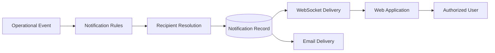
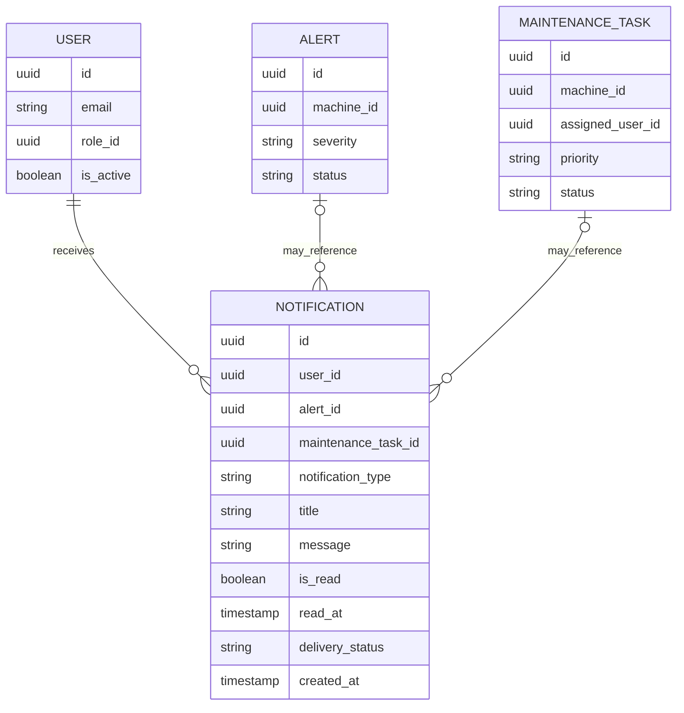

# FactoryPulse AI — Notification and Reporting API

## 1. Purpose

This document defines the FactoryPulse AI API for:

- User notification creation and retrieval
- Unread notification counts
- Marking notifications as read
- Alert and maintenance notification integration
- Email-delivery behaviour
- Dashboard summaries
- Machine-health summaries
- Alert and maintenance statistics
- Prediction-risk summaries
- Measurement trends
- Reporting authorization
- Filtering, aggregation and performance rules

Alert and maintenance workflows are defined in `Alert_and_Maintenance_API.md`.

Real-time delivery of notification and dashboard events will be defined in `WebSocket_Events.md`.

---

## 2. Scope

This API covers two connected domains:

```text
Operational events
    ↓
User notifications
    ↓
Dashboards and reports
```

Notifications inform users about events requiring attention.

Reports and dashboards summarize operational information to support decisions.

This API does not allow clients to:

- Create arbitrary notifications
- Send arbitrary emails
- Execute arbitrary database queries
- Modify historical measurements
- Modify prediction results
- Change alert or maintenance states indirectly

Notifications are normally created internally by Backend business workflows.

---

## 3. Notification Flow



Possible operational events include:

- Critical alert creation
- Alert severity escalation
- Maintenance-task assignment
- Maintenance-task reassignment
- Maintenance task becoming overdue
- Maintenance task becoming blocked
- Maintenance-task completion
- Alert resolution
- Important system-service failures

The primary workflow must remain successful even when WebSocket or email delivery fails after the main database transaction commits.

---

## 4. Notification Relationships



Each notification belongs to exactly one recipient.

A notification may reference:

- One alert
- One maintenance task
- Neither, for a system-level notification

The exact fields must remain aligned with the implemented database schema.

---

## 5. Notification Types

Initial notification types may include:

```text
alert_created
alert_escalated
alert_resolved
maintenance_task_assigned
maintenance_task_reassigned
maintenance_task_due_soon
maintenance_task_overdue
maintenance_task_blocked
maintenance_task_completed
system_warning
```

Notification types are controlled values.

Clients must not create arbitrary notification-type strings.

The notification type allows the frontend to:

- Choose the correct icon
- Display the correct destination link
- Apply translation
- Group similar notifications
- Determine user-interface behaviour

---

## 6. Notification Priority

Notification urgency may be derived from its source.

| Source Condition | Suggested Urgency |
|---|---|
| Low alert | Low |
| Medium alert | Medium |
| High alert | High |
| Critical alert | Critical |
| Normal task assignment | Medium |
| Urgent maintenance task | High |
| Overdue urgent task | Critical |
| System warning | Depends on operational impact |

The MVP may expose urgency as a derived response field even when it is not stored directly.

Notification urgency must not silently replace the source alert severity or task priority.

---

## 7. Delivery Channels

The MVP supports two notification-delivery channels:

```text
In-app notification
Email notification
```

### In-App Notification

Stored in PostgreSQL and retrieved through the API.

It may also be delivered through WebSockets while the user is connected.

### Email Notification

May be sent for selected important events.

Examples:

- Critical alert
- Urgent task assignment
- Urgent overdue task
- Serious system warning

Email is supplementary.

A failed email must not remove or invalidate the in-app notification.

---

## 8. Delivery Status Values

Where supported by the notification schema, delivery status may use:

| Status | Meaning |
|---|---|
| `pending` | Notification is waiting for delivery processing |
| `delivered` | Required delivery processing succeeded |
| `partially_delivered` | At least one channel succeeded and another failed |
| `failed` | Required delivery attempts failed |
| `not_required` | No external delivery channel was required |

An in-app notification is considered available once its database record is committed.

Email-delivery status must not be interpreted as notification read status.

---

## 9. Read Status

Notification read state uses:

```text
is_read
read_at
```

Rules:

- New notifications use `is_read = false`.
- Marking a notification as read sets `is_read = true`.
- `read_at` records the first time it was marked as read.
- Repeating the operation must not create duplicate records.
- Marking a notification as read does not change its source alert or maintenance task.
- Read notifications remain available in history.

Notifications are not deleted merely because they were read.

---

## 10. Authorization Overview

### Administrator

May:

- View their own notifications
- View administrative dashboard data
- View factory-wide reports
- View all machines, alerts, predictions and maintenance summaries
- Review notification-delivery failures where an administrative endpoint is later introduced

### Plant Manager

May:

- View their own notifications
- View factory-wide operational dashboards
- View machine-health summaries
- View alert, prediction and maintenance reports

### Maintenance Engineer

May:

- View their own notifications
- View reports for assigned machines
- View assigned-task summaries
- View relevant alert and prediction information

### Machine Operator

May:

- View their own notifications
- View dashboards for assigned machines
- View limited operational summaries
- View relevant alerts and machine status

A user must not retrieve another user’s notification records through normal endpoints.

---

## 11. Endpoint Summary

### Notification Endpoints

| Method | Endpoint | Purpose |
|---|---|---|
| `GET` | `/api/v1/notifications` | Retrieve the current user’s notifications |
| `GET` | `/api/v1/notifications/unread-count` | Retrieve unread-notification count |
| `GET` | `/api/v1/notifications/{notification_id}` | Retrieve one notification |
| `POST` | `/api/v1/notifications/{notification_id}/read-receipts` | Mark one notification as read |
| `POST` | `/api/v1/notifications/read-receipts` | Mark several or all notifications as read |

The public API does not expose unrestricted notification creation.

---

### Dashboard Endpoints

| Method | Endpoint | Purpose |
|---|---|---|
| `GET` | `/api/v1/dashboard/summary` | Retrieve role-appropriate dashboard summary |
| `GET` | `/api/v1/dashboard/machines/{machine_id}` | Retrieve one machine dashboard |
| `GET` | `/api/v1/dashboard/maintenance` | Retrieve maintenance workload summary |

---

### Reporting Endpoints

| Method | Endpoint | Purpose |
|---|---|---|
| `GET` | `/api/v1/reports/machine-health` | Retrieve machine-health report |
| `GET` | `/api/v1/reports/alerts` | Retrieve alert statistics |
| `GET` | `/api/v1/reports/maintenance` | Retrieve maintenance statistics |
| `GET` | `/api/v1/reports/prediction-risk` | Retrieve prediction-risk statistics |
| `GET` | `/api/v1/reports/measurement-trends` | Retrieve aggregated sensor trends |

Reports return controlled aggregates.

They do not expose arbitrary SQL or database-export capabilities.

---

## 12. Notification Response Model

A notification response may use:

```json
{
  "id": "9ee0e9f8-762c-429f-b832-843ddaa9c972",
  "notification_type": "maintenance_task_assigned",
  "title": "New maintenance task assigned",
  "message": "You have been assigned to inspect the bearing of PUMP-001.",
  "urgency": "high",
  "is_read": false,
  "read_at": null,
  "delivery_status": "delivered",
  "alert": {
    "id": "6c01895f-d712-4391-89fc-02a8127548a3",
    "severity": "high",
    "status": "in_progress"
  },
  "maintenance_task": {
    "id": "8b57c604-319d-4f18-b655-872b37b173a2",
    "title": "Inspect and replace pump bearing",
    "priority": "high",
    "status": "assigned"
  },
  "machine": {
    "id": "2c1f7f02-3b4f-4e75-b517-9636f06c43c0",
    "code": "PUMP-001",
    "name": "Main Cooling Pump"
  },
  "created_at": "2026-08-01T17:40:01Z"
}
```

The machine summary may be derived from the related alert or maintenance task.

Nullable relationships may be returned as `null`.

---

# 13. Retrieve Notifications

## 13.1 Endpoint

```http
GET /api/v1/notifications
```

### Authentication

```text
Bearer access token required
```

### Access

```text
Current user’s notifications only
```

The user ID must be derived from the authenticated account.

Clients must not supply an arbitrary recipient user ID.

---

## 13.2 Query Parameters

Supported parameters:

```text
is_read
notification_type
urgency
start_time
end_time
limit
cursor
sort
```

Example:

```text
GET /api/v1/notifications
    ?is_read=false
    &notification_type=alert_created,maintenance_task_assigned
    &limit=50
```

Default sorting:

```text
-created_at
```

The endpoint uses cursor-based pagination.

---

## 13.3 Successful Response

```text
200 OK
```

```json
{
  "data": [
    {
      "id": "9ee0e9f8-762c-429f-b832-843ddaa9c972",
      "notification_type": "maintenance_task_assigned",
      "title": "New maintenance task assigned",
      "message": "You have been assigned to inspect the bearing of PUMP-001.",
      "urgency": "high",
      "is_read": false,
      "read_at": null,
      "maintenance_task": {
        "id": "8b57c604-319d-4f18-b655-872b37b173a2",
        "status": "assigned"
      },
      "created_at": "2026-08-01T17:40:01Z"
    }
  ],
  "meta": {
    "limit": 50,
    "next_cursor": null,
    "has_more": false
  }
}
```

An empty notification list returns `200 OK` with an empty `data` array.

---

# 14. Retrieve Unread Count

## 14.1 Endpoint

```http
GET /api/v1/notifications/unread-count
```

### Authentication

```text
Bearer access token required
```

### Purpose

Returns the number of unread notifications for the current user.

---

## 14.2 Successful Response

```text
200 OK
```

```json
{
  "data": {
    "unread_count": 7
  }
}
```

The count should use the partial unread-notification index defined in the database indexing strategy.

---

# 15. Retrieve One Notification

## 15.1 Endpoint

```http
GET /api/v1/notifications/{notification_id}
```

### Access

The notification must belong to the current authenticated user.

### Successful Response

```text
200 OK
```

The response contains the complete safe notification representation.

---

## 15.2 Notification Not Found

```text
404 Not Found
```

```json
{
  "error": {
    "code": "notification_not_found",
    "message": "The requested notification does not exist or is not accessible.",
    "details": [],
    "request_id": "req_01J4A7QAX4N12Q3X5F20R8T9MN"
  }
}
```

The response must not reveal whether a notification belonging to another user exists.

---

# 16. Mark One Notification as Read

## 16.1 Endpoint

```http
POST /api/v1/notifications/{notification_id}/read-receipts
```

### Authentication

```text
Bearer access token required
```

### Request Body

No request body is required.

---

## 16.2 Processing Rules

The Backend must:

1. Retrieve the notification.
2. Verify that it belongs to the current user.
3. Set `is_read = true`.
4. Set `read_at` when it has not already been set.
5. Preserve the original `read_at` when the request is repeated.
6. Return the updated notification.

The operation is idempotent.

---

## 16.3 Successful Response

```text
200 OK
```

```json
{
  "data": {
    "id": "9ee0e9f8-762c-429f-b832-843ddaa9c972",
    "is_read": true,
    "read_at": "2026-08-01T18:10:00Z"
  }
}
```

---

# 17. Mark Multiple Notifications as Read

## 17.1 Endpoint

```http
POST /api/v1/notifications/read-receipts
```

### Authentication

```text
Bearer access token required
```

### Purpose

Marks selected notifications or all current-user notifications as read.

---

## 17.2 Selected Notifications Request

```json
{
  "notification_ids": [
    "9ee0e9f8-762c-429f-b832-843ddaa9c972",
    "b5e178f7-b59e-47ca-9b6b-3eb6e604376e"
  ]
}
```

---

## 17.3 Mark All Request

```json
{
  "mark_all": true
}
```

The request must not contain both a non-empty `notification_ids` list and `mark_all = true`.

---

## 17.4 Validation Rules

The Backend must:

- Act only on notifications belonging to the current user
- Reject invalid request combinations
- Limit the maximum number of identifiers
- Preserve previous read timestamps
- Avoid exposing inaccessible notification IDs

---

## 17.5 Successful Response

```text
200 OK
```

```json
{
  "data": {
    "updated_count": 7,
    "unread_count": 0
  }
}
```

---

## 18. Internal Notification Creation

Notifications are normally created by internal services.

Conceptual examples:

```text
Alert Service
    → create alert notification

Maintenance Service
    → create assignment notification

Scheduled Task
    → create overdue-task notification

System Monitoring
    → create service-warning notification
```

Internal notification creation must:

1. Identify the source event.
2. Resolve eligible recipients.
3. Avoid duplicate notifications where appropriate.
4. Create in-app notification records.
5. Commit the records.
6. Publish WebSocket events.
7. Attempt email delivery where required.
8. Update delivery status.
9. Log failures without exposing secrets.

---

## 19. Recipient Resolution

Recipients depend on the event.

### Critical Alert

Possible recipients:

- Administrators
- Plant Managers
- Maintenance Engineers assigned to the machine
- Machine Operators assigned to the machine where appropriate

### Maintenance Task Assigned

Recipients:

- Assigned Maintenance Engineer
- Plant Manager where operational visibility is required

### Maintenance Task Reassigned

Recipients:

- Previous engineer
- New engineer
- Relevant Plant Manager

### Task Overdue

Possible recipients:

- Assigned Maintenance Engineer
- Plant Manager
- Administrator for urgent escalation

### Alert Resolved

Possible recipients:

- Users previously notified about the alert
- Relevant Plant Manager
- Assigned Machine Operator

The Backend should avoid notifying users who:

- Are inactive
- Do not have access to the machine
- No longer have the relevant assignment
- Do not need the event for their role

---

## 20. Duplicate Notification Prevention

Repeated business processing must not flood users with identical notifications.

Possible duplicate-detection factors include:

- Recipient user
- Notification type
- Source alert
- Source maintenance task
- Relevant workflow state
- Recent delivery period

Example:

```text
Same task
    +
Same assigned user
    +
Same assignment event
    → one assignment notification
```

A new notification is justified when:

- Severity increases
- Assignment changes
- Task becomes overdue after a prior due-soon notification
- Workflow state changes
- The previous notification represented a different event

---

## 21. Email Delivery

Email delivery is used only for selected important notifications.

The Backend may use:

- Local email testing during development
- SMTP
- A free external email service where appropriate

Email credentials must be stored in environment variables.

Possible variables:

```text
EMAIL_ENABLED
SMTP_HOST
SMTP_PORT
SMTP_USERNAME
SMTP_PASSWORD
EMAIL_FROM_ADDRESS
```

The real credentials must not be committed to Git.

---

## 22. Email Safety Rules

Email content must:

- Avoid passwords and tokens
- Avoid exposing confidential model internals
- Include only information the recipient may access
- Avoid including unnecessarily sensitive operational details
- Provide a clear summary
- Direct the user to the authenticated application for details

Example email subject:

```text
[FactoryPulse AI] Critical alert for PUMP-001
```

The email should not contain a bearer access token or authentication link that bypasses normal authorization.

---

## 23. Email Failure Behaviour

When email delivery fails:

- The in-app notification remains valid.
- The primary alert or maintenance operation remains successful.
- The delivery failure is logged.
- The notification delivery status may become `partially_delivered` or `failed`.
- A retry may be attempted through a controlled process.
- The API must not repeatedly retry without a limit.

Email failure must not roll back an already committed alert, task or notification.

---

## 24. Notification Retention

The MVP preserves notification history.

A future retention policy may define:

- How long read notifications remain available
- Whether old notifications are archived
- Whether delivery metadata is retained separately
- Whether notification content is anonymized after user deletion or deactivation

No automatic deletion should be implemented until a documented retention policy exists.

---

# 25. Dashboard Summary

## 25.1 Endpoint

```http
GET /api/v1/dashboard/summary
```

### Authentication

```text
Bearer access token required
```

### Purpose

Returns a concise role-appropriate operational summary.

The response must include only resources the current user may access.

---

## 25.2 Administrator or Plant Manager Response

```json
{
  "data": {
    "machines": {
      "total": 18,
      "operational": 12,
      "warning": 3,
      "critical": 1,
      "maintenance": 1,
      "offline": 1
    },
    "alerts": {
      "active_total": 9,
      "critical": 1,
      "high": 3,
      "medium": 4,
      "low": 1
    },
    "maintenance": {
      "active_total": 7,
      "open": 2,
      "assigned": 2,
      "in_progress": 2,
      "blocked": 1,
      "overdue": 2
    },
    "predictions": {
      "high_risk_machines": 2,
      "critical_risk_machines": 1
    },
    "notifications": {
      "unread_count": 4
    },
    "generated_at": "2026-08-01T18:15:00Z"
  }
}
```

---

## 25.3 Assigned-User Response

A Maintenance Engineer or Machine Operator receives a summary limited to assigned machines.

Example:

```json
{
  "data": {
    "machines": {
      "total": 3,
      "operational": 2,
      "warning": 1,
      "critical": 0
    },
    "alerts": {
      "active_total": 2,
      "critical": 0,
      "high": 1,
      "medium": 1,
      "low": 0
    },
    "maintenance": {
      "assigned_to_me": 2,
      "in_progress": 1,
      "blocked": 0,
      "overdue": 0
    },
    "notifications": {
      "unread_count": 2
    },
    "generated_at": "2026-08-01T18:15:00Z"
  }
}
```

The response model may vary by role when some sections are not relevant.

---

## 26. Dashboard Summary Rules

The summary should:

- Use current database state
- Apply machine-level authorization
- Avoid returning large raw collections
- Include a generation timestamp
- Use clearly defined active-status rules
- Avoid double-counting machines or alerts
- Calculate overdue tasks consistently
- Distinguish prediction risk from confirmed failure
- Complete within the performance targets defined by non-functional requirements

The endpoint should not trigger new ML predictions.

It summarizes existing stored data.

---

# 27. Machine Dashboard

## 27.1 Endpoint

```http
GET /api/v1/dashboard/machines/{machine_id}
```

### Permission

```text
Any user authorized to access the machine
```

### Purpose

Returns the principal information needed for one machine monitoring screen.

---

## 27.2 Successful Response

```json
{
  "data": {
    "machine": {
      "id": "2c1f7f02-3b4f-4e75-b517-9636f06c43c0",
      "code": "PUMP-001",
      "name": "Main Cooling Pump",
      "status": "warning"
    },
    "sensors": {
      "total": 4,
      "active": 4,
      "faulty": 0
    },
    "latest_measurements": [
      {
        "sensor_id": "6f3d4cf1-4914-44df-93b8-5311e8d16855",
        "sensor_code": "TEMP-001",
        "value": 78.4,
        "measurement_unit": "°C",
        "quality_status": "good",
        "recorded_at": "2026-08-01T18:14:30Z"
      }
    ],
    "latest_prediction": {
      "id": "458139e4-f383-4360-a4d1-54d899c2e6a9",
      "risk_level": "high",
      "failure_probability": 0.7631,
      "predicted_at": "2026-08-01T18:14:32Z"
    },
    "alerts": {
      "active_total": 2,
      "highest_severity": "high"
    },
    "maintenance": {
      "active_total": 1,
      "current_task_id": "8b57c604-319d-4f18-b655-872b37b173a2"
    },
    "generated_at": "2026-08-01T18:15:00Z"
  }
}
```

This endpoint is optimized for dashboard loading.

Detailed histories remain available through their dedicated endpoints.

---

# 28. Maintenance Dashboard

## 28.1 Endpoint

```http
GET /api/v1/dashboard/maintenance
```

### Permission

```text
Administrator
Plant Manager
Maintenance Engineer
```

### Purpose

Returns maintenance workload and scheduling information.

---

## 28.2 Query Parameters

Possible filters:

```text
assigned_user_id
machine_id
priority
status
due_before
due_after
```

Maintenance Engineers must not use `assigned_user_id` to access another engineer’s restricted work unless broader machine access allows it.

---

## 28.3 Successful Response

```json
{
  "data": {
    "workload": {
      "open": 3,
      "assigned": 4,
      "in_progress": 2,
      "blocked": 1,
      "overdue": 2
    },
    "priority": {
      "urgent": 1,
      "high": 3,
      "medium": 4,
      "low": 2
    },
    "due_soon": [
      {
        "task_id": "8b57c604-319d-4f18-b655-872b37b173a2",
        "machine_code": "PUMP-001",
        "title": "Inspect and replace pump bearing",
        "priority": "high",
        "due_date": "2026-08-02"
      }
    ],
    "generated_at": "2026-08-01T18:15:00Z"
  }
}
```

---

# 29. Machine-Health Report

## 29.1 Endpoint

```http
GET /api/v1/reports/machine-health
```

### Permission

```text
Administrator
Plant Manager
Maintenance Engineer for permitted machines
```

### Purpose

Provides an aggregated operational view of machine condition.

---

## 29.2 Query Parameters

Supported parameters may include:

```text
machine_id
status
location
start_time
end_time
```

When no machine is selected, the report includes only machines accessible to the current user.

---

## 29.3 Successful Response

```json
{
  "data": {
    "summary": {
      "machine_count": 18,
      "machines_with_active_alerts": 6,
      "machines_with_high_risk_predictions": 3,
      "machines_under_maintenance": 2
    },
    "machines": [
      {
        "machine_id": "2c1f7f02-3b4f-4e75-b517-9636f06c43c0",
        "machine_code": "PUMP-001",
        "status": "warning",
        "active_alert_count": 2,
        "highest_alert_severity": "high",
        "latest_prediction_risk": "high",
        "latest_prediction_at": "2026-08-01T18:14:32Z",
        "active_maintenance_count": 1
      }
    ],
    "generated_at": "2026-08-01T18:15:00Z"
  }
}
```

Machine-health state is a summary of stored operational information.

It must not be presented as a guaranteed physical diagnosis.

---

# 30. Alert Report

## 30.1 Endpoint

```http
GET /api/v1/reports/alerts
```

### Permission

```text
Administrator
Plant Manager
Maintenance Engineer for permitted machines
```

### Query Parameters

```text
machine_id
severity
status
source
start_time
end_time
group_by
```

Supported grouping may include:

```text
severity
status
source
machine
day
week
month
```

---

## 30.2 Successful Response

```json
{
  "data": {
    "total_alerts": 48,
    "active_alerts": 9,
    "resolved_alerts": 31,
    "closed_alerts": 8,
    "by_severity": [
      {
        "severity": "critical",
        "count": 3
      },
      {
        "severity": "high",
        "count": 11
      },
      {
        "severity": "medium",
        "count": 24
      },
      {
        "severity": "low",
        "count": 10
      }
    ],
    "by_source": [
      {
        "source": "threshold",
        "count": 19
      },
      {
        "source": "prediction",
        "count": 17
      },
      {
        "source": "manual",
        "count": 12
      }
    ],
    "generated_at": "2026-08-01T18:15:00Z"
  }
}
```

---

# 31. Maintenance Report

## 31.1 Endpoint

```http
GET /api/v1/reports/maintenance
```

### Permission

```text
Administrator
Plant Manager
Maintenance Engineer for permitted machines
```

### Query Parameters

```text
machine_id
assigned_user_id
priority
status
start_time
end_time
group_by
```

---

## 31.2 Possible Metrics

The report may include:

- Tasks created
- Tasks completed
- Tasks cancelled
- Active tasks
- Blocked tasks
- Overdue tasks
- Average completion time
- Completion count by engineer
- Completion count by machine
- Priority distribution

Average values must clearly identify the included time range and task population.

---

## 31.3 Successful Response

```json
{
  "data": {
    "tasks_created": 22,
    "tasks_completed": 14,
    "tasks_cancelled": 2,
    "active_tasks": 6,
    "blocked_tasks": 1,
    "overdue_tasks": 2,
    "average_completion_hours": 13.7,
    "by_priority": [
      {
        "priority": "urgent",
        "count": 2
      },
      {
        "priority": "high",
        "count": 7
      },
      {
        "priority": "medium",
        "count": 10
      },
      {
        "priority": "low",
        "count": 3
      }
    ],
    "generated_at": "2026-08-01T18:15:00Z"
  }
}
```

Tasks that are still active must not be included in completed-task duration calculations.

---

# 32. Prediction-Risk Report

## 32.1 Endpoint

```http
GET /api/v1/reports/prediction-risk
```

### Permission

```text
Administrator
Plant Manager
Maintenance Engineer for permitted machines
```

### Query Parameters

```text
machine_id
model_version_id
prediction_type
risk_level
start_time
end_time
group_by
```

---

## 32.2 Successful Response

```json
{
  "data": {
    "prediction_count": 124,
    "anomaly_count": 31,
    "risk_distribution": [
      {
        "risk_level": "critical",
        "count": 4
      },
      {
        "risk_level": "high",
        "count": 18
      },
      {
        "risk_level": "medium",
        "count": 42
      },
      {
        "risk_level": "low",
        "count": 60
      }
    ],
    "machines_with_latest_high_or_critical_risk": [
      {
        "machine_id": "2c1f7f02-3b4f-4e75-b517-9636f06c43c0",
        "machine_code": "PUMP-001",
        "risk_level": "high",
        "failure_probability": 0.7631,
        "predicted_at": "2026-08-01T18:14:32Z"
      }
    ],
    "generated_at": "2026-08-01T18:15:00Z"
  }
}
```

Prediction reports must preserve model-version traceability.

Results from incompatible model versions should not be combined without clear identification.

---

# 33. Measurement-Trend Report

## 33.1 Endpoint

```http
GET /api/v1/reports/measurement-trends
```

### Permission

```text
Any user authorized to access the selected machine and sensor
```

### Purpose

Returns aggregated measurement values for charts and longer time ranges.

This avoids returning every raw sensor measurement when the frontend needs only a trend.

---

## 33.2 Required Query Parameters

```text
sensor_id
start_time
end_time
interval
```

Supported intervals may include:

```text
minute
hour
day
```

Example:

```text
GET /api/v1/reports/measurement-trends
    ?sensor_id=6f3d4cf1-4914-44df-93b8-5311e8d16855
    &start_time=2026-07-25T00:00:00Z
    &end_time=2026-08-01T00:00:00Z
    &interval=hour
```

---

## 33.3 Aggregated Values

Each interval may include:

```text
minimum
maximum
average
measurement_count
suspect_count
invalid_count
```

---

## 33.4 Successful Response

```json
{
  "data": {
    "sensor": {
      "id": "6f3d4cf1-4914-44df-93b8-5311e8d16855",
      "code": "TEMP-001",
      "sensor_type": "temperature",
      "measurement_unit": "°C"
    },
    "interval": "hour",
    "points": [
      {
        "start_time": "2026-08-01T16:00:00Z",
        "end_time": "2026-08-01T17:00:00Z",
        "minimum": 68.2,
        "maximum": 75.7,
        "average": 71.9,
        "measurement_count": 60,
        "suspect_count": 0,
        "invalid_count": 0
      },
      {
        "start_time": "2026-08-01T17:00:00Z",
        "end_time": "2026-08-01T18:00:00Z",
        "minimum": 71.4,
        "maximum": 78.4,
        "average": 74.6,
        "measurement_count": 60,
        "suspect_count": 1,
        "invalid_count": 0
      }
    ],
    "generated_at": "2026-08-01T18:15:00Z"
  }
}
```

---

## 34. Reporting Time-Range Rules

Reports must validate:

- `start_time` and `end_time`
- Timezone information
- Start before end
- Maximum permitted range
- Appropriate aggregation interval
- Resource authorization

Possible initial limits:

| Report | Maximum Range |
|---|---|
| Detailed dashboard | Current or recent state |
| Raw measurements | 30 days |
| Minute aggregation | 7 days |
| Hour aggregation | 90 days |
| Day aggregation | 2 years |

These limits are initial design recommendations and may be adjusted after performance testing.

---

## 35. Empty Report Results

A valid report with no matching records returns:

```text
200 OK
```

with empty aggregates or arrays.

Example:

```json
{
  "data": {
    "total_alerts": 0,
    "by_severity": [],
    "by_source": [],
    "generated_at": "2026-08-01T18:15:00Z"
  }
}
```

It must not return `404 Not Found`.

---

## 36. Report Consistency

Each report must define:

- Included resources
- Included statuses
- Time-range interpretation
- Grouping method
- Timezone
- Authorization scope
- Generation timestamp
- Meaning of averages and percentages

Report values must be reproducible from stored data.

The frontend must not calculate security-sensitive totals using records it is not authorized to retrieve.

---

## 37. Reporting Performance

Reports may require aggregation across large tables.

The Backend should:

- Apply authorization before aggregation
- Use indexed time and resource filters
- Restrict time ranges
- Use database aggregation
- Avoid loading all records into Python
- Return only required fields
- Use measurement-trend aggregation for long ranges
- Review queries with `EXPLAIN ANALYZE`
- Add indexes only when actual query evidence supports them

Future optimization may include:

- Materialized views
- Precomputed daily summaries
- Caching
- Background report generation
- TimescaleDB continuous aggregates

These are deferred until actual performance requires them.

---

## 38. Caching Rules

Dashboard summaries may be cached briefly when:

- The information is expensive to calculate
- A few seconds of delay are acceptable
- Authorization scope is part of the cache key
- Cached data cannot leak between users

Possible short cache duration:

```text
5 to 30 seconds
```

Notifications and unread counts should normally reflect current database state.

Cache design must never allow one user to receive another user’s protected data.

---

## 39. Report Export

CSV or PDF export is not required for the first MVP API.

When export is added, it must define:

- Supported report types
- Maximum time range
- Asynchronous processing rules
- Download authorization
- File expiration
- Sensitive-data handling
- Audit logging

The initial frontend may display reports directly using JSON responses.

---

## 40. Real-Time Integration

The notification workflow may publish:

```text
notification.created
notification.read
```

Dashboard-related operational events may include:

```text
machine.status_changed
prediction.created
alert.created
alert.updated
maintenance_task.updated
```

The frontend should update affected dashboard sections using WebSocket events or refetch the related API resource.

Detailed real-time message formats will be defined in `WebSocket_Events.md`.

---

## 41. Transaction Boundaries

### Notification Creation

```text
Resolve recipients
    +
Create notification records
    +
Commit
```

After commit:

```text
Publish WebSocket events
    +
Attempt email delivery
    +
Update delivery status
```

### Mark as Read

```text
Verify recipient ownership
    +
Update is_read and read_at
    +
Commit
```

### Report Retrieval

Reports are read-only operations.

They must not modify source operational records.

---

## 42. Failure Behaviour

### Notification Database Creation Fails

The failure is logged.

The source alert or maintenance operation should not be falsely reported as having created a notification.

### WebSocket Delivery Fails

The notification remains available through the REST API.

### Email Delivery Fails

The in-app notification remains valid.

### Report Query Fails

The API returns a standardized server error.

It must not return partial or misleading totals without identifying them as incomplete.

### Optional Related Service Is Unavailable

The report should use stored data where possible.

It should not call the ML Service merely to generate a normal prediction report.

---

## 43. Audit and Logging

Normal user notification reads do not require full administrative audit records.

Operational logs may record:

- Notification creation count
- Recipient count
- WebSocket-delivery failure
- Email-delivery failure
- Report endpoint
- Report filters
- Processing duration
- Request identifier
- Authenticated user identifier

Important administrative notification actions may be audited if introduced later.

Logs must not contain:

- Email passwords
- API keys
- Access tokens
- Private notification content unnecessarily
- Complete large report responses
- Sensitive environment variables

---

## 44. Error Summary

| Condition | HTTP Status | Error Code |
|---|---:|---|
| Notification not found or inaccessible | `404` | `notification_not_found` |
| Invalid notification filter | `422` | `validation_error` |
| Invalid read-receipt request | `422` | `invalid_read_receipt_request` |
| Too many notification IDs | `422` | `notification_batch_limit_exceeded` |
| Machine not found or inaccessible | `404` | `machine_not_found` |
| Sensor not found or inaccessible | `404` | `sensor_not_found` |
| Invalid report time range | `422` | `invalid_report_time_range` |
| Unsupported aggregation interval | `422` | `unsupported_report_interval` |
| Report range too large | `422` | `report_range_exceeded` |
| Report processing failure | `500` | `report_generation_failed` |
| Missing authentication | `401` | `authentication_required` |
| Insufficient permission | `403` | `permission_denied` |

---

## 45. Security Rules

The Notification and Reporting API must:

- Require authentication for every endpoint
- Return only the current user’s notifications
- Enforce machine-level authorization in dashboards and reports
- Prevent arbitrary notification creation
- Prevent clients from choosing arbitrary recipients
- Validate every report filter
- Restrict supported grouping and sorting fields
- Limit report time ranges
- Avoid exposing inaccessible machine information
- Keep email credentials outside source code
- Avoid placing secrets in notification content
- Protect cached responses by authorization scope
- Preserve read and delivery history
- Avoid arbitrary SQL-style reporting
- Return aggregates based only on authorized records
- Never trust frontend filtering as authorization
- Log failures without exposing confidential values

---

## 46. Deferred Features

The following capabilities are outside the initial MVP:

- User-configurable notification preferences
- Per-channel notification preferences
- Push notifications
- SMS notifications
- Mobile-device notifications
- Notification deletion
- Notification archiving
- Notification snoozing
- Digest emails
- Scheduled report emails
- Arbitrary report builder
- User-defined dashboards
- CSV export
- PDF report export
- Scheduled report generation
- Report sharing
- Public dashboard links
- Advanced business-intelligence integration
- Materialized reporting views
- Long-running asynchronous reports
- Multi-site reporting

These features may be added when confirmed requirements justify them.

---

## 47. Implementation Mapping

The API may later map to backend modules such as:

```text
backend/
└── app/
    ├── api/
    │   └── v1/
    │       ├── notifications.py
    │       ├── dashboard.py
    │       └── reports.py
    ├── notifications/
    │   ├── models.py
    │   ├── schemas.py
    │   ├── repository.py
    │   ├── service.py
    │   ├── recipients.py
    │   └── email.py
    ├── dashboard/
    │   ├── schemas.py
    │   ├── repository.py
    │   └── service.py
    ├── reports/
    │   ├── schemas.py
    │   ├── repository.py
    │   └── service.py
    ├── alerts/
    ├── maintenance/
    ├── monitoring/
    ├── predictions/
    ├── realtime/
    ├── auth/
    ├── database/
    └── shared/
```

Possible responsibilities:

| Module | Responsibility |
|---|---|
| `notifications.py` | Notification retrieval and read routes |
| `dashboard.py` | Dashboard summary routes |
| `reports.py` | Reporting routes |
| `notifications/service.py` | Notification business rules |
| `notifications/recipients.py` | Recipient resolution |
| `notifications/email.py` | Email-delivery integration |
| `notifications/repository.py` | Notification database operations |
| `dashboard/service.py` | Role-specific dashboard aggregation |
| `dashboard/repository.py` | Dashboard queries |
| `reports/service.py` | Report validation and coordination |
| `reports/repository.py` | Aggregation queries |
| `realtime` | WebSocket notification delivery |
| `auth` | User and machine authorization |

---

## 48. Related Documents

- [[09_API/API_Overview|API Overview]]
- [[09_API/API_Conventions|API Conventions]]
- [[09_API/Alert_and_Maintenance_API|Alert and Maintenance API]]
- [[09_API/Monitoring_and_Prediction_API|Monitoring and Prediction API]]
- [[04_Database/Database_Schema|Database Schema]]