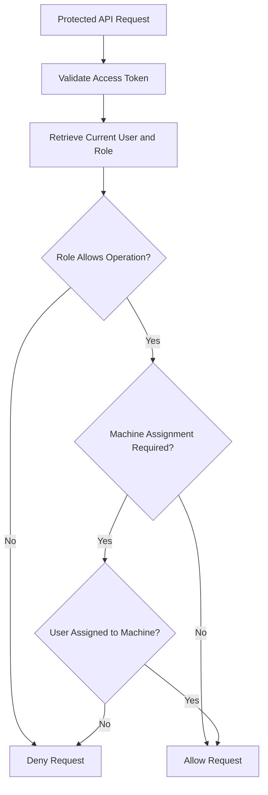

# FactoryPulse AI — User and Access API

## 1. Purpose

This document defines the FactoryPulse AI API for:

- User-account administration
- Role retrieval and assignment
- Account activation and deactivation
- Machine-level user assignments
- Role-based access control
- Resource-level access control
- User and assignment auditing

Authentication and access-token handling are defined separately in `Authentication_API.md`.

---

## 2. Scope

The MVP supports four fixed roles:

```text
administrator
plant_manager
maintenance_engineer
machine_operator
```

Each user has exactly one role.

Users may also be assigned to specific machines through machine assignments.

Access decisions may therefore depend on:

```text
Authentication
    +
User role
    +
Machine assignment
    +
Requested operation
```

Detailed permission tables and custom roles are outside the MVP.

---

## 3. API Endpoints

### 3.1 Role Endpoints

| Method | Endpoint | Permission | Purpose |
|---|---|---|---|
| `GET` | `/api/v1/roles` | Administrator | Retrieve supported roles |
| `GET` | `/api/v1/roles/{role_id}` | Administrator | Retrieve one role |

Roles are created through database seed data and are not created or deleted through the MVP API.

---

### 3.2 User Endpoints

| Method | Endpoint | Permission | Purpose |
|---|---|---|---|
| `POST` | `/api/v1/users` | Administrator | Create a user |
| `GET` | `/api/v1/users` | Administrator | Retrieve users |
| `GET` | `/api/v1/users/{user_id}` | Administrator | Retrieve one user |
| `PATCH` | `/api/v1/users/{user_id}` | Administrator | Update profile, role or account state |

Permanent user deletion is not exposed through the public API.

Users are deactivated using:

```text
is_active = false
```

---

### 3.3 Machine Assignment Endpoints

| Method | Endpoint | Permission | Purpose |
|---|---|---|---|
| `GET` | `/api/v1/users/{user_id}/machine-assignments` | Administrator | Retrieve a user’s assignments |
| `POST` | `/api/v1/users/{user_id}/machine-assignments` | Administrator | Assign a user to a machine |
| `DELETE` | `/api/v1/users/{user_id}/machine-assignments/{assignment_id}` | Administrator | Remove an assignment |
| `GET` | `/api/v1/machines/{machine_id}/assignments` | Administrator or Plant Manager | Retrieve users assigned to a machine |

Plant Managers receive read access to machine assignments for operational visibility but do not modify assignments during the MVP.

---

## 4. Authorization Overview

### 4.1 Administrator

The Administrator may:

- Create users
- View all users
- Change user profiles
- Change roles
- Activate or deactivate accounts
- Assign users to machines
- Remove machine assignments
- View all assignment information

---

### 4.2 Plant Manager

The Plant Manager may:

- View factory-wide operational information
- View users assigned to machines
- View machine responsibilities
- View maintenance assignments

The Plant Manager does not create users or change roles during the MVP.

---

### 4.3 Maintenance Engineer

The Maintenance Engineer may:

- View their own profile through `/auth/me`
- Access assigned machines
- View and manage assigned maintenance tasks
- View alerts and predictions related to permitted machines

The Maintenance Engineer does not manage user accounts.

---

### 4.4 Machine Operator

The Machine Operator may:

- View their own profile through `/auth/me`
- Access assigned machines
- View relevant measurements and alerts
- Report operational problems

The Machine Operator does not manage users or assignments.

---

## 5. User Response Model

A safe user response may use:

```json
{
  "id": "550e8400-e29b-41d4-a716-446655440000",
  "first_name": "Amine",
  "last_name": "Bennani",
  "email": "amine.bennani@example.com",
  "role": {
    "id": "82f5f29b-7475-4b04-8818-03b571db6e51",
    "name": "maintenance_engineer",
    "description": "Investigates alerts and performs maintenance interventions."
  },
  "is_active": true,
  "last_login_at": "2026-08-01T15:30:00Z",
  "created_at": "2026-07-20T11:00:00Z",
  "updated_at": "2026-08-01T15:30:00Z"
}
```

The API must never expose:

```text
password
password_hash
JWT secrets
database credentials
service API keys
```

---

# 6. Retrieve Roles

## 6.1 Endpoint

```http
GET /api/v1/roles
```

### Authentication

```text
Bearer access token required
```

### Permission

```text
Administrator
```

### Purpose

Returns the fixed roles supported by FactoryPulse AI.

---

## 6.2 Successful Response

```text
200 OK
```

```json
{
  "data": [
    {
      "id": "6f6ae404-c8db-4cb5-a75a-f41f34ef3793",
      "name": "administrator",
      "description": "Manages users, machines, sensors and platform configuration."
    },
    {
      "id": "313c3298-d1dd-435d-a34a-f151289d3aa4",
      "name": "plant_manager",
      "description": "Monitors operations, alerts, predictions and reports."
    },
    {
      "id": "82f5f29b-7475-4b04-8818-03b571db6e51",
      "name": "maintenance_engineer",
      "description": "Investigates alerts and performs maintenance interventions."
    },
    {
      "id": "c4997be7-b38e-481f-9622-0538063dc2ca",
      "name": "machine_operator",
      "description": "Monitors assigned machines and reports operational issues."
    }
  ]
}
```

The roles collection does not require pagination because it contains only four records.

---

# 7. Create User

## 7.1 Endpoint

```http
POST /api/v1/users
```

### Authentication

```text
Bearer access token required
```

### Permission

```text
Administrator
```

### Purpose

Creates a new FactoryPulse AI user account.

---

## 7.2 Request Body

```json
{
  "first_name": "Amine",
  "last_name": "Bennani",
  "email": "amine.bennani@example.com",
  "password": "a-secure-user-passphrase",
  "role_id": "82f5f29b-7475-4b04-8818-03b571db6e51",
  "is_active": true
}
```

### Request Fields

| Field | Type | Required | Rules |
|---|---|---:|---|
| `first_name` | String | Yes | Non-empty, maximum 100 characters |
| `last_name` | String | Yes | Non-empty, maximum 100 characters |
| `email` | String | Yes | Valid email, normalized to lowercase, unique |
| `password` | String | Yes | Must satisfy the password policy |
| `role_id` | UUID | Yes | Must reference an existing supported role |
| `is_active` | Boolean | No | Defaults to `true` |

---

## 7.3 Processing Rules

The Backend API must:

1. Validate the Administrator’s permission.
2. Normalize the email address.
3. Verify that the email is not already registered.
4. Verify that the role exists.
5. Validate the password policy.
6. Hash the password using Argon2id.
7. Create the user in a database transaction.
8. Record an audit event.
9. Return the safe user representation.

The plain-text password must be discarded after hashing.

---

## 7.4 Successful Response

```text
201 Created
```

```json
{
  "data": {
    "id": "550e8400-e29b-41d4-a716-446655440000",
    "first_name": "Amine",
    "last_name": "Bennani",
    "email": "amine.bennani@example.com",
    "role": {
      "id": "82f5f29b-7475-4b04-8818-03b571db6e51",
      "name": "maintenance_engineer"
    },
    "is_active": true,
    "last_login_at": null,
    "created_at": "2026-08-01T16:00:00Z",
    "updated_at": "2026-08-01T16:00:00Z"
  }
}
```

The response may include:

```http
Location: /api/v1/users/550e8400-e29b-41d4-a716-446655440000
```

---

## 7.5 Duplicate Email

```text
409 Conflict
```

```json
{
  "error": {
    "code": "duplicate_user_email",
    "message": "A user account already exists with this email address.",
    "details": [
      {
        "field": "email"
      }
    ],
    "request_id": "req_01J4A7QAX4N12Q3X5F20R8T9MN"
  }
}
```

---

## 7.6 Invalid Role

```text
400 Bad Request
```

```json
{
  "error": {
    "code": "invalid_role",
    "message": "The selected role is not valid.",
    "details": [],
    "request_id": "req_01J4A7QAX4N12Q3X5F20R8T9MN"
  }
}
```

---

# 8. Retrieve Users

## 8.1 Endpoint

```http
GET /api/v1/users
```

### Permission

```text
Administrator
```

### Supported Query Parameters

```text
page
page_size
role_id
is_active
search
sort
```

Example:

```text
GET /api/v1/users
    ?role_id=82f5f29b-7475-4b04-8818-03b571db6e51
    &is_active=true
    &search=amine
    &sort=last_name
    &page=1
    &page_size=20
```

---

## 8.2 Searchable Fields

The `search` parameter may search:

```text
first_name
last_name
email
```

Search behaviour should be case-insensitive.

---

## 8.3 Sortable Fields

Approved sorting fields include:

```text
first_name
last_name
email
created_at
last_login_at
```

Default sorting:

```text
last_name ascending
first_name ascending
```

---

## 8.4 Successful Response

```text
200 OK
```

```json
{
  "data": [
    {
      "id": "550e8400-e29b-41d4-a716-446655440000",
      "first_name": "Amine",
      "last_name": "Bennani",
      "email": "amine.bennani@example.com",
      "role": {
        "id": "82f5f29b-7475-4b04-8818-03b571db6e51",
        "name": "maintenance_engineer"
      },
      "is_active": true,
      "last_login_at": "2026-08-01T15:30:00Z",
      "created_at": "2026-07-20T11:00:00Z",
      "updated_at": "2026-08-01T15:30:00Z"
    }
  ],
  "meta": {
    "page": 1,
    "page_size": 20,
    "total_items": 1,
    "total_pages": 1
  }
}
```

---

# 9. Retrieve One User

## 9.1 Endpoint

```http
GET /api/v1/users/{user_id}
```

### Permission

```text
Administrator
```

### Successful Response

```text
200 OK
```

The response contains the safe user representation.

---

## 9.2 User Not Found

```text
404 Not Found
```

```json
{
  "error": {
    "code": "user_not_found",
    "message": "The requested user does not exist.",
    "details": [],
    "request_id": "req_01J4A7QAX4N12Q3X5F20R8T9MN"
  }
}
```

---

# 10. Update User

## 10.1 Endpoint

```http
PATCH /api/v1/users/{user_id}
```

### Permission

```text
Administrator
```

### Purpose

Updates selected user-account fields.

Supported fields include:

```text
first_name
last_name
email
role_id
is_active
```

Password changes are not included in this endpoint during the MVP.

---

## 10.2 Example Request

```json
{
  "role_id": "313c3298-d1dd-435d-a34a-f151289d3aa4",
  "is_active": true
}
```

Fields not included remain unchanged.

---

## 10.3 Successful Response

```text
200 OK
```

```json
{
  "data": {
    "id": "550e8400-e29b-41d4-a716-446655440000",
    "first_name": "Amine",
    "last_name": "Bennani",
    "email": "amine.bennani@example.com",
    "role": {
      "id": "313c3298-d1dd-435d-a34a-f151289d3aa4",
      "name": "plant_manager"
    },
    "is_active": true,
    "last_login_at": "2026-08-01T15:30:00Z",
    "created_at": "2026-07-20T11:00:00Z",
    "updated_at": "2026-08-01T16:20:00Z"
  }
}
```

---

## 10.4 Role-Change Rules

When changing a role, the Backend API must review existing machine assignments.

Examples:

```text
machine_operator + operation assignment
    → compatible

maintenance_engineer + maintenance assignment
    → compatible

plant_manager + supervision assignment
    → compatible
```

If the new role conflicts with existing assignments, the API should either:

- Reject the role change, or
- Require the assignments to be removed first

The MVP should use the safer rule:

> Reject incompatible role changes until conflicting assignments are removed.

Example error:

```text
409 Conflict
```

```json
{
  "error": {
    "code": "role_conflicts_with_assignments",
    "message": "The user has machine assignments that are incompatible with the selected role.",
    "details": [
      {
        "assignment_id": "d0939d21-7fce-4946-a96e-a64468108d6c",
        "assignment_type": "maintenance"
      }
    ],
    "request_id": "req_01J4A7QAX4N12Q3X5F20R8T9MN"
  }
}
```

---

## 10.5 Account Deactivation Rules

Setting:

```json
{
  "is_active": false
}
```

must immediately prevent new authenticated requests.

Because protected endpoints retrieve the current account state from the database, an already issued access token becomes unusable after deactivation.

The system should prevent an Administrator from accidentally deactivating their own account through this endpoint.

Example:

```text
409 Conflict
```

```json
{
  "error": {
    "code": "self_deactivation_not_allowed",
    "message": "You cannot deactivate your own account.",
    "details": [],
    "request_id": "req_01J4A7QAX4N12Q3X5F20R8T9MN"
  }
}
```

The system should also avoid leaving the platform without any active Administrator account.

---

## 10.6 Audit Requirements

The following changes must create audit events:

```text
user.profile_updated
user.email_changed
user.role_changed
user.activated
user.deactivated
```

Audit values must exclude:

```text
password
password_hash
access tokens
secrets
```

---

# 11. Machine Assignment Model

A machine-assignment response may use:

```json
{
  "id": "d0939d21-7fce-4946-a96e-a64468108d6c",
  "user": {
    "id": "550e8400-e29b-41d4-a716-446655440000",
    "first_name": "Amine",
    "last_name": "Bennani",
    "role": "maintenance_engineer"
  },
  "machine": {
    "id": "2c1f7f02-3b4f-4e75-b517-9636f06c43c0",
    "code": "PUMP-001",
    "name": "Main Cooling Pump"
  },
  "assignment_type": "maintenance",
  "assigned_by": {
    "id": "50f907c1-61c8-4502-977d-fe347c2e1093",
    "first_name": "Sara",
    "last_name": "Alaoui"
  },
  "assigned_at": "2026-08-01T16:30:00Z"
}
```

---

# 12. Retrieve User Machine Assignments

## 12.1 Endpoint

```http
GET /api/v1/users/{user_id}/machine-assignments
```

### Permission

```text
Administrator
```

### Purpose

Returns the machines assigned to one user.

### Supported Filters

```text
assignment_type
machine_status
```

---

## 12.2 Successful Response

```text
200 OK
```

```json
{
  "data": [
    {
      "id": "d0939d21-7fce-4946-a96e-a64468108d6c",
      "machine": {
        "id": "2c1f7f02-3b4f-4e75-b517-9636f06c43c0",
        "code": "PUMP-001",
        "name": "Main Cooling Pump",
        "status": "operational"
      },
      "assignment_type": "maintenance",
      "assigned_at": "2026-08-01T16:30:00Z"
    }
  ]
}
```

The expected number of assignments per user is small, so pagination is optional for the MVP.

---

# 13. Create Machine Assignment

## 13.1 Endpoint

```http
POST /api/v1/users/{user_id}/machine-assignments
```

### Permission

```text
Administrator
```

### Request Body

```json
{
  "machine_id": "2c1f7f02-3b4f-4e75-b517-9636f06c43c0",
  "assignment_type": "maintenance"
}
```

---

## 13.2 Assignment Types

| Assignment Type | Expected Role | Meaning |
|---|---|---|
| `operation` | Machine Operator | Operates or monitors the machine |
| `maintenance` | Maintenance Engineer | Performs maintenance work |
| `supervision` | Plant Manager | Supervises machine performance |

Administrators do not normally require machine assignments because they have platform-wide access.

---

## 13.3 Validation Rules

The Backend API must verify:

- The user exists.
- The user is active.
- The machine exists.
- The machine is not decommissioned.
- The assignment type is supported.
- The assignment type is compatible with the user role.
- The same user-machine assignment does not already exist.
- The authenticated Administrator may perform the operation.

---

## 13.4 Successful Response

```text
201 Created
```

```json
{
  "data": {
    "id": "d0939d21-7fce-4946-a96e-a64468108d6c",
    "user": {
      "id": "550e8400-e29b-41d4-a716-446655440000",
      "first_name": "Amine",
      "last_name": "Bennani",
      "role": "maintenance_engineer"
    },
    "machine": {
      "id": "2c1f7f02-3b4f-4e75-b517-9636f06c43c0",
      "code": "PUMP-001",
      "name": "Main Cooling Pump"
    },
    "assignment_type": "maintenance",
    "assigned_by": {
      "id": "50f907c1-61c8-4502-977d-fe347c2e1093",
      "first_name": "Sara",
      "last_name": "Alaoui"
    },
    "assigned_at": "2026-08-01T16:30:00Z"
  }
}
```

---

## 13.5 Duplicate Assignment

```text
409 Conflict
```

```json
{
  "error": {
    "code": "duplicate_machine_assignment",
    "message": "This user is already assigned to the selected machine.",
    "details": [],
    "request_id": "req_01J4A7QAX4N12Q3X5F20R8T9MN"
  }
}
```

---

## 13.6 Incompatible Assignment

```text
400 Bad Request
```

```json
{
  "error": {
    "code": "assignment_role_mismatch",
    "message": "The assignment type is not compatible with the user’s role.",
    "details": [
      {
        "role": "machine_operator",
        "assignment_type": "maintenance"
      }
    ],
    "request_id": "req_01J4A7QAX4N12Q3X5F20R8T9MN"
  }
}
```

---

# 14. Remove Machine Assignment

## 14.1 Endpoint

```http
DELETE /api/v1/users/{user_id}/machine-assignments/{assignment_id}
```

### Permission

```text
Administrator
```

### Successful Response

```text
204 No Content
```

The operation removes the assignment relationship but does not delete:

- The user
- The machine
- Historical maintenance records
- Alerts
- Audit records

---

## 14.2 Removal Rules

Before removing the assignment, the Backend API should verify whether it is still required by active work.

Example:

```text
Maintenance Engineer
    → assigned to PUMP-001
    → has an active maintenance task for PUMP-001
```

The assignment should not be removed until the active task is reassigned or completed.

Example response:

```text
409 Conflict
```

```json
{
  "error": {
    "code": "assignment_has_active_work",
    "message": "The assignment cannot be removed while the user has active work for this machine.",
    "details": [
      {
        "maintenance_task_id": "8b57c604-319d-4f18-b655-872b37b173a2"
      }
    ],
    "request_id": "req_01J4A7QAX4N12Q3X5F20R8T9MN"
  }
}
```

Removing an assignment must create an audit event:

```text
machine_assignment.removed
```

---

# 15. Retrieve Machine Assignments

## 15.1 Endpoint

```http
GET /api/v1/machines/{machine_id}/assignments
```

### Permission

```text
Administrator
Plant Manager
```

### Supported Filters

```text
assignment_type
role
is_active
```

### Successful Response

```text
200 OK
```

```json
{
  "data": [
    {
      "id": "d0939d21-7fce-4946-a96e-a64468108d6c",
      "user": {
        "id": "550e8400-e29b-41d4-a716-446655440000",
        "first_name": "Amine",
        "last_name": "Bennani",
        "email": "amine.bennani@example.com",
        "role": "maintenance_engineer",
        "is_active": true
      },
      "assignment_type": "maintenance",
      "assigned_at": "2026-08-01T16:30:00Z"
    }
  ]
}
```

Plant Managers receive only the information needed for operational coordination.

They must not receive password, authentication or sensitive audit fields.

---

## 16. Resource-Level Authorization Flow



The API must not rely only on frontend visibility.

Every protected backend operation must independently validate authorization.

---

## 17. Permission Matrix

| Capability | Administrator | Plant Manager | Maintenance Engineer | Machine Operator |
|---|---:|---:|---:|---:|
| Create users | Yes | No | No | No |
| View all users | Yes | No | No | No |
| Change roles | Yes | No | No | No |
| Activate or deactivate users | Yes | No | No | No |
| Create machine assignments | Yes | No | No | No |
| Remove machine assignments | Yes | No | No | No |
| View machine assignments | Yes | Yes | Assigned context only | Assigned context only |
| View all machines | Yes | Yes | No | No |
| View assigned machines | Yes | Yes | Yes | Yes |
| Review audit logs | Yes | No | No | No |

Specific operational permissions will be expanded in the corresponding machine, alert and maintenance API documents.

---

## 18. Error Summary

| Condition | HTTP Status | Error Code |
|---|---:|---|
| User not found | `404` | `user_not_found` |
| Role not found | `404` | `role_not_found` |
| Machine not found | `404` | `machine_not_found` |
| Duplicate email | `409` | `duplicate_user_email` |
| Duplicate assignment | `409` | `duplicate_machine_assignment` |
| Role conflicts with assignments | `409` | `role_conflicts_with_assignments` |
| Assignment has active work | `409` | `assignment_has_active_work` |
| Assignment-role mismatch | `400` | `assignment_role_mismatch` |
| Self-deactivation attempted | `409` | `self_deactivation_not_allowed` |
| Invalid request fields | `422` | `validation_error` |
| Missing authentication | `401` | `authentication_required` |
| Insufficient permission | `403` | `permission_denied` |

---

## 19. Audit Events

The following operations should generate audit records:

```text
user.created
user.profile_updated
user.email_changed
user.role_changed
user.activated
user.deactivated
machine_assignment.created
machine_assignment.removed
```

An audit record should include:

- Acting Administrator
- Action
- Affected resource
- Selected previous values
- Selected new values
- Timestamp
- Request identifier
- IP address where appropriate

Sensitive values must be removed before writing audit JSON.

---

## 20. Transaction Requirements

The following operations should use database transactions:

### Create User

```text
Create user
    +
Write audit log
```

### Update User Role

```text
Validate assignments
    +
Update role
    +
Write audit log
```

### Create Assignment

```text
Validate user and machine
    +
Create assignment
    +
Write audit log
```

### Remove Assignment

```text
Validate active work
    +
Remove assignment
    +
Write audit log
```

When a required step fails, the operation should roll back to prevent incomplete state.

---

## 21. Security Rules

The User and Access API must:

- Require authentication for every endpoint
- Restrict account management to Administrators
- Validate roles using the current database state
- Enforce machine-level access where required
- Never expose password hashes
- Normalize email addresses
- Prevent duplicate email addresses
- Prevent duplicate machine assignments
- Prevent incompatible role and assignment combinations
- Prevent accidental Administrator self-deactivation
- Preserve account history through deactivation
- Record important account and assignment changes
- Return generic permission errors
- Validate every identifier and request field

---

## 22. Deferred Features

The following capabilities are outside the MVP:

- User self-registration
- Custom roles
- Multiple roles per user
- Detailed permission tables
- Temporary assignments
- Assignment expiration dates
- Team or department management
- Bulk user import
- User avatar uploads
- Password reset
- Administrator password changes through this API
- External identity-provider synchronization

They may be added when confirmed requirements justify them.

---

## 23. Implementation Mapping

The API may later map to backend modules such as:

```text
backend/
└── app/
    ├── api/
    │   └── v1/
    │       ├── users.py
    │       ├── roles.py
    │       └── machine_assignments.py
    ├── users/
    ├── auth/
    ├── machines/
    ├── audit/
    ├── database/
    └── shared/
```

Possible responsibilities:

| Module | Responsibility |
|---|---|
| `users.py` | User route definitions |
| `roles.py` | Role retrieval routes |
| `machine_assignments.py` | Assignment routes |
| `users/service.py` | User business rules |
| `users/repository.py` | User database operations |
| `auth/dependencies.py` | Authentication and role checks |
| `machines/access.py` | Machine-level authorization |
| `audit` | Change-history recording |

---

## 24. Related Documents

- [[09_API/API_Overview|API Overview]]
- [[09_API/API_Conventions|API Conventions]]
- [[09_API/Authentication_API|Authentication API]]
- [[04_Database/Database_Schema|Database Schema]]
- [[03_Architecture/Component_Architecture|Component Architecture]]
- [[02_Requirements/Use_Cases|Use Cases]]