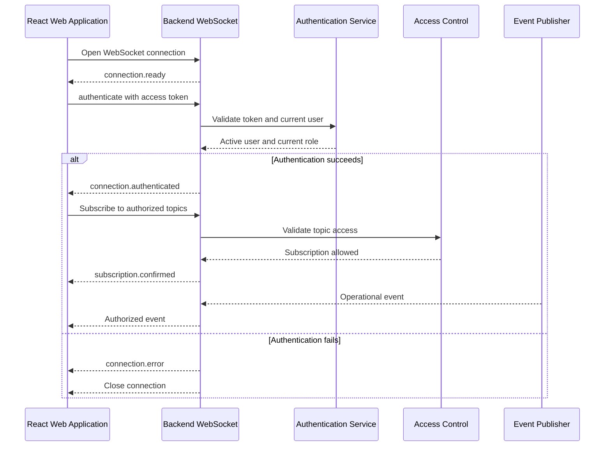

# FactoryPulse AI — WebSocket Events

## 1. Purpose

This document defines the real-time communication contract between the FactoryPulse AI Backend API and the React Web Application.

It specifies:

- WebSocket connection establishment
- Connection authentication
- Authorization and machine-level access
- Subscription and unsubscription behaviour
- Event-message structure
- Measurement, prediction, alert and maintenance events
- Notification events
- Heartbeats and connection health
- Token expiration
- Reconnection behaviour
- Error messages
- Delivery guarantees and limitations
- Security and performance rules

REST endpoints remain the authoritative method for retrieving complete and current resource state.

WebSocket events inform the frontend that something has changed and may contain enough information for an immediate interface update.

---

## 2. Scope

The WebSocket interface supports near-real-time updates for:

```text
Sensor measurements
Machine status
ML predictions
Alerts
Maintenance tasks
Maintenance events
Notifications
```

It does not replace:

```text
REST API resource retrieval
Database persistence
Authentication endpoints
Historical-data queries
Report endpoints
Guaranteed message delivery
```

The frontend must use the REST API when it needs:

- Complete resource details
- Historical records
- Paginated collections
- Guaranteed current state
- Recovery after connection loss

---

## 3. WebSocket Endpoint

The conceptual endpoint is:

```text
/api/v1/ws
```

Local development:

```text
ws://localhost:8000/api/v1/ws
```

Public deployment:

```text
wss://api.example.com/api/v1/ws
```

A public deployment must use:

```text
wss
```

to protect authentication and operational data in transit.

---

## 4. Connection Lifecycle



The normal lifecycle is:

```text
Connect
    ↓
Authenticate
    ↓
Subscribe
    ↓
Receive events
    ↓
Reconnect when necessary
```

No protected operational event may be sent before authentication succeeds.

---

## 5. Authentication Strategy

Browser WebSocket clients cannot reliably send the normal HTTP `Authorization` header during connection creation.

The MVP therefore authenticates using the first client message after the socket opens.

The access token must not be placed in the WebSocket URL.

Avoid:

```text
/api/v1/ws?token=<access_token>
```

Tokens inside URLs may appear in:

- Browser history
- Proxy logs
- Server logs
- Monitoring systems
- Error reports

---

## 6. Initial Connection Message

After opening the connection, the Backend sends:

```json
{
  "event_id": "evt_01J4A7QAX4N12Q3X5F20R8T9MN",
  "event": "connection.ready",
  "timestamp": "2026-08-02T10:00:00Z",
  "data": {
    "authentication_required": true,
    "authentication_timeout_seconds": 10
  }
}
```

The client must authenticate within:

```text
10 seconds
```

The timeout should be configurable.

An unauthenticated connection must not remain open indefinitely.

---

## 7. Authentication Request

The frontend sends:

```json
{
  "action": "authenticate",
  "request_id": "wsreq_01J4A7T0N84V5KSZ91YG8R2JQH",
  "data": {
    "access_token": "<jwt-access-token>"
  }
}
```

The Backend must validate:

- Token signature
- Token expiration
- Token type
- Token issuer
- Token audience
- User identifier
- Current user existence
- Current account status
- Current role

The access token must not be written to application logs.

---

## 8. Authentication Success

Successful authentication returns:

```json
{
  "event_id": "evt_01J4A7VHM9M8TS4PJ7BHFCR0BX",
  "event": "connection.authenticated",
  "timestamp": "2026-08-02T10:00:01Z",
  "request_id": "wsreq_01J4A7T0N84V5KSZ91YG8R2JQH",
  "data": {
    "connection_id": "ws_01J4A7VHM9M8TS4PJ7BHFCR0BX",
    "user_id": "550e8400-e29b-41d4-a716-446655440000",
    "role": "maintenance_engineer",
    "token_expires_at": "2026-08-02T10:29:58Z"
  }
}
```

The connection identifier supports:

- Server-side logging
- Connection management
- Troubleshooting
- Event-delivery diagnostics

It must not be treated as an authentication credential.

---

## 9. Authentication Failure

An invalid or expired token returns:

```json
{
  "event_id": "evt_01J4A7XQ76WFEV6CZ46SMK2RH9",
  "event": "connection.error",
  "timestamp": "2026-08-02T10:00:01Z",
  "request_id": "wsreq_01J4A7T0N84V5KSZ91YG8R2JQH",
  "data": {
    "code": "invalid_access_token",
    "message": "The WebSocket connection could not be authenticated."
  }
}
```

The server then closes the connection.

Authentication errors must not expose:

- Cryptographic details
- Signing secrets
- Password information
- Internal exception messages
- Whether a specific account exists

---

## 10. WebSocket Close Codes

FactoryPulse AI may use these application close codes:

| Code | Meaning |
|---:|---|
| `1000` | Normal connection closure |
| `1001` | Client or server is going away |
| `1008` | Invalid message or policy violation |
| `1011` | Unexpected server error |
| `4401` | Authentication required, invalid or expired |
| `4403` | Authenticated user is not permitted |
| `4408` | Authentication or heartbeat timeout |
| `4429` | Client is sending too many messages |

Application close codes must be documented in the frontend WebSocket client.

---

## 11. Authorization Principles

WebSocket authentication identifies the user.

The Backend must still authorize:

- Every requested subscription
- Every machine-scoped event
- Every sensor-scoped event
- Every notification recipient
- Every maintenance resource

Authorization must use the current database state.

The Backend must consider:

```text
Current account status
Current role
Current machine assignments
Requested topic
Event resource
```

Frontend subscription requests are never trusted automatically.

---

## 12. Subscription Strategy

The WebSocket interface does not send every event to every connected user.

After authentication, the client subscribes to specific topics.

Example topics:

```text
notifications
machine:<machine_id>
sensor:<sensor_id>:measurements
maintenance:assigned-to-me
```

Examples:

```text
notifications
machine:2c1f7f02-3b4f-4e75-b517-9636f06c43c0
sensor:6f3d4cf1-4914-44df-93b8-5311e8d16855:measurements
maintenance:assigned-to-me
```

The Backend must validate each topic independently.

---

## 13. Automatic Subscriptions

After authentication, the server may automatically subscribe the user to:

```text
notifications
```

This topic contains only notifications belonging to the authenticated user.

Other topics should require an explicit subscription, especially high-frequency measurement topics.

This prevents unnecessary traffic when the user is not viewing a live monitoring screen.

---

## 14. Subscription Request

The frontend sends:

```json
{
  "action": "subscribe",
  "request_id": "wsreq_01J4A82CG46NQYZ76ETFPD3SJ2",
  "data": {
    "topics": [
      "machine:2c1f7f02-3b4f-4e75-b517-9636f06c43c0",
      "sensor:6f3d4cf1-4914-44df-93b8-5311e8d16855:measurements"
    ]
  }
}
```

The number of topics in one request should be limited.

Initial recommendation:

```text
Maximum 50 topics per request
```

---

## 15. Subscription Confirmation

The Backend returns:

```json
{
  "event_id": "evt_01J4A83Z23C98J4BBYK7RFMNW3",
  "event": "subscription.confirmed",
  "timestamp": "2026-08-02T10:00:05Z",
  "request_id": "wsreq_01J4A82CG46NQYZ76ETFPD3SJ2",
  "data": {
    "subscribed_topics": [
      "machine:2c1f7f02-3b4f-4e75-b517-9636f06c43c0",
      "sensor:6f3d4cf1-4914-44df-93b8-5311e8d16855:measurements"
    ],
    "rejected_topics": []
  }
}
```

When some topics are rejected:

```json
{
  "data": {
    "subscribed_topics": [
      "machine:2c1f7f02-3b4f-4e75-b517-9636f06c43c0"
    ],
    "rejected_topics": [
      {
        "topic": "machine:9d06d697-b6bf-4bcd-bb4a-7f0717fc7222",
        "code": "topic_not_accessible"
      }
    ]
  }
}
```

The response must not reveal sensitive information about inaccessible resources.

---

## 16. Unsubscription

The frontend may stop receiving events for a topic.

Request:

```json
{
  "action": "unsubscribe",
  "request_id": "wsreq_01J4A85G80PBVZAJCBR5403FW9",
  "data": {
    "topics": [
      "sensor:6f3d4cf1-4914-44df-93b8-5311e8d16855:measurements"
    ]
  }
}
```

Response:

```json
{
  "event_id": "evt_01J4A85ZA6RFQ7SZ6JMAYCD8QT",
  "event": "subscription.removed",
  "timestamp": "2026-08-02T10:02:00Z",
  "request_id": "wsreq_01J4A85G80PBVZAJCBR5403FW9",
  "data": {
    "removed_topics": [
      "sensor:6f3d4cf1-4914-44df-93b8-5311e8d16855:measurements"
    ]
  }
}
```

The frontend should unsubscribe from high-frequency topics when the related screen is closed.

---

## 17. Server Event Envelope

All server events use a consistent envelope:

```json
{
  "event_id": "evt_01J4A87P0TQXW8K7C5GDHFV3MY",
  "event": "alert.created",
  "timestamp": "2026-08-02T10:03:00Z",
  "data": {}
}
```

Optional fields include:

```text
request_id
correlation_id
```

Complete format:

```json
{
  "event_id": "evt_01J4A87P0TQXW8K7C5GDHFV3MY",
  "event": "prediction.created",
  "timestamp": "2026-08-02T10:03:00Z",
  "request_id": null,
  "correlation_id": "corr_01J4A87M5RQJ91DKP4C6MTVYWN",
  "data": {}
}
```

### Field Meanings

| Field | Meaning |
|---|---|
| `event_id` | Unique identifier for this event message |
| `event` | Stable event-type name |
| `timestamp` | Time the event was published |
| `request_id` | Related client command identifier where applicable |
| `correlation_id` | Identifier connecting a larger backend workflow |
| `data` | Event-specific payload |

---

## 18. Event Naming Convention

Event names use:

```text
resource.action
```

Examples:

```text
measurement.received
machine.status_changed
prediction.created
alert.created
alert.updated
maintenance_task.updated
notification.created
```

Event names must remain stable because the frontend uses them for application logic.

---

## 19. Measurement Event

Event:

```text
measurement.received
```

Published to:

```text
sensor:<sensor_id>:measurements
machine:<machine_id>
```

Example:

```json
{
  "event_id": "evt_01J4A89R6NG4TZKQPF2WCS3EHM",
  "event": "measurement.received",
  "timestamp": "2026-08-02T10:03:30Z",
  "correlation_id": "corr_01J4A89NZR14PYP9SCN3RQ5KTX",
  "data": {
    "measurement_id": "ab915409-6d47-4ce2-951c-0c395f0cb5a8",
    "machine_id": "2c1f7f02-3b4f-4e75-b517-9636f06c43c0",
    "sensor_id": "6f3d4cf1-4914-44df-93b8-5311e8d16855",
    "sensor_code": "TEMP-001",
    "sensor_type": "temperature",
    "value": 78.4,
    "measurement_unit": "°C",
    "quality_status": "good",
    "threshold_state": "warning",
    "recorded_at": "2026-08-02T10:03:29Z"
  }
}
```

The event should remain compact.

Complete measurement history must be retrieved through the REST API.

---

## 20. Measurement Event Rate

Sensor measurements may arrive frequently.

The Backend must avoid overwhelming clients.

Possible controls include:

- Subscribe only while viewing live data
- Publish only selected sensor topics
- Limit active subscriptions per connection
- Aggregate or sample events when frequency becomes high
- Disconnect clients that cannot consume messages safely
- Avoid broadcasting every measurement to users who do not need it

The MVP may publish each simulated measurement because the expected local data volume is limited.

This decision must be reviewed if ingestion frequency increases.

---

## 21. Machine Status Event

Event:

```text
machine.status_changed
```

Published to:

```text
machine:<machine_id>
```

Example:

```json
{
  "event_id": "evt_01J4A8BWN45GMRKV2R6TSX39HF",
  "event": "machine.status_changed",
  "timestamp": "2026-08-02T10:04:00Z",
  "data": {
    "machine_id": "2c1f7f02-3b4f-4e75-b517-9636f06c43c0",
    "previous_status": "operational",
    "current_status": "warning",
    "changed_at": "2026-08-02T10:04:00Z"
  }
}
```

The event does not need to expose the user who made the change to every role.

Detailed audit information remains available only through authorized APIs.

---

## 22. Prediction Event

Event:

```text
prediction.created
```

Published to:

```text
machine:<machine_id>
```

Example:

```json
{
  "event_id": "evt_01J4A8E93CM6JPKRQ5Y0B4HSTN",
  "event": "prediction.created",
  "timestamp": "2026-08-02T10:04:30Z",
  "correlation_id": "corr_01J4A8E6QT9BMV8NX5DZKHJ3YR",
  "data": {
    "prediction_id": "458139e4-f383-4360-a4d1-54d899c2e6a9",
    "machine_id": "2c1f7f02-3b4f-4e75-b517-9636f06c43c0",
    "prediction_type": "combined",
    "is_anomaly": true,
    "failure_probability": 0.7631,
    "risk_level": "high",
    "predicted_at": "2026-08-02T10:04:29Z"
  }
}
```

Detailed explanations and model information should be retrieved through:

```text
GET /api/v1/predictions/{prediction_id}
```

---

## 23. Machine Risk Event

Event:

```text
machine.risk_changed
```

This event is published only when the machine’s summarized risk level changes meaningfully.

Example:

```json
{
  "event_id": "evt_01J4A8GSR8F1WKB4K5H9CX0PVZ",
  "event": "machine.risk_changed",
  "timestamp": "2026-08-02T10:04:31Z",
  "data": {
    "machine_id": "2c1f7f02-3b4f-4e75-b517-9636f06c43c0",
    "previous_risk_level": "medium",
    "current_risk_level": "high",
    "latest_prediction_id": "458139e4-f383-4360-a4d1-54d899c2e6a9"
  }
}
```

The platform must distinguish prediction risk from confirmed machine failure.

---

## 24. Alert Created Event

Event:

```text
alert.created
```

Published to:

```text
machine:<machine_id>
```

and relevant user notification channels.

Example:

```json
{
  "event_id": "evt_01J4A8J41R5YXB6WCVZMT2DQ3K",
  "event": "alert.created",
  "timestamp": "2026-08-02T10:05:00Z",
  "data": {
    "alert_id": "6c01895f-d712-4391-89fc-02a8127548a3",
    "machine_id": "2c1f7f02-3b4f-4e75-b517-9636f06c43c0",
    "title": "Elevated cooling-pump failure risk",
    "source": "prediction",
    "severity": "high",
    "status": "open",
    "created_at": "2026-08-02T10:05:00Z"
  }
}
```

---

## 25. Alert Updated Event

Event:

```text
alert.updated
```

Used for:

- Severity escalation
- Acknowledgement
- Investigation start
- Resolution
- Reopening before closure
- Closure

Example:

```json
{
  "event_id": "evt_01J4A8M8G1T2Y95NQFZDV3RHKS",
  "event": "alert.updated",
  "timestamp": "2026-08-02T10:06:00Z",
  "data": {
    "alert_id": "6c01895f-d712-4391-89fc-02a8127548a3",
    "machine_id": "2c1f7f02-3b4f-4e75-b517-9636f06c43c0",
    "previous_status": "open",
    "current_status": "acknowledged",
    "previous_severity": "high",
    "current_severity": "high",
    "updated_at": "2026-08-02T10:06:00Z"
  }
}
```

The frontend should retrieve the alert when it needs complete details.

---

## 26. Maintenance Task Created Event

Event:

```text
maintenance_task.created
```

Example:

```json
{
  "event_id": "evt_01J4A8PE6TRMKGY0N9Z7CFV35A",
  "event": "maintenance_task.created",
  "timestamp": "2026-08-02T10:07:00Z",
  "data": {
    "maintenance_task_id": "8b57c604-319d-4f18-b655-872b37b173a2",
    "machine_id": "2c1f7f02-3b4f-4e75-b517-9636f06c43c0",
    "source_alert_id": "6c01895f-d712-4391-89fc-02a8127548a3",
    "title": "Inspect and replace pump bearing",
    "priority": "high",
    "status": "assigned",
    "assigned_user_id": "550e8400-e29b-41d4-a716-446655440000",
    "due_date": "2026-08-03"
  }
}
```

It may be published to:

```text
machine:<machine_id>
maintenance:assigned-to-me
notifications
```

depending on the authenticated user and task assignment.

---

## 27. Maintenance Task Updated Event

Event:

```text
maintenance_task.updated
```

Example:

```json
{
  "event_id": "evt_01J4A8RK56YMT2D7K0S9HW4BFC",
  "event": "maintenance_task.updated",
  "timestamp": "2026-08-02T10:08:00Z",
  "data": {
    "maintenance_task_id": "8b57c604-319d-4f18-b655-872b37b173a2",
    "machine_id": "2c1f7f02-3b4f-4e75-b517-9636f06c43c0",
    "previous_status": "assigned",
    "current_status": "in_progress",
    "assigned_user_id": "550e8400-e29b-41d4-a716-446655440000",
    "updated_at": "2026-08-02T10:08:00Z"
  }
}
```

---

## 28. Maintenance Event Created

Event:

```text
maintenance_event.created
```

Example:

```json
{
  "event_id": "evt_01J4A8TQGXPK5B9W0MVH1S3CDA",
  "event": "maintenance_event.created",
  "timestamp": "2026-08-02T10:08:00Z",
  "data": {
    "maintenance_event_id": "d8b492cd-1098-4ae1-a2ba-265bf4d38c90",
    "maintenance_task_id": "8b57c604-319d-4f18-b655-872b37b173a2",
    "machine_id": "2c1f7f02-3b4f-4e75-b517-9636f06c43c0",
    "event_type": "started",
    "created_at": "2026-08-02T10:08:00Z"
  }
}
```

Detailed notes may be excluded from the WebSocket message to reduce data exposure.

Authorized clients can retrieve the complete event through the REST API.

---

## 29. Notification Created Event

Event:

```text
notification.created
```

Published automatically to the notification topic of the intended recipient.

Example:

```json
{
  "event_id": "evt_01J4A8X10MPR3VZQWHB7C2D9FK",
  "event": "notification.created",
  "timestamp": "2026-08-02T10:09:00Z",
  "data": {
    "notification_id": "9ee0e9f8-762c-429f-b832-843ddaa9c972",
    "notification_type": "maintenance_task_assigned",
    "title": "New maintenance task assigned",
    "message": "You have been assigned to inspect PUMP-001.",
    "urgency": "high",
    "is_read": false,
    "created_at": "2026-08-02T10:09:00Z"
  }
}
```

The user identifier should not be required in the payload because delivery is already recipient-specific.

---

## 30. Notification Read Event

Event:

```text
notification.read
```

This event may be useful when the same user has the application open in multiple browser tabs.

Example:

```json
{
  "event_id": "evt_01J4A8ZCGTR7Q2KMV0X9PF6YHD",
  "event": "notification.read",
  "timestamp": "2026-08-02T10:10:00Z",
  "data": {
    "notification_id": "9ee0e9f8-762c-429f-b832-843ddaa9c972",
    "read_at": "2026-08-02T10:10:00Z",
    "unread_count": 4
  }
}
```

---

## 31. Client Ping

The client may send:

```json
{
  "action": "ping",
  "request_id": "wsreq_01J4A91BTF4Q6N7YK8XCP0W5SR",
  "data": {}
}
```

The Backend responds:

```json
{
  "event_id": "evt_01J4A91D7GZK3WPQ9V4SHTN6CM",
  "event": "connection.pong",
  "timestamp": "2026-08-02T10:11:00Z",
  "request_id": "wsreq_01J4A91BTF4Q6N7YK8XCP0W5SR",
  "data": {}
}
```

The application may also use native WebSocket ping and pong support where available.

---

## 32. Heartbeat Behaviour

The Backend should detect abandoned connections.

Initial recommendation:

```text
Heartbeat interval: 30 seconds
Connection timeout: 90 seconds
```

If the connection becomes unresponsive, the Backend may close it using:

```text
4408
```

The exact values should be configurable.

---

## 33. Token Expiration

The access token remains subject to its normal expiration time after the WebSocket connection is established.

Before expiration, the server may publish:

```text
connection.token_expiring
```

Example:

```json
{
  "event_id": "evt_01J4A93JWY2MX6P7R5ZKTG8FCH",
  "event": "connection.token_expiring",
  "timestamp": "2026-08-02T10:28:58Z",
  "data": {
    "expires_at": "2026-08-02T10:29:58Z",
    "remaining_seconds": 60
  }
}
```

Because the MVP does not use refresh tokens, the frontend should:

1. Inform the user when appropriate.
2. Close the current WebSocket connection.
3. Remove the expired access token.
4. Return to the login page.
5. Authenticate again before opening a new protected connection.

The server must close the socket when the token expires.

---

## 34. Account and Permission Changes

When possible, the Backend should close or restrict active connections when:

- The user is deactivated
- The user’s role changes
- Machine assignments are removed
- The user loses access to a subscribed resource

At minimum, authorization must be rechecked:

- When a topic is subscribed to
- Before delivering a protected machine-scoped event

A user must not continue receiving events for a machine after losing access.

---

## 35. Client Error Message

Invalid client actions return:

```json
{
  "event_id": "evt_01J4A95RT3ZP2M6XCBFQ70D8VK",
  "event": "client.error",
  "timestamp": "2026-08-02T10:12:00Z",
  "request_id": "wsreq_01J4A95P9N7E4GHY2DKR6T1XSC",
  "data": {
    "code": "unsupported_action",
    "message": "The requested WebSocket action is not supported.",
    "details": []
  }
}
```

Possible error codes include:

```text
authentication_required
invalid_access_token
unsupported_action
invalid_message_format
invalid_topic
topic_not_accessible
subscription_limit_exceeded
message_rate_exceeded
internal_websocket_error
```

Errors must not expose internal stack traces.

---

## 36. Invalid JSON

When a client sends invalid JSON, the Backend may return:

```json
{
  "event_id": "evt_01J4A97XY0NPM4C1QZ6DTS2KBR",
  "event": "client.error",
  "timestamp": "2026-08-02T10:12:30Z",
  "data": {
    "code": "invalid_message_format",
    "message": "The WebSocket message is not valid JSON.",
    "details": []
  }
}
```

Repeated invalid messages may cause the connection to close with:

```text
1008
```

---

## 37. Rate Limiting

The Backend should limit client-originated WebSocket messages.

This protects against:

- Subscription flooding
- Repeated authentication attempts
- Excessive ping requests
- Invalid-message flooding
- Resource exhaustion

A client exceeding the permitted rate may receive:

```text
message_rate_exceeded
```

and the connection may close with:

```text
4429
```

Server-originated event volume should also be controlled, especially for measurements.

---

## 38. Delivery Guarantees

WebSocket events use:

```text
best-effort delivery
```

The MVP does not guarantee:

- Delivery while the user is disconnected
- Event replay after reconnection
- Exactly-once delivery
- Global ordering across event types
- Durable event queues
- Recovery of every missed measurement event

Persistent database records remain the authoritative source.

After reconnecting, the frontend must refresh relevant data through the REST API.

---

## 39. Event Ordering

Events should normally be published after the corresponding database transaction commits.

This ensures that the frontend can retrieve the referenced resource immediately.

Within one connection, events are generally received in the order the Backend sends them.

However, the client must not assume strict global ordering across:

- Different backend workflows
- Different machines
- Different service instances
- WebSocket and REST responses

Event timestamps and resource state should be used carefully.

---

## 40. Reconnection Strategy

When the connection closes unexpectedly, the frontend should reconnect using exponential backoff.

Example delays:

```text
1 second
2 seconds
4 seconds
8 seconds
15 seconds
30 seconds maximum
```

A small random delay may be added to prevent many clients reconnecting simultaneously.

The frontend should stop automatic reconnection when:

- The user logs out
- The token expires
- Authentication is rejected
- The account becomes inactive
- The browser is intentionally closing the application

---

## 41. Reconnection Recovery

After reconnecting and authenticating, the frontend should:

1. Restore required subscriptions.
2. Retrieve unread notification count.
3. Refetch visible alerts and maintenance tasks.
4. Refetch the currently displayed machine dashboard.
5. Retrieve recent measurements where required.
6. Avoid assuming that no events were missed.

Conceptual recovery:

```text
WebSocket reconnects
    ↓
Authentication succeeds
    ↓
Subscriptions restored
    ↓
Visible REST resources refetched
    ↓
Live updates continue
```

---

## 42. Multiple Browser Tabs

A user may open several browser tabs.

Each tab may have its own WebSocket connection.

The Backend should:

- Associate every connection with the same user
- Deliver user notifications to active connections
- Apply connection limits where necessary
- Preserve machine-level authorization
- Avoid sharing access between different users

A future frontend optimization may share one connection through a browser worker.

This is not required for the MVP.

---

## 43. Connection Limits

Initial recommended limits:

```text
Maximum connections per user: 5
Maximum subscribed topics per connection: 100
Maximum topics per subscription request: 50
```

These values should be configurable.

Administrators should not automatically receive every measurement from every sensor.

They should subscribe only to the live views they are currently using.

---

## 44. Event Payload Rules

WebSocket event payloads should:

- Be compact
- Include stable resource identifiers
- Include enough information for immediate UI feedback
- Avoid complete historical records
- Avoid secrets
- Avoid password or authentication information
- Avoid unnecessary personal information
- Avoid large ML explanation structures
- Avoid full maintenance notes when not required
- Use UTC ISO 8601 timestamps
- Use `snake_case` field names

The frontend should retrieve full details through the corresponding REST endpoint.

---

## 45. Database and Transaction Relationship

Operational events must normally be published after the related database transaction succeeds.

Example:

```text
Create alert
    ↓
Commit transaction
    ↓
Publish alert.created
```

Avoid:

```text
Publish alert.created
    ↓
Database transaction fails
```

Notification and WebSocket-delivery failure must not roll back an already committed primary operation.

---

## 46. Single-Instance MVP Architecture

The initial local MVP may manage active WebSocket connections inside the Backend process.

Conceptually:

```text
FastAPI Backend
    ├── REST endpoints
    ├── WebSocket connection manager
    └── In-memory active connections
```

This is acceptable while running one Backend instance.

---

## 47. Future Multi-Instance Architecture

When several Backend instances are deployed, an in-memory connection manager alone is insufficient.

A future version may use:

```text
Redis Pub/Sub
Redis Streams
RabbitMQ
Kafka
Dedicated real-time service
```

Conceptual architecture:

```text
Backend instance A
        ↓
Shared event broker
        ↓
Backend instance B
        ↓
Connected WebSocket clients
```

This is deferred until multi-instance deployment is required.

---

## 48. Logging

WebSocket logs may contain:

- Connection identifier
- User identifier
- Connection time
- Disconnection time
- Close code
- Subscription count
- Topic type
- Authentication success or failure category
- Event-delivery failure
- Message-processing duration

Logs must not contain:

- Complete access tokens
- JWT secrets
- Sensor-service API keys
- Passwords
- Database credentials
- Complete sensitive maintenance notes
- Large measurement payloads unnecessarily

---

## 49. Security Rules

The WebSocket interface must:

- Use `wss` in public deployment
- Authenticate before sending protected events
- Avoid access tokens in URLs
- Validate every subscription
- Recheck machine-level access
- Close expired-token connections
- Stop delivery after account deactivation
- Prevent unauthorized topic discovery
- Limit connections and subscriptions
- Limit client-message rates
- Validate all client JSON messages
- Avoid sending secrets
- Keep payloads minimal
- Publish events after database commit
- Avoid trusting frontend filtering
- Avoid returning internal exception details
- Log failures without logging credentials

---

## 50. Deferred Features

The following capabilities are outside the initial MVP:

- Durable event replay
- Exactly-once delivery
- Client acknowledgement of every event
- Persistent subscription storage
- Offline notification synchronization through WebSockets
- Cross-region event delivery
- Dedicated event broker
- Redis Pub/Sub
- Kafka streaming
- Binary WebSocket messages
- Message compression tuning
- User-defined subscriptions
- Public third-party WebSocket clients
- Device-to-server WebSockets
- WebSocket-based sensor ingestion
- Background token refresh through WebSockets

These capabilities may be introduced when confirmed deployment requirements justify them.

---

## 51. Implementation Mapping

The WebSocket interface may later map to backend modules such as:

```text
backend/
└── app/
    ├── api/
    │   └── v1/
    │       └── websocket.py
    ├── realtime/
    │   ├── connection_manager.py
    │   ├── authentication.py
    │   ├── subscriptions.py
    │   ├── events.py
    │   └── publisher.py
    ├── auth/
    ├── machines/
    ├── monitoring/
    ├── predictions/
    ├── alerts/
    ├── maintenance/
    ├── notifications/
    └── shared/
```

Possible responsibilities:

| Module | Responsibility |
|---|---|
| `websocket.py` | WebSocket endpoint and client-message handling |
| `connection_manager.py` | Active connections and disconnection |
| `authentication.py` | WebSocket token validation |
| `subscriptions.py` | Topic validation and access control |
| `events.py` | Event names and payload schemas |
| `publisher.py` | Authorized event delivery |
| `auth` | Current user and role retrieval |
| `machines` | Machine-level authorization |
| `notifications` | Recipient-specific notification events |

---

## 52. Related Documents

- [[09_API/API_Overview|API Overview]]
- [[09_API/API_Conventions|API Conventions]]
- [[09_API/Authentication_API|Authentication API]]
- [[09_API/Monitoring_and_Prediction_API|Monitoring and Prediction API]]
- [[09_API/Alert_and_Maintenance_API|Alert and Maintenance API]]
- [[09_API/Notification_and_Reporting_API|Notification and Reporting API]]